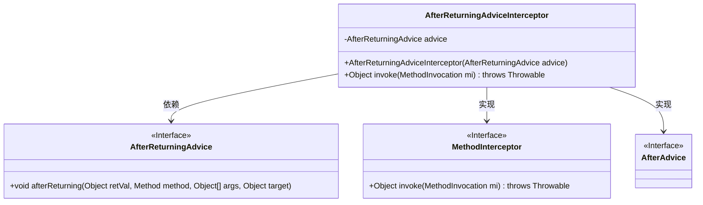
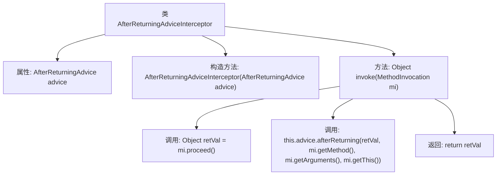

# 基础信息

|      |      |
|------|------|
| 名称 | AfterReturningAdviceInterceptor |
| 编码语言 | .java |
| 代码路径 | Minis/src/com/minis/aop/AfterReturningAdviceInterceptor.java |
| 包名 | com.minis.aop |
| 依赖项 | [] |
| 概述说明 | AfterReturningAdviceInterceptor拦截方法并在方法返回后执行通知。 |

# 说明

AfterReturningAdviceInterceptor是一种方法拦截器，专门用于在目标方法执行完毕后进行拦截操作。它主要实现返回通知功能，即在方法成功执行并返回结果后，执行预定义的逻辑或处理。这种拦截器通常用于在方法调用后执行特定的后续操作，如日志记录、结果处理或状态更新等。通过这种方式，开发者可以在不影响原有业务逻辑的情况下，增强方法的功能和灵活性。

# 类列表 Class Summary

| 名称   | 类型  | 说明 |
|-------|------|-------------|
| AfterReturningAdviceInterceptor | class | AfterReturningAdviceInterceptor实现方法拦截，调用方法后执行返回通知。 |

## 类 AfterReturningAdviceInterceptor

|      |      |
|------|------|
| 访问范围 | public |
| 类型 | class |
| 名称 | AfterReturningAdviceInterceptor |
| 说明 | AfterReturningAdviceInterceptor实现方法拦截，调用方法后执行返回通知。 |

### UML类图

这段代码定义了一个 `AfterReturningAdviceInterceptor` 类，该类实现了 `MethodInterceptor` 和 `AfterAdvice` 接口。`AfterReturningAdviceInterceptor` 类包含一个 `AfterReturningAdvice` 类型的私有成员 `advice`，并在构造函数中初始化该成员。`invoke` 方法首先调用 `MethodInvocation` 的 `proceed` 方法获取返回值，然后调用 `advice` 的 `afterReturning` 方法进行后续处理，最后返回获取的返回值。该类的主要作用是在方法执行后执行特定的操作。

### 内部方法调用关系图

该流程图描述了`AfterReturningAdviceInterceptor`类的结构和主要方法调用关系。类包含一个属性`advice`和一个构造方法，用于初始化该属性。`invoke`方法是核心，它首先调用`mi.proceed()`获取返回值，然后调用`advice.afterReturning`方法进行后置处理，最后返回结果。整个流程展示了方法调用的顺序和依赖关系。

### 字段列表 Field List

| 名称  | 类型  | 说明 |
|-------|-------|------|
| advice | AfterReturningAdvice | 私有成员变量advice，类型为AfterReturningAdvice。 |

### 方法列表 Method List

| 名称  | 类型  | 说明 |
|-------|-------|------|
| invoke | Object | 重写invoke方法，执行后调用afterReturning处理返回值。 |

