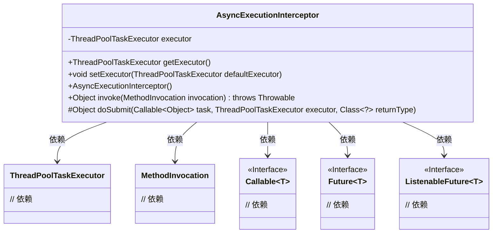
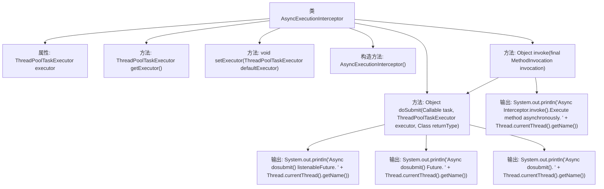

# 基础信息

|      |      |
|------|------|
| 名称 | AsyncExecutionInterceptor |
| 编码语言 | .java |
| 代码路径 | Minis/src/com/minis/aop/AsyncExecutionInterceptor.java |
| 包名 | com.minis.aop |
| 依赖项 | ['java.lang.reflect.Method', 'java.util.concurrent.Callable', 'java.util.concurrent.ExecutionException', 'java.util.concurrent.Future', 'com.minis.scheduling.concurrent.ThreadPoolTaskExecutor', 'com.minis.util.concurrent.ListenableFuture'] |
| 概述说明 | AsyncExecutionInterceptor拦截异步方法，通过ThreadPoolTaskExecutor执行任务，支持ListenableFuture和Future返回类型。 |

# 说明

AsyncExecutionInterceptor是一个用于实现异步方法拦截的组件，它通过ThreadPoolTaskExecutor来执行任务。该拦截器支持两种返回类型：ListenableFuture和Future。这意味着开发者可以利用该拦截器来处理需要异步执行的方法，并且可以根据需要选择返回ListenableFuture或Future类型的结果，从而实现对异步任务的灵活管理和控制。

# 类列表 Class Summary

| 名称   | 类型  | 说明 |
|-------|------|-------------|
| AsyncExecutionInterceptor | class | AsyncExecutionInterceptor实现异步方法拦截，使用ThreadPoolTaskExecutor执行任务，支持ListenableFuture和Future返回类型。 |

## 类 AsyncExecutionInterceptor

|      |      |
|------|------|
| 访问范围 | public |
| 类型 | class |
| 名称 | AsyncExecutionInterceptor |
| 说明 | AsyncExecutionInterceptor实现异步方法拦截，使用ThreadPoolTaskExecutor执行任务，支持ListenableFuture和Future返回类型。 |

### UML类图

### 描述
`AsyncExecutionInterceptor` 类实现了方法拦截器接口，用于异步执行方法调用。它依赖于 `ThreadPoolTaskExecutor` 来管理线程池，并通过 `invoke` 方法拦截方法调用，将其封装为 `Callable` 任务提交给线程池执行。`doSubmit` 方法根据返回类型的不同，选择不同的提交方式（如 `ListenableFuture` 或 `Future`）。该类通过泛型接口 `Callable` 和 `Future` 来处理异步任务的执行和结果获取。

### 内部方法调用关系图

这段代码定义了一个名为 `AsyncExecutionInterceptor` 的类，它实现了 `MethodInterceptor` 接口。该类的主要功能是异步执行方法调用。`invoke` 方法接收一个 `MethodInvocation` 对象，并将其封装为一个 `Callable` 任务，然后通过 `doSubmit` 方法提交给线程池执行。`doSubmit` 方法根据返回类型的不同，选择不同的提交方式（`submitListenable` 或 `submit`），并输出相应的日志信息。整个流程展示了如何将同步方法调用转换为异步执行的过程。

### 字段列表 Field List

| 名称  | 类型  | 说明 |
|-------|-------|------|
| executor | ThreadPoolTaskExecutor | 线程池任务执行器实例化。 |

### 方法列表 Method List

| 名称  | 类型  | 说明 |
|-------|-------|------|
| invoke | Object | 异步执行方法，处理Future结果，捕获异常并返回null。 |
| getExecutor | ThreadPoolTaskExecutor | 返回当前线程池任务执行器实例。 |
| setExecutor | void | 设置线程池任务执行器。 |
| doSubmit | Object | 根据返回类型选择异步提交任务，支持ListenableFuture和Future，否则直接提交并返回null。 |

