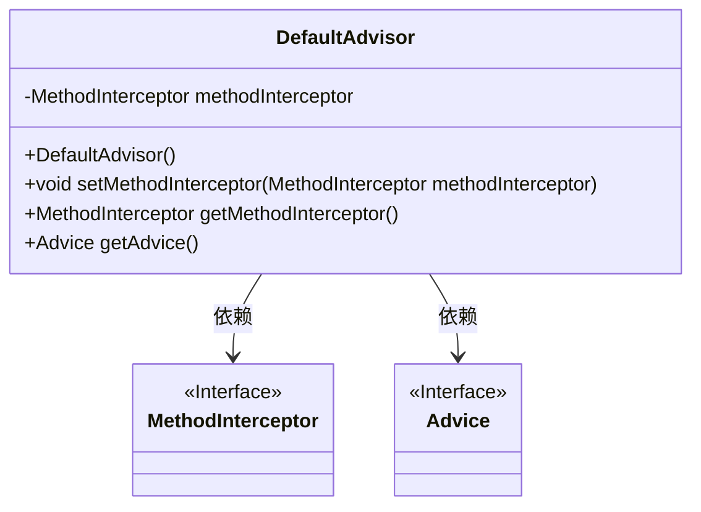
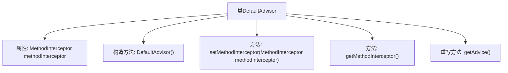

# 基础信息

|      |      |
|------|------|
| 名称 | DefaultAdvisor |
| 编码语言 | .java |
| 代码路径 | Minis/src/com/minis/aop/DefaultAdvisor.java |
| 包名 | com.minis.aop |
| 依赖项 | [] |
| 概述说明 | DefaultAdvisor类实现Advisor接口，包含MethodInterceptor属性及getter/setter方法。 |

# 说明

DefaultAdvisor类实现了Advisor接口，具备MethodInterceptor属性，并提供了相应的getter和setter方法，用于获取和设置该属性。

# 类列表 Class Summary

| 名称   | 类型  | 说明 |
|-------|------|-------------|
| DefaultAdvisor | class | DefaultAdvisor类实现Advisor接口，包含MethodInterceptor属性和相关getter/setter方法。 |

## 类 DefaultAdvisor

|      |      |
|------|------|
| 访问范围 | public |
| 类型 | class |
| 名称 | DefaultAdvisor |
| 说明 | DefaultAdvisor类实现Advisor接口，包含MethodInterceptor属性和相关getter/setter方法。 |

### UML类图

**描述：**  
`DefaultAdvisor` 类实现了 `Advisor` 接口，包含一个私有的 `MethodInterceptor` 成员变量，并提供了设置和获取该变量的方法。`getAdvice` 方法返回 `MethodInterceptor` 对象，表明 `MethodInterceptor` 实现了 `Advice` 接口。`MethodInterceptor` 和 `Advice` 均为接口，`DefaultAdvisor` 依赖于这两个接口来实现其功能。

### 内部方法调用关系图

这段代码定义了一个名为`DefaultAdvisor`的类，它实现了`Advisor`接口。该类包含一个`MethodInterceptor`类型的属性`methodInterceptor`，并通过构造函数初始化。`setMethodInterceptor`方法用于设置`methodInterceptor`的值，`getMethodInterceptor`方法用于获取该值。`getAdvice`方法重写了接口中的方法，返回`methodInterceptor`。这段代码主要用于管理和获取`MethodInterceptor`实例。

### 字段列表 Field List

| 名称  | 类型  | 说明 |
|-------|-------|------|
| methodInterceptor | MethodInterceptor | 私有方法拦截器变量声明。 |

### 方法列表 Method List

| 名称  | 类型  | 说明 |
|-------|-------|------|
| getMethodInterceptor | MethodInterceptor | 获取方法拦截器的公共方法。 |
| getAdvice | Advice | 重写getAdvice方法，返回methodInterceptor对象。 |
| setMethodInterceptor | void | 设置方法拦截器以处理特定方法调用。 |

