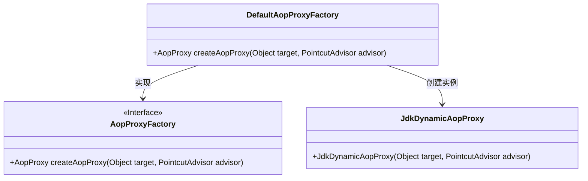
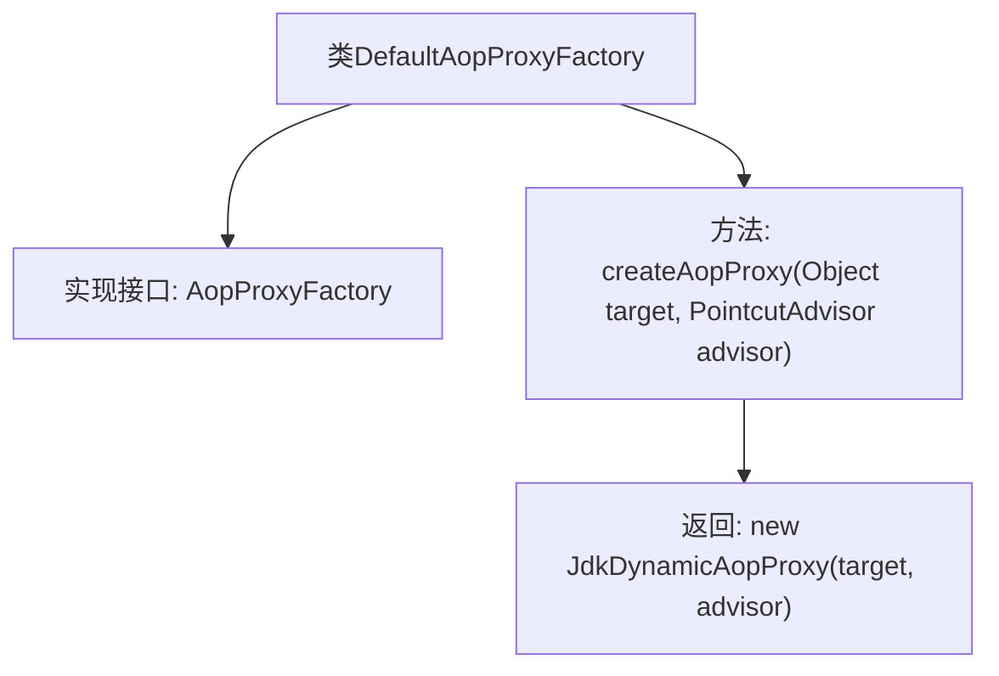

# 基础信息

|      |      |
|------|------|
| 名称 | DefaultAopProxyFactory |
| 编码语言 | .java |
| 代码路径 | Minis/src/com/minis/aop/DefaultAopProxyFactory.java |
| 包名 | com.minis.aop |
| 依赖项 | [] |
| 概述说明 | DefaultAopProxyFactory实现AopProxyFactory接口，创建JdkDynamicAopProxy实例。 |

# 说明

DefaultAopProxyFactory实现了AopProxyFactory接口，其主要功能是通过createAopProxy方法创建JdkDynamicAopProxy实例。该工厂类负责生成动态代理对象，用于在运行时拦截和处理方法调用，从而实现面向切面编程（AOP）的功能。通过这种方式，开发者可以在不修改原有代码的情况下，增强或修改应用程序的行为。

# 类列表 Class Summary

| 名称   | 类型  | 说明 |
|-------|------|-------------|
| DefaultAopProxyFactory | class | DefaultAopProxyFactory实现AopProxyFactory接口，通过createAopProxy方法创建JdkDynamicAopProxy实例。 |

## 类 DefaultAopProxyFactory

|      |      |
|------|------|
| 访问范围 | public |
| 类型 | class |
| 名称 | DefaultAopProxyFactory |
| 说明 | DefaultAopProxyFactory实现AopProxyFactory接口，通过createAopProxy方法创建JdkDynamicAopProxy实例。 |

### UML类图

这段代码定义了一个名为 `DefaultAopProxyFactory` 的类，该类实现了 `AopProxyFactory` 接口。`DefaultAopProxyFactory` 的主要职责是通过 `createAopProxy` 方法创建一个 `JdkDynamicAopProxy` 实例，该实例依赖于传入的目标对象和切面通知器。这个设计模式通常用于AOP（面向切面编程）框架中，用于动态生成代理对象以增强目标对象的功能。

### 内部方法调用关系图

这段代码描述了一个名为 `DefaultAopProxyFactory` 的类，该类实现了 `AopProxyFactory` 接口。该类中定义了一个 `createAopProxy` 方法，该方法接收两个参数：`target` 和 `advisor`，并返回一个 `JdkDynamicAopProxy` 的实例。这个类的主要作用是创建 AOP 代理对象，通过 `JdkDynamicAopProxy` 来实现动态代理功能。

### 字段列表 Field List

| 名称  | 类型  | 说明 |
|-------|-------|------|

### 方法列表 Method List

| 名称  | 类型  | 说明 |
|-------|-------|------|
| createAopProxy | AopProxy | 重写方法，创建基于JDK动态代理的AOP代理。 |

