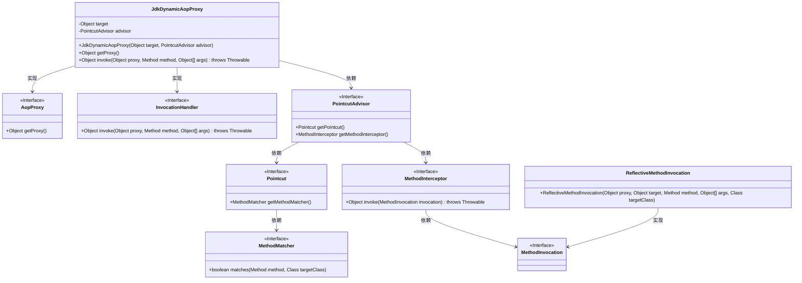
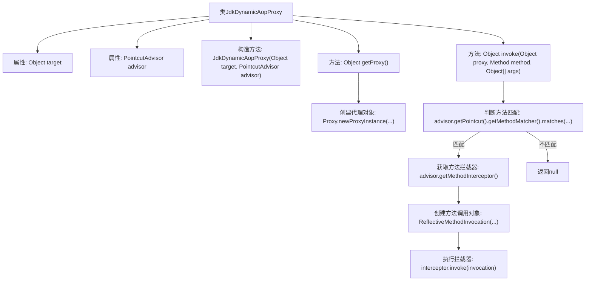

# 基础信息

|      |      |
|------|------|
| 名称 | JdkDynamicAopProxy |
| 编码语言 | .java |
| 代码路径 | Minis/src/com/minis/aop/JdkDynamicAopProxy.java |
| 包名 | com.minis.aop |
| 依赖项 | ['java.lang.reflect.InvocationHandler', 'java.lang.reflect.Method', 'java.lang.reflect.Proxy'] |
| 概述说明 | JdkDynamicAopProxy实现动态代理，拦截目标对象匹配方法。 |

# 说明

JdkDynamicAopProxy是一个实现了AopProxy和InvocationHandler接口的类，主要用于动态代理目标对象。它通过拦截匹配的方法调用，实现对目标对象的增强或控制。该机制允许在方法执行前后插入自定义逻辑，从而实现面向切面编程（AOP）的核心功能。

# 类列表 Class Summary

| 名称   | 类型  | 说明 |
|-------|------|-------------|
| JdkDynamicAopProxy | class | JdkDynamicAopProxy实现AopProxy和InvocationHandler，用于动态代理目标对象并拦截匹配方法。 |

## 类 JdkDynamicAopProxy

|      |      |
|------|------|
| 访问范围 | public |
| 类型 | class |
| 名称 | JdkDynamicAopProxy |
| 说明 | JdkDynamicAopProxy实现AopProxy和InvocationHandler，用于动态代理目标对象并拦截匹配方法。 |

### UML类图

### 描述
该代码展示了`JdkDynamicAopProxy`类如何通过实现`AopProxy`和`InvocationHandler`接口来实现动态代理。`JdkDynamicAopProxy`依赖于`PointcutAdvisor`来获取切点和拦截器，并通过`ReflectiveMethodInvocation`来执行方法调用。整个过程涉及多个接口和类的协作，以实现AOP（面向切面编程）的核心功能。

### 内部方法调用关系图

这段代码实现了一个基于JDK动态代理的AOP代理类`JdkDynamicAopProxy`。它通过`getProxy`方法创建代理对象，并在`invoke`方法中根据方法匹配规则决定是否执行拦截器。如果方法匹配，则通过`MethodInterceptor`执行拦截逻辑，否则返回`null`。代码展示了AOP的核心机制，包括代理创建、方法匹配和拦截器调用。

### 字段列表 Field List

| 名称  | 类型  | 说明 |
|-------|-------|------|
| target | Object | 定义目标对象。 |
| advisor | PointcutAdvisor | PointcutAdvisor是Spring框架中的切面顾问接口。 |

### 方法列表 Method List

| 名称  | 类型  | 说明 |
|-------|-------|------|
| invoke | Object | 方法调用前检查匹配，匹配则通过拦截器执行方法，否则返回空。 |
| getProxy | Object | 使用JDK动态代理生成目标对象的代理实例。 |

