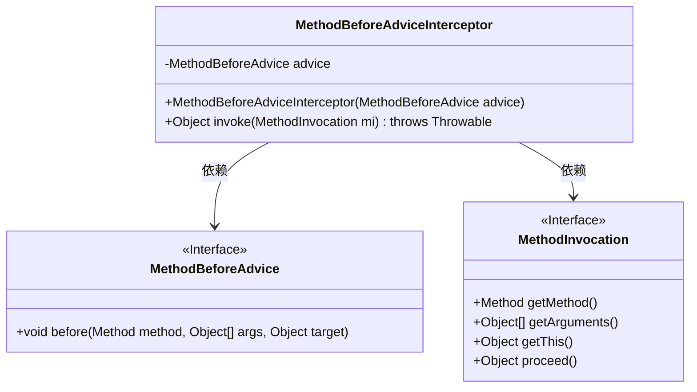
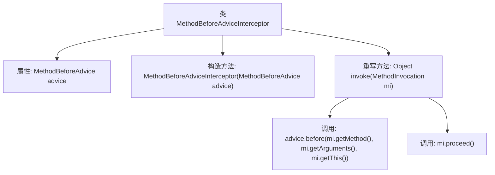

# 基础信息

|      |      |
|------|------|
| 名称 | MethodBeforeAdviceInterceptor |
| 编码语言 | .java |
| 代码路径 | Minis/src/com/minis/aop/MethodBeforeAdviceInterceptor.java |
| 包名 | com.minis.aop |
| 依赖项 | [] |
| 概述说明 | 方法拦截器实现前置通知，执行前置方法后继续原方法。 |

# 说明

方法拦截器用于在目标方法执行前插入前置通知，前置方法会在原方法调用之前执行，完成前置操作后，拦截器会继续执行原方法，确保流程的连贯性和功能的完整性。

# 类列表 Class Summary

| 名称   | 类型  | 说明 |
|-------|------|-------------|
| MethodBeforeAdviceInterceptor | class | 方法拦截器实现前置通知，调用前置方法后继续执行原方法。 |

## 类 MethodBeforeAdviceInterceptor

|      |      |
|------|------|
| 访问范围 | public |
| 类型 | class |
| 名称 | MethodBeforeAdviceInterceptor |
| 说明 | 方法拦截器实现前置通知，调用前置方法后继续执行原方法。 |

### UML类图

这段代码定义了一个 `MethodBeforeAdviceInterceptor` 类，它实现了 `MethodInterceptor` 接口，并在调用目标方法之前执行 `MethodBeforeAdvice` 中的 `before` 方法。`MethodBeforeAdvice` 是一个接口，定义了 `before` 方法，用于在方法调用前执行某些操作。`MethodInvocation` 是一个接口，提供了获取方法、参数和目标对象的方法，并允许继续执行方法调用。`MethodBeforeAdviceInterceptor` 依赖于这两个接口来实现其功能。

### 内部方法调用关系图

这段代码定义了一个`MethodBeforeAdviceInterceptor`类，该类实现了`MethodInterceptor`接口。它包含一个`MethodBeforeAdvice`类型的属性`advice`，并通过构造函数进行初始化。在`invoke`方法中，首先调用`advice.before`方法，传入方法、参数和目标对象，然后继续执行原始方法调用`mi.proceed()`。该代码主要用于在方法执行前插入额外的逻辑处理。

### 字段列表 Field List

| 名称  | 类型  | 说明 |
|-------|-------|------|
| advice | MethodBeforeAdvice | 私有且不可变的MethodBeforeAdvice实例。 |

### 方法列表 Method List

| 名称  | 类型  | 说明 |
|-------|-------|------|
| invoke | Object | 方法重写，执行前调用advice.before，然后继续执行原方法。 |

