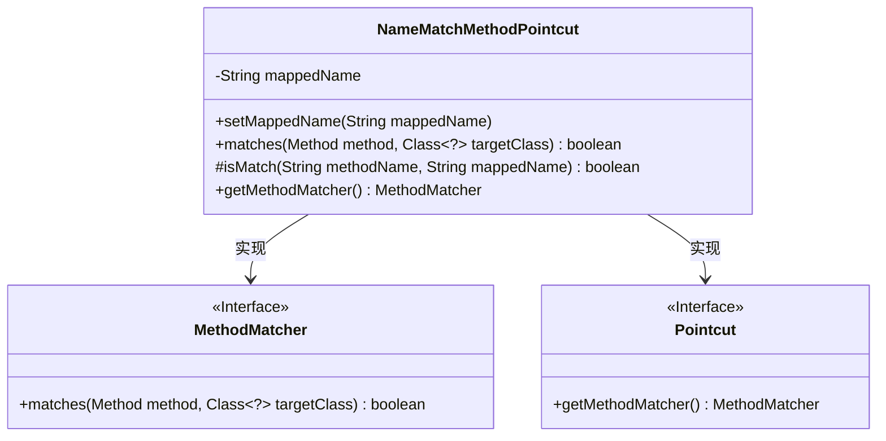
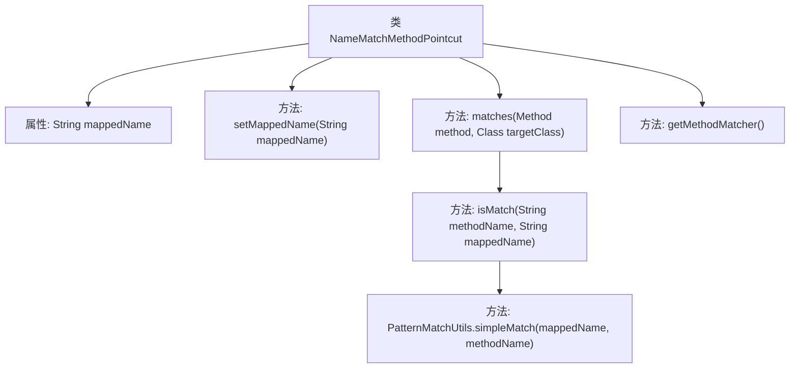

# 基础信息

|      |      |
|------|------|
| 名称 | NameMatchMethodPointcut |
| 编码语言 | .java |
| 代码路径 | Minis/src/com/minis/aop/NameMatchMethodPointcut.java |
| 包名 | com.minis.aop |
| 依赖项 | ['java.lang.reflect.Method', 'com.minis.util.PatternMatchUtils'] |
| 概述说明 | 类方法匹配与切点通过名称判断是否符合条件。 |

# 说明

类实现方法匹配与切点功能主要通过名称匹配来判断方法是否符合特定条件。该机制用于在类中筛选出符合条件的方法，以便进行进一步处理或操作。名称匹配是核心判断标准，确保所选方法与预设条件一致。

# 类列表 Class Summary

| 名称   | 类型  | 说明 |
|-------|------|-------------|
| NameMatchMethodPointcut | class | 类实现方法匹配与切点，通过名称匹配判断方法是否符合条件。 |

## 类 NameMatchMethodPointcut

|      |      |
|------|------|
| 访问范围 | public |
| 类型 | class |
| 名称 | NameMatchMethodPointcut |
| 说明 | 类实现方法匹配与切点，通过名称匹配判断方法是否符合条件。 |

### UML类图

类图描述：`NameMatchMethodPointcut` 类实现了 `MethodMatcher` 和 `Pointcut` 接口，用于匹配方法名。它包含一个私有属性 `mappedName` 用于存储匹配的模式，提供了设置该模式的方法 `setMappedName`，并通过 `matches` 方法判断方法名是否匹配。`isMatch` 方法用于辅助匹配逻辑，`getMethodMatcher` 方法返回自身实例。

### 内部方法调用关系图

这段代码定义了一个名为 `NameMatchMethodPointcut` 的类，该类实现了 `MethodMatcher` 和 `Pointcut` 接口。类中包含一个属性 `mappedName`，用于存储方法名称的匹配模式。`setMappedName` 方法用于设置 `mappedName` 的值。`matches` 方法用于判断给定的方法名称是否与 `mappedName` 匹配，匹配规则可以是完全匹配或通过 `isMatch` 方法进行模式匹配。`isMatch` 方法调用了 `PatternMatchUtils.simpleMatch` 来实现模式匹配。`getMethodMatcher` 方法返回当前对象本身，表明该类可以作为方法匹配器使用。

### 字段列表 Field List

| 名称  | 类型  | 说明 |
|-------|-------|------|
| mappedName = "" | String | 定义私有字符串变量mappedName并初始化为空。 |

### 方法列表 Method List

| 名称  | 类型  | 说明 |
|-------|-------|------|
| setMappedName | void | 设置映射名称的方法。 |
| getMethodMatcher | MethodMatcher | 重写getMethodMatcher方法，返回当前对象。 |
| isMatch | boolean | 该方法检查方法名是否与映射名匹配，使用简单模式匹配。 |
| matches | boolean | 该方法检查方法名是否匹配指定名称，匹配则返回true，否则返回false。 |

