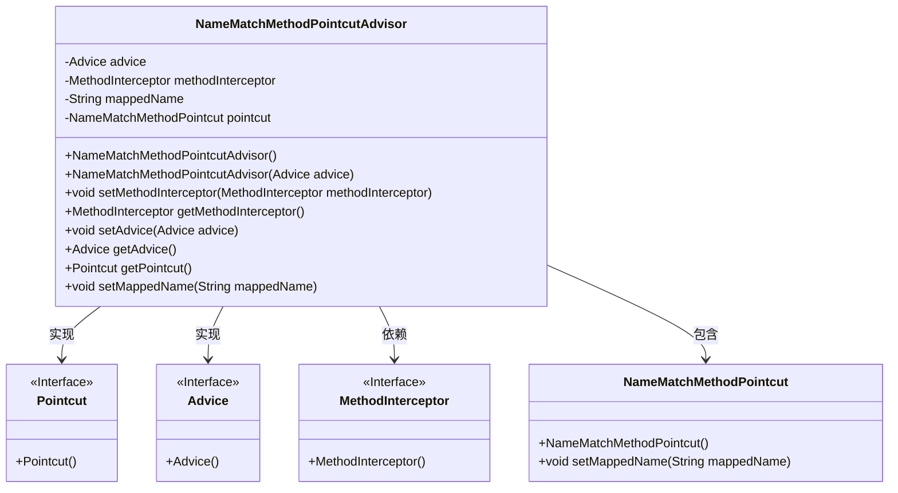
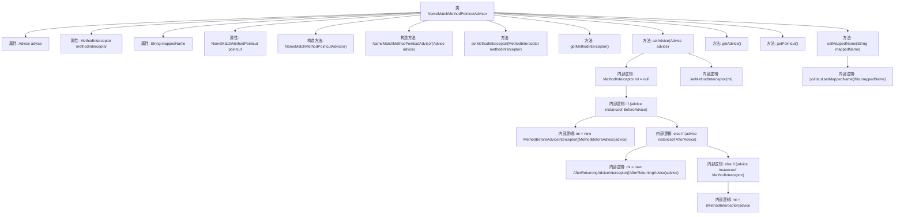

# 基础信息

|      |      |
|------|------|
| 名称 | NameMatchMethodPointcutAdvisor |
| 编码语言 | .java |
| 代码路径 | Minis/src/com/minis/aop/NameMatchMethodPointcutAdvisor.java |
| 包名 | com.minis.aop |
| 依赖项 | [] |
| 概述说明 | 类实现方法匹配切面，具备建议、拦截器和映射名称设置功能。 |

# 说明

类实现方法匹配切面是一种功能强大的设计模式，主要用于在软件系统中实现方法级别的拦截和处理。该切面包含多个核心功能，首先提供了建议功能，允许开发者在特定方法执行前后插入自定义逻辑，从而实现行为增强或修改。其次，拦截器功能使得系统能够在方法调用时进行拦截，执行额外的操作或验证。此外，映射名称设置功能允许开发者灵活地定义方法匹配规则，通过名称映射来精确控制哪些方法需要应用切面逻辑。这些功能共同作用，提升了系统的可扩展性和可维护性，适用于复杂业务逻辑的处理和系统行为的动态调整。

# 类列表 Class Summary

| 名称   | 类型  | 说明 |
|-------|------|-------------|
| NameMatchMethodPointcutAdvisor | class | 类实现方法匹配切面，包含建议、拦截器和映射名称设置功能。 |

## 类 NameMatchMethodPointcutAdvisor

|      |      |
|------|------|
| 访问范围 | public |
| 类型 | class |
| 名称 | NameMatchMethodPointcutAdvisor |
| 说明 | 类实现方法匹配切面，包含建议、拦截器和映射名称设置功能。 |

### UML类图

### 描述：
`NameMatchMethodPointcutAdvisor` 类实现了 `PointcutAdvisor` 接口，用于根据方法名称匹配来提供切点（`Pointcut`）和通知（`Advice`）。它包含一个 `NameMatchMethodPointcut` 实例，用于设置和匹配方法名称。`setAdvice` 方法根据传入的 `Advice` 类型，将其转换为相应的 `MethodInterceptor`，并将其设置为当前实例的拦截器。该类还提供了设置和获取方法拦截器、通知、切点以及映射名称的功能。

### 内部方法调用关系图

该流程图展示了`NameMatchMethodPointcutAdvisor`类的结构及其方法调用关系。类包含多个属性和方法，主要功能是通过`setAdvice`方法根据传入的`Advice`类型设置相应的`MethodInterceptor`，并通过`setMappedName`方法设置`pointcut`的映射名称。流程图清晰地展示了各个方法之间的调用顺序和逻辑判断过程。

### 字段列表 Field List

| 名称  | 类型  | 说明 |
|-------|-------|------|
| methodInterceptor | MethodInterceptor | 私有方法拦截器实例声明。 |
| advice = null | Advice | 私有变量advice初始化为null。 |
| pointcut = new NameMatchMethodPointcut() | NameMatchMethodPointcut | 创建了一个私有且不可变的NameMatchMethodPointcut实例。 |
| mappedName | String | 定义了一个私有字符串变量mappedName。 |

### 方法列表 Method List

| 名称  | 类型  | 说明 |
|-------|-------|------|
| getMethodInterceptor | MethodInterceptor | 获取方法拦截器实例。 |
| setMappedName | void | 设置映射名称并更新切点。 |
| getPointcut | Pointcut | 重写方法，返回pointcut对象。 |
| setMethodInterceptor | void | 设置方法拦截器，用于拦截和处理方法调用。 |
| getAdvice | Advice | 重写getAdvice方法，返回当前advice对象。 |
| setAdvice | void | 根据advice类型设置对应的MethodInterceptor。 |

