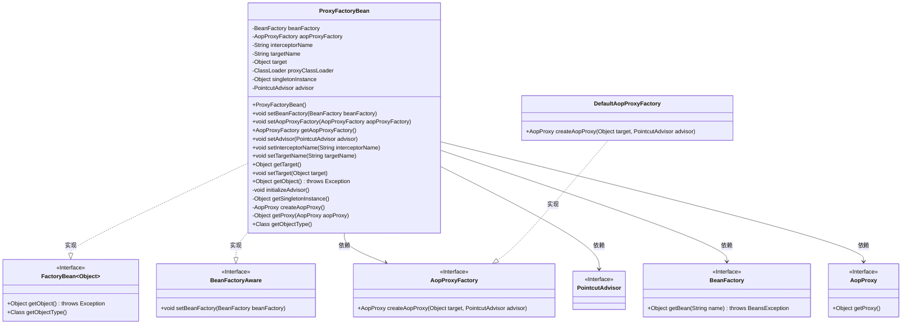

# 基础信息

|      |      |
|------|------|
| 名称 | ProxyFactoryBean |
| 编码语言 | .java |
| 代码路径 | Minis/src/com/minis/aop/ProxyFactoryBean.java |
| 包名 | com.minis.aop |
| 依赖项 | ['com.minis.beans.BeansException', 'com.minis.beans.factory.BeanFactory', 'com.minis.beans.factory.BeanFactoryAware', 'com.minis.beans.factory.FactoryBean', 'com.minis.util.ClassUtils'] |
| 概述说明 | ProxyFactoryBean实现FactoryBean和BeanFactoryAware，创建AOP代理实例。 |

# 说明

ProxyFactoryBean是一个实现了FactoryBean和BeanFactoryAware接口的类，专门用于创建AOP（面向切面编程）代理实例。它通过FactoryBean接口提供了一种机制，使得在Spring容器中可以通过配置来创建和管理代理对象。同时，BeanFactoryAware接口使得ProxyFactoryBean能够感知并访问Spring的BeanFactory，从而在创建代理实例时能够获取所需的依赖和配置信息。这种方式简化了AOP代理的创建过程，提高了灵活性和可配置性。

# 类列表 Class Summary

| 名称   | 类型  | 说明 |
|-------|------|-------------|
| ProxyFactoryBean | class | ProxyFactoryBean实现FactoryBean和BeanFactoryAware，用于创建AOP代理实例。 |

## 类 ProxyFactoryBean

|      |      |
|------|------|
| 访问范围 | public |
| 类型 | class |
| 名称 | ProxyFactoryBean |
| 说明 | ProxyFactoryBean实现FactoryBean和BeanFactoryAware，用于创建AOP代理实例。 |

### UML类图

**描述：**  
`ProxyFactoryBean` 是一个实现了 `FactoryBean<Object>` 和 `BeanFactoryAware` 接口的类，用于创建代理对象。它依赖于 `AopProxyFactory` 来生成 AOP 代理，并通过 `BeanFactory` 获取拦截器。`ProxyFactoryBean` 还维护了目标对象、拦截器名称、单例实例等状态，并通过 `initializeAdvisor` 和 `getSingletonInstance` 方法初始化和管理这些状态。`DefaultAopProxyFactory` 是 `AopProxyFactory` 的具体实现，用于创建 AOP 代理实例。

### 内部方法调用关系图

```mermaid
graph TD
    A["类ProxyFactoryBean"]
    B["属性: BeanFactory beanFactory"]
    C["属性: AopProxyFactory aopProxyFactory"]
    D["属性: String interceptorName"]
    E["属性: String targetName"]
    F["属性: Object target"]
    G["属性: ClassLoader proxyClassLoader"]
    H["属性: Object singletonInstance"]
    I["属性: PointcutAdvisor advisor"]
    J["构造方法: ProxyFactoryBean()"]
    K["方法: setBeanFactory(BeanFactory beanFactory)"]
    L["方法: setAopProxyFactory(AopProxyFactory aopProxyFactory)"]
    M["方法: getAopProxyFactory()"]
    N["方法: setAdvisor(PointcutAdvisor advisor)"]
    O["方法: setInterceptorName(String interceptorName)"]
    P["方法: setTargetName(String targetName)"]
    Q["方法: getTarget()"]
    R["方法: setTarget(Object target)"]
    S["方法: getObject()"]
    T["方法: initializeAdvisor()"]
    U["方法: getSingletonInstance()"]
    V["方法: createAopProxy()"]
    W["方法: getProxy(AopProxy aopProxy)"]
    X["方法: getObjectType()"]

    A --> B
    A --> C
    A --> D
    A --> E
    A --> F
    A --> G
    A --> H
    A --> I
    A --> J
    A --> K
    A --> L
    A --> M
    A --> N
    A --> O
    A --> P
    A --> Q
    A --> R
    A --> S
    S --> T
    S --> U
    U --> V
    U --> W
    A --> X
```

这段代码定义了一个`ProxyFactoryBean`类，用于创建和管理AOP代理对象。类中包含多个属性和方法，用于设置和获取代理相关的配置，如`BeanFactory`、`AopProxyFactory`、`interceptorName`等。`getObject()`方法是核心方法，它通过调用`initializeAdvisor()`和`getSingletonInstance()`来初始化并获取单例代理对象。`initializeAdvisor()`方法从`BeanFactory`中获取拦截器并设置`advisor`，而`getSingletonInstance()`方法则负责创建并返回代理对象。

### 字段列表 Field List

| 名称  | 类型  | 说明 |
|-------|-------|------|
| beanFactory | BeanFactory | 私有成员变量beanFactory，类型为BeanFactory。 |
| aopProxyFactory | AopProxyFactory | 私有变量aopProxyFactory用于AOP代理工厂。 |
| interceptorName | String | 定义了一个名为interceptorName的私有字符串变量。 |
| target | Object | 定义私有对象变量target。 |
| proxyClassLoader = ClassUtils.getDefaultClassLoader() | ClassLoader | 使用默认类加载器初始化代理类加载器。 |
| advisor | PointcutAdvisor | 私有切面顾问对象声明。 |
| singletonInstance | Object | 私有单例实例对象声明。 |
| targetName | String | 定义了一个私有字符串变量targetName。 |

### 方法列表 Method List

| 名称  | 类型  | 说明 |
|-------|-------|------|
| getTarget | Object | 该方法返回目标对象。 |
| setTarget | void | 设置目标对象的方法。 |
| setInterceptorName | void | 设置拦截器名称的方法。 |
| setAopProxyFactory | void | 设置AOP代理工厂方法。 |
| getObjectType | Class<?> | 重写getObjectType方法，返回null类型。 |
| getAopProxyFactory | AopProxyFactory | 方法返回AopProxyFactory实例。 |
| setAdvisor | void | 设置切面顾问对象的方法。 |
| setBeanFactory | void | 设置BeanFactory实例到当前对象。 |
| getObject | Object | 重写getObject方法，初始化顾问并返回单例实例。 |
| getProxy | Object | 方法`getProxy`通过`AopProxy`实例获取代理对象。 |
| setTargetName | void | 设置目标名称的方法，将传入的字符串赋值给类的成员变量。 |
| createAopProxy | AopProxy | 创建AOP代理方法，通过工厂生成代理对象，使用目标和通知器作为参数。 |
| initializeAdvisor | void | 私有同步方法初始化顾问，获取拦截器并转换为点切顾问。 |
| getSingletonInstance | Object | 同步方法获取单例实例，若为空则创建代理并返回。 |

