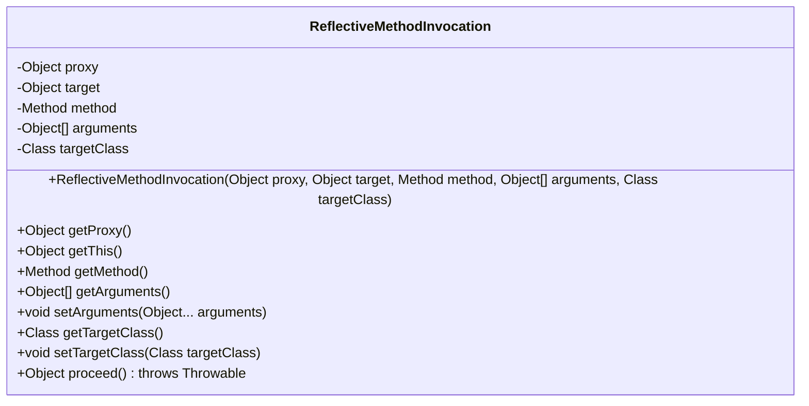

# 基础信息

|      |      |
|------|------|
| 名称 | ReflectiveMethodInvocation |
| 编码语言 | .java |
| 代码路径 | Minis/src/com/minis/aop/ReflectiveMethodInvocation.java |
| 包名 | com.minis.aop |
| 依赖项 | ['java.lang.reflect.Method'] |
| 概述说明 | ReflectiveMethodInvocation类实现方法调用，管理代理、目标、方法、参数，支持参数和目标类操作及执行。 |

# 说明

ReflectiveMethodInvocation类负责实现方法调用，包含代理、目标、方法、参数等关键属性。该类支持获取和设置参数及目标类，并能够执行方法调用。通过这一实现，开发者可以灵活地管理和操作方法调用的各个要素，确保方法调用的准确性和高效性。

# 类列表 Class Summary

| 名称   | 类型  | 说明 |
|-------|------|-------------|
| ReflectiveMethodInvocation | class | ReflectiveMethodInvocation类实现方法调用，包含代理、目标、方法、参数等属性，支持获取和设置参数及目标类，并执行方法调用。 |

## 类 ReflectiveMethodInvocation

|      |      |
|------|------|
| 访问范围 | public |
| 类型 | class |
| 名称 | ReflectiveMethodInvocation |
| 说明 | ReflectiveMethodInvocation类实现方法调用，包含代理、目标、方法、参数等属性，支持获取和设置参数及目标类，并执行方法调用。 |

### UML类图

这段代码定义了一个 `ReflectiveMethodInvocation` 类，用于封装方法调用的相关信息，包括代理对象、目标对象、方法、参数和目标类。类中提供了多个方法用于获取和设置这些信息，并提供了一个 `proceed` 方法用于实际执行方法调用。该类主要用于在反射调用中管理和执行方法。

### 内部方法调用关系图

```mermaid
graph TD
    A["类ReflectiveMethodInvocation"]
    B["属性: Object proxy"]
    C["属性: Object target"]
    D["属性: Method method"]
    E["属性: Object[] arguments"]
    F["属性: Class<?> targetClass"]
    G["构造方法: ReflectiveMethodInvocation(Object proxy, Object target, Method method, Object[] arguments, Class<?> targetClass)"]
    H["方法: Object getProxy()"]
    I["方法: Object getThis()"]
    J["方法: Method getMethod()"]
    K["方法: Object[] getArguments()"]
    L["方法: void setArguments(Object... arguments)"]
    M["方法: Class<?> getTargetClass()"]
    N["方法: void setTargetClass(Class<?> targetClass)"]
    O["方法: Object proceed() throws Throwable"]

    A --> B
    A --> C
    A --> D
    A --> E
    A --> F
    A --> G
    A --> H
    A --> I
    A --> J
    A --> K
    A --> L
    A --> M
    A --> N
    A --> O
```

这段代码定义了一个名为 `ReflectiveMethodInvocation` 的类，主要用于通过反射机制调用目标对象的方法。类中包含多个属性和方法，用于存储和操作代理对象、目标对象、方法、参数等信息。构造方法用于初始化这些属性，而 `proceed` 方法则通过反射调用目标方法并返回结果。其他方法用于获取或设置类的属性值。

### 字段列表 Field List

| 名称  | 类型  | 说明 |
|-------|-------|------|
| proxy | Object | 保护性代理对象实例。 |
| target | Object | 保护且不可变的目标对象。 |
| method | Method | 保护且不可变的方法实例。 |
| arguments | Object[] | 声明一个受保护的对象数组变量arguments。 |
| targetClass | Class<?> | 私有变量targetClass用于存储目标类。 |

### 方法列表 Method List

| 名称  | 类型  | 说明 |
|-------|-------|------|
| getArguments | Object[] | 获取对象数组类型参数的公共方法。 |
| setTargetClass | void | 设置目标类为指定类。 |
| getThis | Object | 该方法返回当前对象的`target`属性。 |
| getProxy | Object | 获取当前对象的代理实例。 |
| setArguments | void | 设置方法参数为可变参数数组。 |
| getTargetClass | Class<?> | 获取目标类的方法，返回目标类的Class对象。 |
| getMethod | Method | 返回当前对象的method属性。 |
| proceed | Object | 方法通过反射调用目标对象并返回结果。 |

