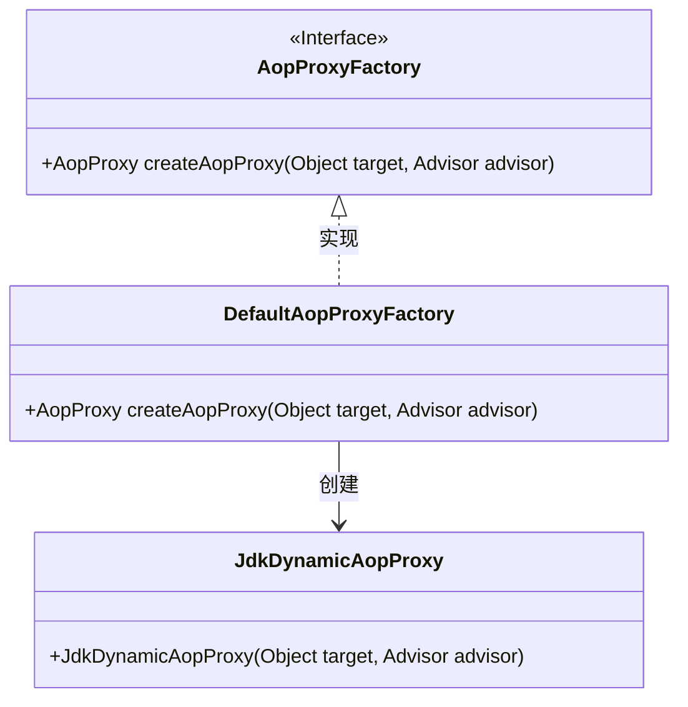
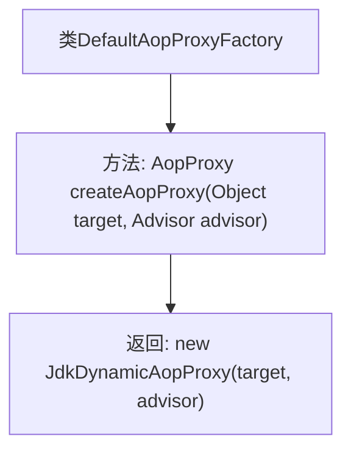

# 基础信息

|      |      |
|------|------|
| 名称 | DefaultAopProxyFactory |
| 编码语言 | .java |
| 代码路径 | Minis/src/com/minis/aop/framework/DefaultAopProxyFactory.java |
| 包名 | com.minis.aop.framework |
| 依赖项 | ['com.minis.aop.Advisor', 'com.minis.aop.PointcutAdvisor'] |
| 概述说明 | DefaultAopProxyFactory实现AopProxyFactory接口，生成JdkDynamicAopProxy实例。 |

# 说明

DefaultAopProxyFactory是AopProxyFactory接口的一个实现类，其主要功能是创建JdkDynamicAopProxy实例。JdkDynamicAopProxy是基于Java动态代理机制实现的AOP代理，用于在运行时动态生成代理对象。DefaultAopProxyFactory通过实现AopProxyFactory接口，提供了创建这种代理对象的标准化方法，确保AOP功能的实现与Spring框架的无缝集成。

# 类列表 Class Summary

| 名称   | 类型  | 说明 |
|-------|------|-------------|
| DefaultAopProxyFactory | class | DefaultAopProxyFactory实现AopProxyFactory接口，创建JdkDynamicAopProxy实例。 |

## 类 DefaultAopProxyFactory

|      |      |
|------|------|
| 访问范围 | public |
| 类型 | class |
| 名称 | DefaultAopProxyFactory |
| 说明 | DefaultAopProxyFactory实现AopProxyFactory接口，创建JdkDynamicAopProxy实例。 |

### UML类图

这段代码展示了`DefaultAopProxyFactory`类实现了`AopProxyFactory`接口，并提供了`createAopProxy`方法的具体实现。该方法接收一个目标对象和一个`Advisor`对象，并返回一个`JdkDynamicAopProxy`实例。`JdkDynamicAopProxy`类负责动态代理的创建，`DefaultAopProxyFactory`类则通过调用`JdkDynamicAopProxy`的构造函数来生成代理对象。这种设计模式常用于AOP（面向切面编程）框架中，用于动态生成代理对象以增强目标对象的功能。

### 内部方法调用关系图

这段代码定义了一个名为 `DefaultAopProxyFactory` 的类，该类实现了 `AopProxyFactory` 接口。该类包含一个 `createAopProxy` 方法，该方法接收一个目标对象和一个 `Advisor` 对象作为参数，并返回一个新的 `JdkDynamicAopProxy` 实例。该方法的目的是根据传入的目标对象和 `Advisor` 创建一个动态代理对象，用于实现AOP（面向切面编程）的功能。

### 字段列表 Field List

| 名称  | 类型  | 说明 |
|-------|-------|------|

### 方法列表 Method List

| 名称  | 类型  | 说明 |
|-------|-------|------|
| createAopProxy | AopProxy | 重写方法，创建基于JDK动态代理的AOP代理对象。 |

