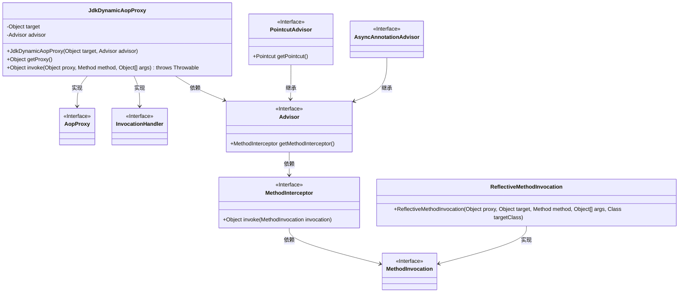
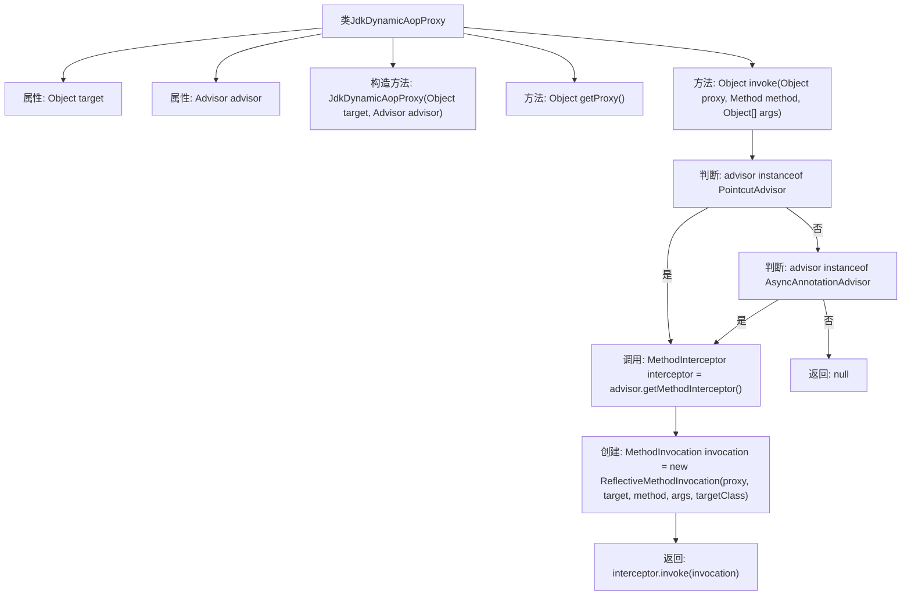

# 基础信息

|      |      |
|------|------|
| 名称 | JdkDynamicAopProxy |
| 编码语言 | .java |
| 代码路径 | Minis/src/com/minis/aop/framework/JdkDynamicAopProxy.java |
| 包名 | com.minis.aop.framework |
| 依赖项 | ['java.lang.reflect.InvocationHandler', 'java.lang.reflect.Method', 'java.lang.reflect.Proxy', 'com.minis.aop.Advisor', 'com.minis.aop.MethodInterceptor', 'com.minis.aop.MethodInvocation', 'com.minis.aop.PointcutAdvisor', 'com.minis.scheduling.annotation.AsyncAnnotationAdvisor'] |
| 概述说明 | JdkDynamicAopProxy实现AopProxy和InvocationHandler，通过代理执行目标方法，支持多种Advisor。 |

# 说明

JdkDynamicAopProxy实现了AopProxy和InvocationHandler接口，通过创建代理对象来执行目标方法。它能够支持多种Advisor，用于在方法执行前后插入自定义逻辑。该实现基于JDK动态代理机制，适用于接口代理场景，提供了灵活且强大的AOP功能。

# 类列表 Class Summary

| 名称   | 类型  | 说明 |
|-------|------|-------------|
| JdkDynamicAopProxy | class | JdkDynamicAopProxy实现AopProxy和InvocationHandler，通过代理对象执行目标方法，支持多种Advisor。 |

## 类 JdkDynamicAopProxy

|      |      |
|------|------|
| 访问范围 | public |
| 类型 | class |
| 名称 | JdkDynamicAopProxy |
| 说明 | JdkDynamicAopProxy实现AopProxy和InvocationHandler，通过代理对象执行目标方法，支持多种Advisor。 |

### UML类图

### 描述
`JdkDynamicAopProxy`类实现了`AopProxy`和`InvocationHandler`接口，用于生成动态代理对象。它依赖于`Advisor`接口，该接口提供了`MethodInterceptor`，用于在方法调用时进行拦截。`PointcutAdvisor`和`AsyncAnnotationAdvisor`是`Advisor`的子接口，分别用于基于切点和异步注解的拦截。`MethodInvocation`接口定义了方法调用的上下文，`ReflectiveMethodInvocation`是其实现类，用于反射调用方法。整体设计支持灵活的AOP（面向切面编程）功能。

### 内部方法调用关系图

这段代码展示了`JdkDynamicAopProxy`类的结构和功能。该类实现了`AopProxy`和`InvocationHandler`接口，用于动态生成代理对象并处理方法调用。流程图清晰地展示了类的属性、构造方法、`getProxy`方法以及`invoke`方法的执行流程。`invoke`方法根据`advisor`的类型（`PointcutAdvisor`或`AsyncAnnotationAdvisor`）来决定是否调用方法拦截器，并最终返回相应的结果或`null`。

### 字段列表 Field List

| 名称  | 类型  | 说明 |
|-------|-------|------|
| target | Object | 定义目标对象。 |
| advisor | Advisor | 定义了名为Advisor的advisor变量。 |

### 方法列表 Method List

| 名称  | 类型  | 说明 |
|-------|-------|------|
| getProxy | Object | 该方法使用JDK动态代理创建并返回目标对象的代理实例。 |
| invoke | Object | 方法invoke根据advisor类型匹配方法并调用拦截器执行。 |

