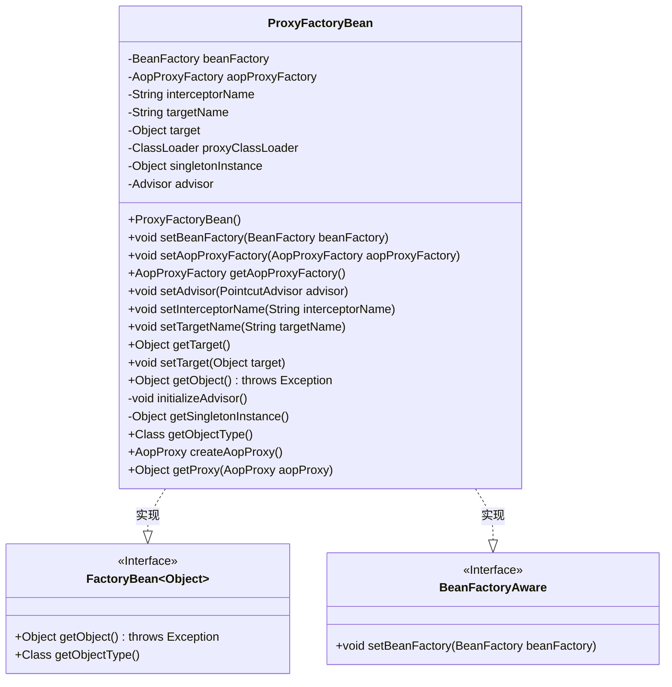

# 基础信息

|      |      |
|------|------|
| 名称 | ProxyFactoryBean |
| 编码语言 | .java |
| 代码路径 | Minis/src/com/minis/aop/framework/ProxyFactoryBean.java |
| 包名 | com.minis.aop.framework |
| 依赖项 | ['com.minis.aop.Advisor', 'com.minis.aop.PointcutAdvisor', 'com.minis.beans.BeansException', 'com.minis.beans.factory.BeanFactory', 'com.minis.beans.factory.BeanFactoryAware', 'com.minis.beans.factory.FactoryBean', 'com.minis.util.ClassUtils'] |
| 概述说明 | ProxyFactoryBean实现FactoryBean，管理AOP代理，配置拦截器和目标对象。 |

# 说明

ProxyFactoryBean实现了FactoryBean接口，用于管理AOP代理。它支持配置拦截器和目标对象，允许用户通过拦截器对目标对象的方法进行增强或修改。通过ProxyFactoryBean，用户可以灵活地定义和管理代理对象，实现面向切面编程的功能。

# 类列表 Class Summary

| 名称   | 类型  | 说明 |
|-------|------|-------------|
| ProxyFactoryBean | class | ProxyFactoryBean实现FactoryBean，管理AOP代理，支持拦截器和目标对象配置。 |

## 类 ProxyFactoryBean

|      |      |
|------|------|
| 访问范围 | public |
| 类型 | class |
| 名称 | ProxyFactoryBean |
| 说明 | ProxyFactoryBean实现FactoryBean，管理AOP代理，支持拦截器和目标对象配置。 |

### UML类图

这段代码定义了一个 `ProxyFactoryBean` 类，该类实现了 `FactoryBean<Object>` 和 `BeanFactoryAware` 接口。`ProxyFactoryBean` 主要用于创建代理对象，通过 `AopProxyFactory` 和 `Advisor` 来生成目标对象的代理实例。类中包含多个私有成员变量，如 `beanFactory`、`aopProxyFactory`、`interceptorName` 等，以及一系列公有方法用于设置和获取这些变量。`initializeAdvisor` 和 `getSingletonInstance` 是私有方法，用于初始化 `Advisor` 和获取单例代理实例。`createAopProxy` 和 `getProxy` 方法用于创建和获取代理对象。

### 内部方法调用关系图

```mermaid
graph TD
    A["类ProxyFactoryBean"]
    B["属性: BeanFactory beanFactory"]
    C["属性: AopProxyFactory aopProxyFactory"]
    D["属性: String interceptorName"]
    E["属性: String targetName"]
    F["属性: Object target"]
    G["属性: ClassLoader proxyClassLoader"]
    H["属性: Object singletonInstance"]
    I["属性: Advisor advisor"]
    J["构造方法: ProxyFactoryBean()"]
    K["方法: setBeanFactory(BeanFactory beanFactory)"]
    L["方法: setAopProxyFactory(AopProxyFactory aopProxyFactory)"]
    M["方法: getAopProxyFactory()"]
    N["方法: setAdvisor(PointcutAdvisor advisor)"]
    O["方法: setInterceptorName(String interceptorName)"]
    P["方法: setTargetName(String targetName)"]
    Q["方法: getTarget()"]
    R["方法: setTarget(Object target)"]
    S["方法: getObject()"]
    T["方法: initializeAdvisor()"]
    U["方法: getSingletonInstance()"]
    V["方法: createAopProxy()"]
    W["方法: getProxy(AopProxy aopProxy)"]
    X["方法: getObjectType()"]

    A --> B
    A --> C
    A --> D
    A --> E
    A --> F
    A --> G
    A --> H
    A --> I
    A --> J
    A --> K
    A --> L
    A --> M
    A --> N
    A --> O
    A --> P
    A --> Q
    A --> R
    A --> S
    S --> T
    S --> U
    U --> V
    U --> W
    A --> X
```

这段代码定义了一个`ProxyFactoryBean`类，用于创建和管理AOP代理对象。该类实现了`FactoryBean`和`BeanFactoryAware`接口，通过`BeanFactory`获取拦截器，并利用`AopProxyFactory`创建代理对象。`initializeAdvisor`方法初始化顾问对象，`getSingletonInstance`方法确保单例实例的创建，`createAopProxy`和`getProxy`方法负责生成代理对象。整个流程确保了代理对象的正确创建和初始化。

### 字段列表 Field List

| 名称  | 类型  | 说明 |
|-------|-------|------|
| beanFactory | BeanFactory | 私有成员变量beanFactory，类型为BeanFactory。 |
| target | Object | 定义私有对象变量target。 |
| singletonInstance | Object | 私有单例对象实例声明。 |
| aopProxyFactory | AopProxyFactory | 私有变量aopProxyFactory用于AOP代理工厂。 |
| advisor | Advisor | 声明一个私有的Advisor类型变量advisor。 |
| targetName | String | 声明一个私有字符串变量targetName。 |
| proxyClassLoader = ClassUtils.getDefaultClassLoader() | ClassLoader | 使用默认类加载器初始化代理类加载器。 |
| interceptorName | String | 定义私有字符串变量interceptorName。 |

### 方法列表 Method List

| 名称  | 类型  | 说明 |
|-------|-------|------|
| setTarget | void | 设置目标对象的方法。 |
| setAopProxyFactory | void | 设置AOP代理工厂实例。 |
| setInterceptorName | void | 设置拦截器名称的方法。 |
| getAopProxyFactory | AopProxyFactory | 该方法返回AopProxyFactory实例。 |
| getObject | Object | 重写getObject方法，初始化顾问并返回单例实例。 |
| getSingletonInstance | Object | 私有同步方法获取单例实例，若为空则创建代理并返回。 |
| getProxy | Object | 方法getProxy通过AopProxy实例获取代理对象。 |
| getTarget | Object | 该方法返回目标对象。 |
| createAopProxy | AopProxy | 创建AOP代理的方法，使用工厂和目标对象及顾问生成代理。 |
| initializeAdvisor | void | 同步方法初始化Advisor，从beanFactory获取interceptorName对应的bean并赋值给advisor。 |
| setBeanFactory | void | 该方法用于设置BeanFactory实例。 |
| setTargetName | void | 设置目标名称的方法，将传入的字符串赋值给成员变量。 |
| getObjectType | Class<?> | 重写getObjectType方法，返回类型为Class<?>，返回值为null。 |
| setAdvisor | void | 设置切面顾问对象。 |

