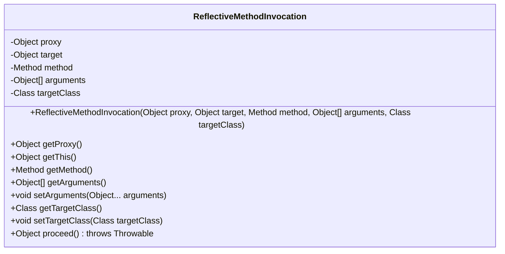

# 基础信息

|      |      |
|------|------|
| 名称 | ReflectiveMethodInvocation |
| 编码语言 | .java |
| 代码路径 | Minis/src/com/minis/aop/framework/ReflectiveMethodInvocation.java |
| 包名 | com.minis.aop.framework |
| 依赖项 | ['java.lang.reflect.Method', 'com.minis.aop.MethodInvocation'] |
| 概述说明 | ReflectiveMethodInvocation类实现方法调用，包含代理、目标、方法、参数等属性。 |

# 说明

ReflectiveMethodInvocation类用于实现方法调用，包含代理、目标、方法和参数等关键属性。该类支持对方法参数的设置，并能执行指定的方法。通过集成这些属性，ReflectiveMethodInvocation能够灵活地处理和管理方法调用过程，确保方法执行的准确性和效率。

# 类列表 Class Summary

| 名称   | 类型  | 说明 |
|-------|------|-------------|
| ReflectiveMethodInvocation | class | ReflectiveMethodInvocation类实现方法调用，包含代理、目标、方法、参数等属性，支持参数设置和方法执行。 |

## 类 ReflectiveMethodInvocation

|      |      |
|------|------|
| 访问范围 | public |
| 类型 | class |
| 名称 | ReflectiveMethodInvocation |
| 说明 | ReflectiveMethodInvocation类实现方法调用，包含代理、目标、方法、参数等属性，支持参数设置和方法执行。 |

### UML类图

这段代码定义了一个名为 `ReflectiveMethodInvocation` 的类，用于封装方法调用的相关信息，包括代理对象、目标对象、方法、参数和目标类。类中提供了获取和设置这些属性的方法，并提供了一个 `proceed` 方法，用于通过反射调用目标方法。该类主要用于在方法拦截或代理模式中，管理和执行方法调用。

### 内部方法调用关系图

```mermaid
graph TD
    A["类ReflectiveMethodInvocation"]
    B["属性: Object proxy"]
    C["属性: Object target"]
    D["属性: Method method"]
    E["属性: Object[] arguments"]
    F["属性: Class<?> targetClass"]
    G["构造方法: ReflectiveMethodInvocation(Object proxy, Object target, Method method, Object[] arguments, Class<?> targetClass)"]
    H["方法: Object getProxy()"]
    I["方法: Object getThis()"]
    J["方法: Method getMethod()"]
    K["方法: Object[] getArguments()"]
    L["方法: void setArguments(Object... arguments)"]
    M["方法: Class<?> getTargetClass()"]
    N["方法: void setTargetClass(Class<?> targetClass)"]
    O["方法: Object proceed() throws Throwable"]

    A --> B
    A --> C
    A --> D
    A --> E
    A --> F
    A --> G
    A --> H
    A --> I
    A --> J
    A --> K
    A --> L
    A --> M
    A --> N
    A --> O
```

这段代码定义了一个名为 `ReflectiveMethodInvocation` 的类，用于封装方法调用的相关信息，包括代理对象、目标对象、方法、参数和目标类。类提供了多个方法来获取和设置这些属性，并包含一个 `proceed` 方法，用于通过反射调用目标方法。该类主要用于实现方法拦截和动态代理功能，确保方法调用可以在拦截器链中传递和执行。

### 字段列表 Field List

| 名称  | 类型  | 说明 |
|-------|-------|------|
| proxy | Object | 保护性封装的最终代理对象。 |
| target | Object | 保护类型的最终目标对象。 |
| arguments | Object[] | 声明了一个受保护的对象数组变量arguments。 |
| method | Method | 受保护且不可更改的方法实例。 |
| targetClass | Class<?> | 私有变量targetClass存储目标类对象。 |

### 方法列表 Method List

| 名称  | 类型  | 说明 |
|-------|-------|------|
| getThis | Object | 该方法返回当前对象的实例。 |
| getMethod | Method | 获取当前方法的实例。 |
| setArguments | void | 设置方法参数为可变参数数组。 |
| getTargetClass | Class<?> | 获取目标类的类型信息。 |
| getProxy | Object | 方法返回当前对象的代理实例。 |
| setTargetClass | void | 设置目标类方法，将传入类赋值给目标类。 |
| proceed | Object | 该方法调用目标对象的指定方法并返回结果。 |
| getArguments | Object[] | 获取并返回当前对象的参数数组。 |

