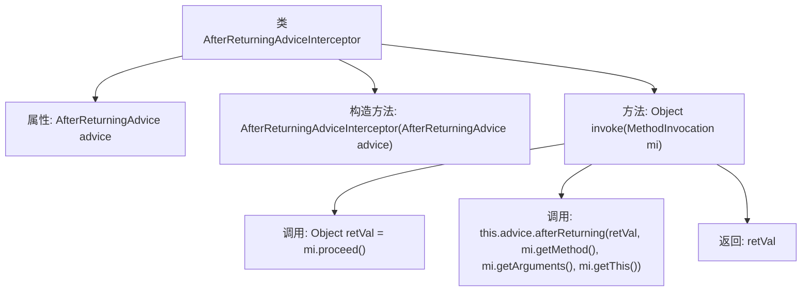

# 基础信息

|      |      |
|------|------|
| 名称 | AfterReturningAdviceInterceptor |
| 编码语言 | .java |
| 代码路径 | Minis/src/com/minis/aop/framework/adapter/AfterReturningAdviceInterceptor.java |
| 包名 | com.minis.aop.framework.adapter |
| 依赖项 | ['com.minis.aop.AfterAdvice', 'com.minis.aop.AfterReturningAdvice', 'com.minis.aop.MethodInterceptor', 'com.minis.aop.MethodInvocation'] |
| 概述说明 | AfterReturningAdviceInterceptor实现方法拦截，执行后调用返回通知。 |

# 说明

AfterReturningAdviceInterceptor是一个用于方法拦截的组件，它在目标方法执行完毕后调用返回通知。该拦截器的主要功能是在方法执行完成后，根据预定义的逻辑或规则，执行相应的通知操作。这种机制通常用于在方法返回结果后，进行额外的处理或记录，确保业务流程的完整性和可追踪性。通过这种方式，开发者可以在不修改原有方法代码的情况下，灵活地扩展和增强方法的功能。

# 类列表 Class Summary

| 名称   | 类型  | 说明 |
|-------|------|-------------|
| AfterReturningAdviceInterceptor | class | AfterReturningAdviceInterceptor实现方法拦截，执行后调用返回通知。 |


## 类 AfterReturningAdviceInterceptor

|      |      |
|------|------|
| 访问范围 | public |
| 类型 | class |
| 名称 | AfterReturningAdviceInterceptor |
| 说明 | AfterReturningAdviceInterceptor实现方法拦截，执行后调用返回通知。 |


### UML类图

```mermaid
classDiagram
    class AfterReturningAdviceInterceptor {
        -AfterReturningAdvice advice
        +AfterReturningAdviceInterceptor(AfterReturningAdvice advice)
        +Object invoke(MethodInvocation mi) throws Throwable
    }
    <<Interface>> AfterReturningAdvice {
        +void afterReturning(Object retVal, Method method, Object[] args, Object target)
    }
    <<Interface>> MethodInterceptor {
        +Object invoke(MethodInvocation mi) throws Throwable
    }
    <<Interface>> AfterAdvice {
    }
    AfterReturningAdviceInterceptor --> AfterReturningAdvice : 依赖
    AfterReturningAdviceInterceptor ..|> MethodInterceptor : 实现
    AfterReturningAdviceInterceptor ..|> AfterAdvice : 实现
```

**描述：**  
`AfterReturningAdviceInterceptor`类实现了`MethodInterceptor`和`AfterAdvice`接口，并依赖于`AfterReturningAdvice`接口。该类的主要功能是在方法调用后执行特定的操作，即在方法返回后调用`AfterReturningAdvice`的`afterReturning`方法。这种设计通常用于AOP（面向切面编程）中的后置通知，确保在方法执行后执行额外的逻辑。


### 内部方法调用关系图



这段代码定义了一个名为`AfterReturningAdviceInterceptor`的类，它实现了`MethodInterceptor`和`AfterAdvice`接口。类中包含一个`AfterReturningAdvice`类型的属性`advice`，并通过构造函数进行初始化。`invoke`方法首先调用`MethodInvocation`的`proceed`方法获取返回值，然后调用`advice`的`afterReturning`方法，最后返回获取的返回值。该代码主要用于在方法执行后执行特定的逻辑。

### 字段列表 Field List

| 名称  | 类型  | 说明 |
|-------|-------|------|
| advice | AfterReturningAdvice | 私有最终返回后通知对象。 |

### 方法列表 Method List

| 名称  | 类型  | 说明 |
|-------|-------|------|
| invoke | Object | 方法调用后执行返回操作并通知后续处理。 |


