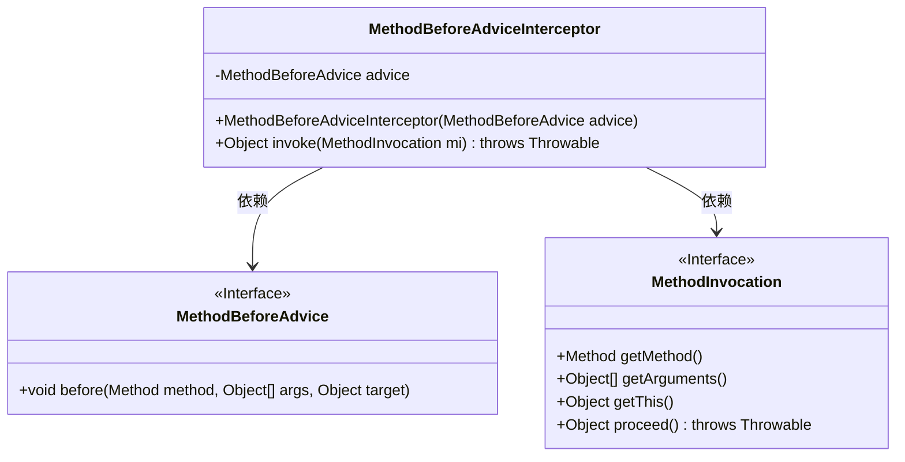
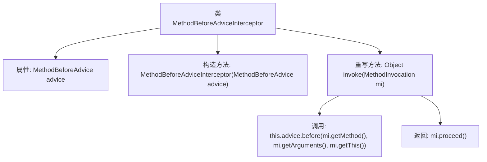

# 基础信息

|      |      |
|------|------|
| 名称 | MethodBeforeAdviceInterceptor |
| 编码语言 | .java |
| 代码路径 | Minis/src/com/minis/aop/framework/adapter/MethodBeforeAdviceInterceptor.java |
| 包名 | com.minis.aop.framework.adapter |
| 依赖项 | ['com.minis.aop.MethodBeforeAdvice', 'com.minis.aop.MethodInterceptor', 'com.minis.aop.MethodInvocation'] |
| 概述说明 | 方法前拦截器执行前置通知后继续原方法。 |

# 说明

方法前拦截器实现的主要功能是在调用原方法之前执行前置通知操作。具体来说，当某个方法被调用时，拦截器会首先触发前置通知，完成预设的逻辑或检查，然后再继续执行原方法的逻辑。这种机制通常用于在方法执行前进行权限验证、日志记录、参数校验等操作，确保方法在特定条件下安全、正确地执行。通过这种方式，拦截器可以在不修改原方法代码的情况下，灵活地扩展或控制方法的行为。

# 类列表 Class Summary

| 名称   | 类型  | 说明 |
|-------|------|-------------|
| MethodBeforeAdviceInterceptor | class | 方法前拦截器实现，调用前置通知后继续执行原方法。 |

## 类 MethodBeforeAdviceInterceptor

|      |      |
|------|------|
| 访问范围 | public |
| 类型 | class |
| 名称 | MethodBeforeAdviceInterceptor |
| 说明 | 方法前拦截器实现，调用前置通知后继续执行原方法。 |

### UML类图

这段代码展示了一个`MethodBeforeAdviceInterceptor`类，它实现了`MethodInterceptor`接口，并依赖`MethodBeforeAdvice`和`MethodInvocation`两个接口。`MethodBeforeAdviceInterceptor`的主要作用是在方法执行前调用`MethodBeforeAdvice`的`before`方法，然后继续执行原始方法。这种设计通常用于AOP（面向切面编程）中，用于在方法执行前插入额外的逻辑。

### 内部方法调用关系图

这段代码定义了一个`MethodBeforeAdviceInterceptor`类，实现了`MethodInterceptor`接口。该类包含一个`MethodBeforeAdvice`类型的属性`advice`，并通过构造函数进行初始化。在`invoke`方法中，首先调用`advice`的`before`方法，传入方法、参数和目标对象，然后继续执行原始方法的调用。该流程展示了在方法执行前插入前置通知的机制。

### 字段列表 Field List

| 名称  | 类型  | 说明 |
|-------|-------|------|
| advice | MethodBeforeAdvice | 私有成员变量advice，类型为MethodBeforeAdvice。 |

### 方法列表 Method List

| 名称  | 类型  | 说明 |
|-------|-------|------|
| invoke | Object | 重写invoke方法，调用advice.before后执行mi.proceed()。 |

