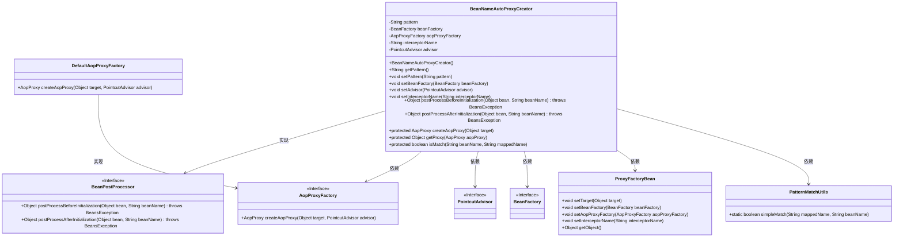

# 基础信息

|      |      |
|------|------|
| 名称 | BeanNameAutoProxyCreator |
| 编码语言 | .java |
| 代码路径 | Minis/src/com/minis/aop/framework/autoproxy/BeanNameAutoProxyCreator.java |
| 包名 | com.minis.aop.framework.autoproxy |
| 依赖项 | ['com.minis.aop.PointcutAdvisor', 'com.minis.aop.framework.AopProxy', 'com.minis.aop.framework.AopProxyFactory', 'com.minis.aop.framework.DefaultAopProxyFactory', 'com.minis.aop.framework.ProxyFactoryBean', 'com.minis.beans.BeansException', 'com.minis.beans.factory.BeanFactory', 'com.minis.beans.factory.config.BeanPostProcessor', 'com.minis.util.PatternMatchUtils'] |
| 概述说明 | BeanNameAutoProxyCreator通过模式匹配创建代理，实现BeanPostProcessor接口。 |

# 说明

BeanNameAutoProxyCreator实现了BeanPostProcessor接口，其主要功能是根据指定的模式匹配规则自动为符合条件的Bean创建代理。通过这种方式，它能够在Spring容器中动态地为匹配的Bean生成代理对象，从而实现对Bean的增强或拦截操作。这种机制常用于AOP编程，简化了代理对象的创建和管理过程。

# 类列表 Class Summary

| 名称   | 类型  | 说明 |
|-------|------|-------------|
| BeanNameAutoProxyCreator | class | BeanNameAutoProxyCreator实现BeanPostProcessor，根据模式匹配创建代理。 |

## 类 BeanNameAutoProxyCreator

|      |      |
|------|------|
| 访问范围 | public |
| 类型 | class |
| 名称 | BeanNameAutoProxyCreator |
| 说明 | BeanNameAutoProxyCreator实现BeanPostProcessor，根据模式匹配创建代理。 |

### UML类图

### 描述
`BeanNameAutoProxyCreator` 是一个实现了 `BeanPostProcessor` 接口的类，用于在 Spring 容器中根据 Bean 的名称自动创建代理。它依赖于 `AopProxyFactory`、`PointcutAdvisor`、`BeanFactory` 等接口，并使用 `ProxyFactoryBean` 来创建代理对象。`DefaultAopProxyFactory` 是 `AopProxyFactory` 的一个实现类，用于创建 AOP 代理。`PatternMatchUtils` 提供了简单的模式匹配功能，用于判断 Bean 名称是否符合指定的模式。

### 内部方法调用关系图

```mermaid
graph TD
    A["类BeanNameAutoProxyCreator"]
    B["属性: String pattern"]
    C["属性: BeanFactory beanFactory"]
    D["属性: AopProxyFactory aopProxyFactory"]
    E["属性: String interceptorName"]
    F["属性: PointcutAdvisor advisor"]
    G["构造方法: BeanNameAutoProxyCreator()"]
    H["方法: String getPattern()"]
    I["方法: void setPattern(String pattern)"]
    J["方法: void setBeanFactory(BeanFactory beanFactory)"]
    K["方法: void setAdvisor(PointcutAdvisor advisor)"]
    L["方法: void setInterceptorName(String interceptorName)"]
    M["方法: Object postProcessBeforeInitialization(Object bean, String beanName)"]
    N["方法: AopProxy createAopProxy(Object target)"]
    O["方法: Object getProxy(AopProxy aopProxy)"]
    P["方法: Object postProcessAfterInitialization(Object bean, String beanName)"]
    Q["方法: boolean isMatch(String beanName, String mappedName)"]

    A --> B
    A --> C
    A --> D
    A --> E
    A --> F
    A --> G
    A --> H
    A --> I
    A --> J
    A --> K
    A --> L
    A --> M
    A --> N
    A --> O
    A --> P
    A --> Q
```

该流程图展示了`BeanNameAutoProxyCreator`类的结构及其内部方法之间的关系。该类实现了`BeanPostProcessor`接口，用于在Spring容器中创建和管理Bean的代理。它包含多个属性，如`pattern`、`beanFactory`、`aopProxyFactory`等，并提供了构造方法和多个setter方法。核心方法`postProcessBeforeInitialization`用于在Bean初始化前创建代理，而`isMatch`方法用于匹配Bean名称与模式。

### 字段列表 Field List

| 名称  | 类型  | 说明 |
|-------|-------|------|
| pattern | String | 定义字符串模式变量。 |
| beanFactory | BeanFactory | 私有BeanFactory类型的beanFactory变量。 |
| advisor | PointcutAdvisor | 声明一个私有切面顾问对象。 |
| aopProxyFactory | AopProxyFactory | 私有属性AopProxyFactory用于AOP代理工厂。 |
| interceptorName | String | 定义了私有字符串变量interceptorName。 |

### 方法列表 Method List

| 名称  | 类型  | 说明 |
|-------|-------|------|
| getPattern | String | 获取字符串模式的公共方法。 |
| setAdvisor | void | 设置切面顾问对象。 |
| setInterceptorName | void | 设置拦截器名称的方法。 |
| getProxy | Object | 该方法通过AopProxy对象获取并返回代理实例。 |
| postProcessAfterInitialization | Object | 该方法在初始化后处理Bean对象并返回null。 |
| createAopProxy | AopProxy | 方法`createAopProxy`通过工厂创建AOP代理对象。 |
| setBeanFactory | void | 重写setBeanFactory方法，将beanFactory赋值给当前对象。 |
| setPattern | void | 设置模式字符串的方法。 |
| postProcessBeforeInitialization | Object | 在初始化前处理bean，匹配时创建代理并返回，否则返回原bean。 |
| isMatch | boolean | 方法isMatch比较beanName与mappedName，返回匹配结果。 |

