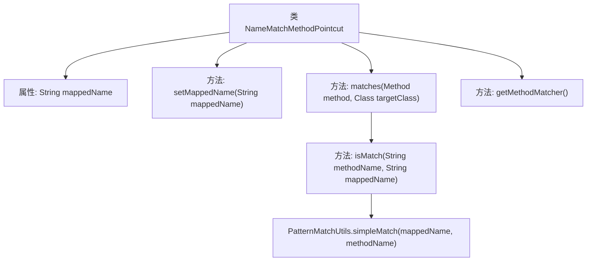

# 基础信息

|      |      |
|------|------|
| 名称 | NameMatchMethodPointcut |
| 编码语言 | .java |
| 代码路径 | Minis/src/com/minis/aop/support/NameMatchMethodPointcut.java |
| 包名 | com.minis.aop.support |
| 依赖项 | ['java.lang.reflect.Method', 'com.minis.aop.MethodMatcher', 'com.minis.aop.Pointcut', 'com.minis.util.PatternMatchUtils'] |
| 概述说明 | 类NameMatchMethodPointcut通过方法名匹配实现MethodMatcher和Pointcut接口。 |

# 说明

类NameMatchMethodPointcut实现了MethodMatcher和Pointcut接口，其主要功能是通过匹配方法名来判断是否与特定条件相符。该类通过方法名的匹配来确定是否满足切点的要求，从而实现方法级别的筛选和匹配。

# 类列表 Class Summary

| 名称   | 类型  | 说明 |
|-------|------|-------------|
| NameMatchMethodPointcut | class | 类NameMatchMethodPointcut实现MethodMatcher和Pointcut接口，通过匹配方法名判断是否匹配。 |


## 类 NameMatchMethodPointcut

|      |      |
|------|------|
| 访问范围 | public |
| 类型 | class |
| 名称 | NameMatchMethodPointcut |
| 说明 | 类NameMatchMethodPointcut实现MethodMatcher和Pointcut接口，通过匹配方法名判断是否匹配。 |


### UML类图

```mermaid
classDiagram
    class NameMatchMethodPointcut {
        -String mappedName
        +setMappedName(String mappedName)
        +matches(Method method, Class~?~ targetClass) boolean
        #isMatch(String methodName, String mappedName) boolean
        +getMethodMatcher() MethodMatcher
    }
    <<Interface>> MethodMatcher {
        +matches(Method method, Class~?~ targetClass) boolean
    }
    <<Interface>> Pointcut {
        +getMethodMatcher() MethodMatcher
    }
    NameMatchMethodPointcut --> MethodMatcher : 实现
    NameMatchMethodPointcut --> Pointcut : 实现
```

这段代码定义了一个名为 `NameMatchMethodPointcut` 的类，该类实现了 `MethodMatcher` 和 `Pointcut` 接口。`NameMatchMethodPointcut` 类包含一个私有字段 `mappedName`，用于存储匹配的方法名。类中提供了 `setMappedName` 方法来设置 `mappedName`，并通过 `matches` 方法检查传入的方法名是否与 `mappedName` 匹配。`isMatch` 方法用于执行实际的匹配逻辑，而 `getMethodMatcher` 方法返回当前的 `MethodMatcher` 实例。


### 内部方法调用关系图



这段代码定义了一个名为 `NameMatchMethodPointcut` 的类，该类实现了 `MethodMatcher` 和 `Pointcut` 接口。类中包含一个属性 `mappedName`，用于存储方法名称的匹配模式。`matches` 方法用于判断给定的方法是否与 `mappedName` 匹配，它调用了 `isMatch` 方法，后者使用 `PatternMatchUtils.simpleMatch` 进行实际的匹配逻辑。`getMethodMatcher` 方法返回当前对象本身，表明该类本身就是一个方法匹配器。整体逻辑围绕方法名称的匹配展开，适用于需要根据方法名称进行筛选的场景。

### 字段列表 Field List

| 名称  | 类型  | 说明 |
|-------|-------|------|
| mappedName = "" | String | 定义了一个私有字符串变量mappedName并初始化为空。 |

### 方法列表 Method List

| 名称  | 类型  | 说明 |
|-------|-------|------|
| setMappedName | void | 设置映射名称的方法。 |
| getMethodMatcher | MethodMatcher | 重写getMethodMatcher方法，返回当前对象。 |
| isMatch | boolean | 方法isMatch检查methodName是否与mappedName匹配，使用PatternMatchUtils.simpleMatch实现。 |
| matches | boolean | 方法匹配目标类，名称一致或符合匹配规则返回真。 |


