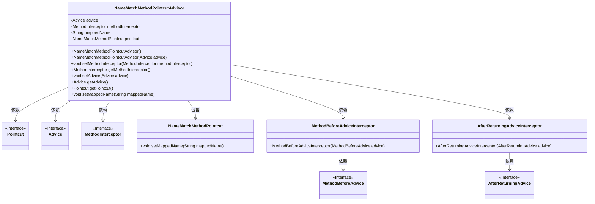
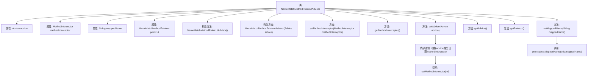

# 基础信息

|      |      |
|------|------|
| 名称 | NameMatchMethodPointcutAdvisor |
| 编码语言 | .java |
| 代码路径 | Minis/src/com/minis/aop/support/NameMatchMethodPointcutAdvisor.java |
| 包名 | com.minis.aop.support |
| 依赖项 | ['com.minis.aop.Advice', 'com.minis.aop.AfterAdvice', 'com.minis.aop.AfterReturningAdvice', 'com.minis.aop.BeforeAdvice', 'com.minis.aop.MethodBeforeAdvice', 'com.minis.aop.MethodInterceptor', 'com.minis.aop.Pointcut', 'com.minis.aop.PointcutAdvisor', 'com.minis.aop.framework.adapter.AfterReturningAdviceInterceptor', 'com.minis.aop.framework.adapter.MethodBeforeAdviceInterceptor'] |
| 概述说明 | 类实现PointcutAdvisor，管理Advice和MethodInterceptor，支持方法名前匹配。 |

# 说明

该内容描述了一个类实现了PointcutAdvisor接口，用于管理Advice和MethodInterceptor。该类支持基于方法名称的前缀匹配功能，允许根据方法名的前缀来筛选和处理特定的方法。这种设计使得在AOP（面向切面编程）中能够更灵活地定义和应用切面逻辑，提升代码的可维护性和可扩展性。

# 类列表 Class Summary

| 名称   | 类型  | 说明 |
|-------|------|-------------|
| NameMatchMethodPointcutAdvisor | class | 类实现PointcutAdvisor，管理Advice和MethodInterceptor，支持方法名前匹配。 |

## 类 NameMatchMethodPointcutAdvisor

|      |      |
|------|------|
| 访问范围 | public |
| 类型 | class |
| 名称 | NameMatchMethodPointcutAdvisor |
| 说明 | 类实现PointcutAdvisor，管理Advice和MethodInterceptor，支持方法名前匹配。 |

### UML类图

**描述：**  
`NameMatchMethodPointcutAdvisor` 类实现了 `PointcutAdvisor` 接口，用于根据方法名称匹配来提供建议（Advice）和切入点（Pointcut）。该类包含了对 `Advice`、`MethodInterceptor` 和 `NameMatchMethodPointcut` 的依赖，并根据不同的 `Advice` 类型（如 `BeforeAdvice`、`AfterAdvice` 或 `MethodInterceptor`）来设置相应的拦截器。`NameMatchMethodPointcut` 类用于设置匹配的方法名称。

### 内部方法调用关系图

这段代码定义了一个名为`NameMatchMethodPointcutAdvisor`的类，该类实现了`PointcutAdvisor`接口。类中包含多个属性和方法，用于管理和设置`Advice`、`MethodInterceptor`以及`NameMatchMethodPointcut`。`setAdvice`方法根据传入的`Advice`类型设置相应的`MethodInterceptor`，而`setMappedName`方法则用于设置`mappedName`并更新`pointcut`。整体流程清晰，逻辑严谨，适用于AOP（面向切面编程）场景。

### 字段列表 Field List

| 名称  | 类型  | 说明 |
|-------|-------|------|
| advice = null | Advice | 私有变量advice初始化为null。 |
| mappedName | String | 定义了私有字符串变量mappedName。 |
| pointcut = new NameMatchMethodPointcut() | NameMatchMethodPointcut | 创建了NameMatchMethodPointcut实例并赋值给pointcut变量。 |
| methodInterceptor | MethodInterceptor | 私有方法拦截器变量methodInterceptor。 |

### 方法列表 Method List

| 名称  | 类型  | 说明 |
|-------|-------|------|
| getPointcut | Pointcut | 重写方法，返回Pointcut对象。 |
| setMethodInterceptor | void | 设置方法拦截器实例。 |
| setAdvice | void | 根据建议类型设置相应的方法拦截器。 |
| setMappedName | void | 设置映射名称并更新切点。 |
| getMethodInterceptor | MethodInterceptor | 获取当前方法拦截器实例。 |
| getAdvice | Advice | 重写getAdvice方法，返回当前advice对象。 |

