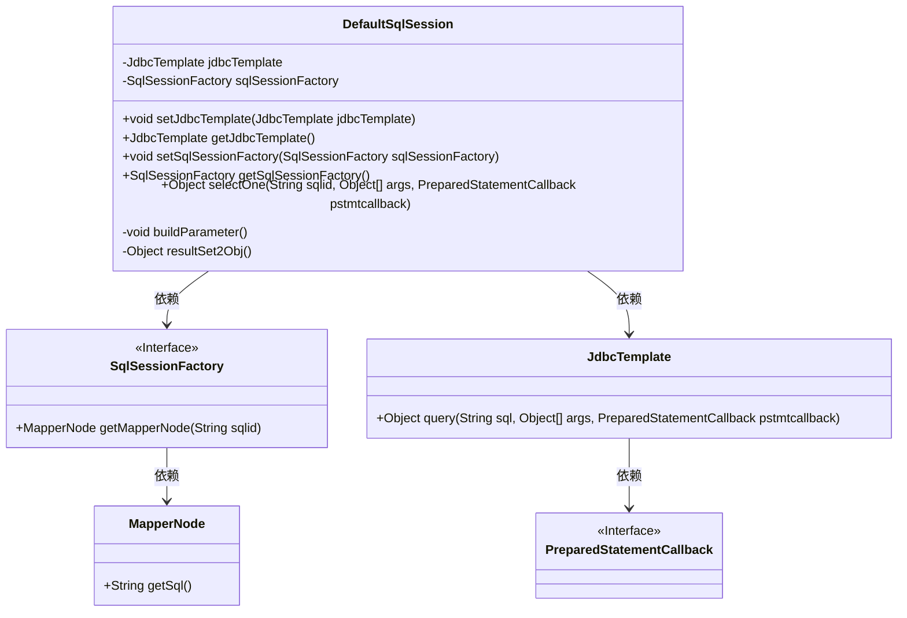
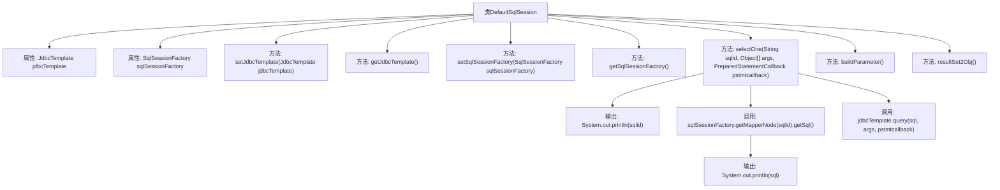

# 基础信息

|      |      |
|------|------|
| 名称 | DefaultSqlSession |
| 编码语言 | .java |
| 代码路径 | Minis/src/com/minis/batis/DefaultSqlSession.java |
| 包名 | com.minis.batis |
| 依赖项 | ['javax.sql.DataSource', 'com.minis.jdbc.core.JdbcTemplate', 'com.minis.jdbc.core.PreparedStatementCallback'] |
| 概述说明 | DefaultSqlSession实现SqlSession接口，包含JdbcTemplate和SqlSessionFactory的设置与获取方法，支持selectOne查询。 |

# 说明

DefaultSqlSession实现了SqlSession接口，具备设置和获取JdbcTemplate与SqlSessionFactory的功能，同时实现了selectOne查询方法，用于执行单一查询操作。

# 类列表 Class Summary

| 名称   | 类型  | 说明 |
|-------|------|-------------|
| DefaultSqlSession | class | DefaultSqlSession实现SqlSession接口，包含JdbcTemplate和SqlSessionFactory的设置与获取方法，并实现selectOne查询功能。 |

## 类 DefaultSqlSession

|      |      |
|------|------|
| 访问范围 | public |
| 类型 | class |
| 名称 | DefaultSqlSession |
| 说明 | DefaultSqlSession实现SqlSession接口，包含JdbcTemplate和SqlSessionFactory的设置与获取方法，并实现selectOne查询功能。 |

### UML类图

### 描述
`DefaultSqlSession` 类实现了 `SqlSession` 接口，负责处理SQL会话操作。它依赖于 `SqlSessionFactory` 来获取SQL映射节点，并通过 `JdbcTemplate` 执行SQL查询。`SqlSessionFactory` 是一个接口，提供了获取 `MapperNode` 的方法，`MapperNode` 则包含了SQL语句的具体信息。`JdbcTemplate` 负责执行SQL查询，并依赖于 `PreparedStatementCallback` 来处理预编译语句的回调逻辑。整体设计体现了依赖注入和接口隔离原则，确保了代码的可扩展性和可维护性。

### 内部方法调用关系图

这段代码定义了一个名为 `DefaultSqlSession` 的类，该类包含两个主要属性：`jdbcTemplate` 和 `sqlSessionFactory`，并提供了相应的设置和获取方法。类中的 `selectOne` 方法用于执行 SQL 查询，首先通过 `sqlSessionFactory` 获取 SQL 语句，然后使用 `jdbcTemplate` 执行查询并返回结果。此外，类中还包含两个私有方法 `buildParameter` 和 `resultSet2Obj`，但它们的实现为空。

### 字段列表 Field List

| 名称  | 类型  | 说明 |
|-------|-------|------|
| jdbcTemplate | JdbcTemplate | JdbcTemplate用于简化JDBC操作。 |
| sqlSessionFactory | SqlSessionFactory | SqlSessionFactory是MyBatis框架中用于创建SqlSession的核心接口。 |

### 方法列表 Method List

| 名称  | 类型  | 说明 |
|-------|-------|------|
| resultSet2Obj | Object | 方法resultSet2Obj返回空值。 |
| buildParameter | void | 该方法为空，未实现任何功能。 |
| getJdbcTemplate | JdbcTemplate | 获取JdbcTemplate实例的方法。 |
| setJdbcTemplate | void | 该方法用于设置JdbcTemplate实例。 |
| selectOne | Object | 方法通过SQL ID获取SQL语句并执行查询。 |
| setSqlSessionFactory | void | 设置SQL会话工厂实例。 |
| getSqlSessionFactory | SqlSessionFactory | 获取SQL会话工厂实例。 |

