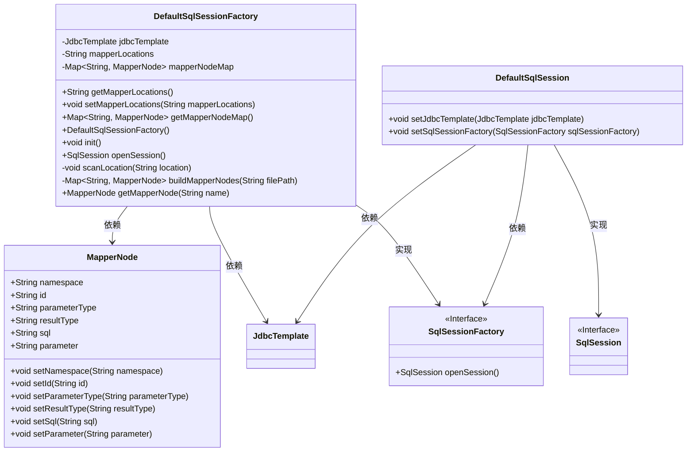
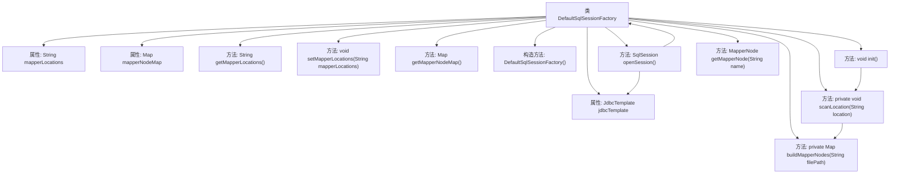

# 基础信息

|      |      |
|------|------|
| 名称 | DefaultSqlSessionFactory |
| 编码语言 | .java |
| 代码路径 | Minis/src/com/minis/batis/DefaultSqlSessionFactory.java |
| 包名 | com.minis.batis |
| 依赖项 | ['java.io.File', 'java.net.URL', 'java.util.ArrayList', 'java.util.HashMap', 'java.util.Iterator', 'java.util.List', 'java.util.Map', 'javax.sql.DataSource', 'org.dom4j.Document', 'org.dom4j.Element', 'org.dom4j.io.SAXReader', 'com.minis.beans.factory.annotation.Autowired', 'com.minis.jdbc.core.JdbcTemplate'] |
| 概述说明 | DefaultSqlSessionFactory实现SqlSessionFactory，管理Mapper节点并初始化扫描路径。 |

# 说明

DefaultSqlSessionFactory实现了SqlSessionFactory接口，负责管理Mapper节点并初始化扫描路径。该实现类的主要功能是确保Mapper节点被正确加载和配置，同时处理与数据库会话相关的初始化工作，以便应用程序能够顺利执行SQL操作。

# 类列表 Class Summary

| 名称   | 类型  | 说明 |
|-------|------|-------------|
| DefaultSqlSessionFactory | class | DefaultSqlSessionFactory实现SqlSessionFactory，管理Mapper节点并初始化扫描路径。 |

## 类 DefaultSqlSessionFactory

|      |      |
|------|------|
| 访问范围 | public |
| 类型 | class |
| 名称 | DefaultSqlSessionFactory |
| 说明 | DefaultSqlSessionFactory实现SqlSessionFactory，管理Mapper节点并初始化扫描路径。 |

### UML类图

**描述：**  
`DefaultSqlSessionFactory` 类实现了 `SqlSessionFactory` 接口，负责创建和管理 `SqlSession` 实例。它依赖于 `JdbcTemplate` 来执行数据库操作，并通过 `mapperNodeMap` 存储 `MapperNode` 对象，这些对象代表 SQL 映射信息。`DefaultSqlSession` 是 `SqlSession` 接口的实现类，用于执行具体的 SQL 操作。整个类图展示了 SQL 会话工厂、会话、映射节点和数据库模板之间的依赖和实现关系。

### 内部方法调用关系图

这段代码定义了一个 `DefaultSqlSessionFactory` 类，用于管理 SQL 会话和映射器节点。类中包含多个方法和属性，如 `jdbcTemplate`、`mapperLocations` 和 `mapperNodeMap`。`init` 方法用于初始化映射器节点，`openSession` 方法用于创建新的 SQL 会话。`scanLocation` 和 `buildMapperNodes` 方法用于扫描和构建映射器节点。整个流程通过递归扫描文件路径并解析 XML 文件来构建映射器节点，最终存储在 `mapperNodeMap` 中。

### 字段列表 Field List

| 名称  | 类型  | 说明 |
|-------|-------|------|
| jdbcTemplate | JdbcTemplate | 自动装配JdbcTemplate实例。 |
| mapperNodeMap = new HashMap<>() | Map<String,MapperNode> | 创建了一个键为String、值为MapperNode的HashMap对象。 |
| mapperLocations | String | 配置字符串映射器位置。 |

### 方法列表 Method List

| 名称  | 类型  | 说明 |
|-------|-------|------|
| getMapperNode | MapperNode | 获取指定名称的MapperNode对象。 |
| getMapperNodeMap | Map<String, MapperNode> | 获取映射节点映射表的方法。 |
| buildMapperNodes | Map<String, MapperNode> | 解析XML文件，构建MapperNode对象并存入Map。 |
| openSession | SqlSession | 重写openSession方法，创建并配置DefaultSqlSession实例后返回。 |
| scanLocation | void | 扫描指定路径，递归处理目录，构建映射节点。 |
| setMapperLocations | void | 设置映射文件路径的方法。 |
| init | void | 初始化方法扫描位置并遍历映射节点输出键值对。 |
| getMapperLocations | String | 该方法返回mapperLocations的值。 |

