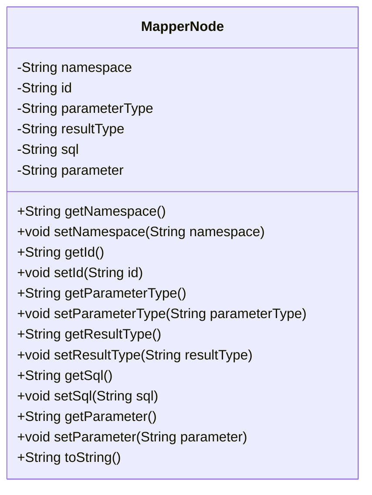

# 基础信息

|      |      |
|------|------|
| 名称 | MapperNode |
| 编码语言 | .java |
| 代码路径 | Minis/src/com/minis/batis/MapperNode.java |
| 包名 | com.minis.batis |
| 依赖项 | [] |
| 概述说明 | MapperNode类含命名空间、ID、参数类型、结果类型、SQL语句及参数属性，提供getter和setter方法。 |

# 说明

MapperNode类是一个用于映射数据库操作的类，包含多个关键属性及其对应的getter和setter方法。这些属性包括命名空间，用于标识映射的上下文；ID，用于唯一标识映射节点；参数类型，定义传入参数的数据类型；结果类型，定义返回结果的数据类型；SQL语句，用于执行具体的数据库操作；以及参数，用于存储传递给SQL语句的具体值。通过getter和setter方法，可以对这些属性进行读取和修改，从而灵活地配置和管理数据库映射操作。

# 类列表 Class Summary

| 名称   | 类型  | 说明 |
|-------|------|-------------|
| MapperNode | class | MapperNode类包含命名空间、ID、参数类型、结果类型、SQL语句和参数等属性及其getter和setter方法。 |

## 类 MapperNode

|      |      |
|------|------|
| 访问范围 | public |
| 类型 | class |
| 名称 | MapperNode |
| 说明 | MapperNode类包含命名空间、ID、参数类型、结果类型、SQL语句和参数等属性及其getter和setter方法。 |

### UML类图

这段代码定义了一个名为 `MapperNode` 的类，该类主要用于映射SQL语句的相关信息。类中包含多个私有属性，如 `namespace`、`id`、`parameterType`、`resultType`、`sql` 和 `parameter`，并为每个属性提供了对应的 `getter` 和 `setter` 方法。此外，类中还重写了 `toString` 方法，用于返回该对象的字符串表示形式。这个类通常用于ORM框架中，用于封装SQL映射的元数据。

### 内部方法调用关系图

```mermaid
graph TD
    A["类MapperNode"]
    B["属性: String namespace"]
    C["属性: String id"]
    D["属性: String parameterType"]
    E["属性: String resultType"]
    F["属性: String sql"]
    G["属性: String parameter"]
    H["方法: String getNamespace()"]
    I["方法: void setNamespace(String namespace)"]
    J["方法: String getId()"]
    K["方法: void setId(String id)"]
    L["方法: String getParameterType()"]
    M["方法: void setParameterType(String parameterType)"]
    N["方法: String getResultType()"]
    O["方法: void setResultType(String resultType)"]
    P["方法: String getSql()"]
    Q["方法: void setSql(String sql)"]
    R["方法: String getParameter()"]
    S["方法: void setParameter(String parameter)"]
    T["方法: String toString()"]

    A --> B
    A --> C
    A --> D
    A --> E
    A --> F
    A --> G
    A --> H
    A --> I
    A --> J
    A --> K
    A --> L
    A --> M
    A --> N
    A --> O
    A --> P
    A --> Q
    A --> R
    A --> S
    A --> T
```

这段代码定义了一个名为`MapperNode`的类，包含了多个属性和方法。属性包括`namespace`、`id`、`parameterType`、`resultType`、`sql`和`parameter`，分别用于存储命名空间、标识符、参数类型、结果类型、SQL语句和参数。类中还定义了这些属性的getter和setter方法，以及一个`toString`方法，用于返回对象的字符串表示。该类的设计主要用于管理和操作与SQL映射相关的数据。

### 字段列表 Field List

| 名称  | 类型  | 说明 |
|-------|-------|------|
| namespace | String | 定义了一个名为`namespace`的字符串变量。 |
| parameter | String | 字符串参数。 |
| sql | String | SQL语句变量声明。 |
| parameterType | String | 参数类型为字符串。 |
| id | String | 包含一个字符串类型的变量id。 |
| resultType | String | 结果类型为字符串。 |

### 方法列表 Method List

| 名称  | 类型  | 说明 |
|-------|-------|------|
| getSql | String | 获取SQL字符串的方法。 |
| getNamespace | String | 该方法返回命名空间字符串。 |
| setSql | void | 设置SQL语句的公共方法。 |
| getParameterType | String | 该方法返回参数类型。 |
| getResultType | String | 该方法返回结果类型字符串。 |
| setParameter | void | 设置类成员变量parameter的值。 |
| setResultType | void | 设置结果类型的方法，参数为字符串类型。 |
| setParameterType | void | 设置参数类型的方法，将传入值赋给类成员变量。 |
| toString | String | 返回格式为"命名空间.标识符 : SQL语句"的字符串。 |
| getId | String | 获取ID的字符串方法。 |
| setNamespace | void | 设置类成员变量namespace的值。 |
| setId | void | 设置对象的ID属性。 |
| getParameter | String | 该方法返回字符串类型的参数值。 |

