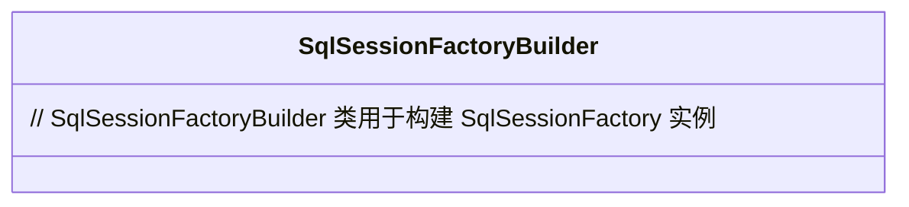
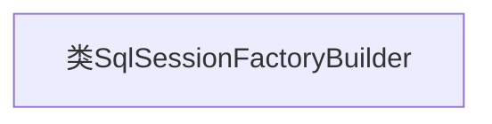

# 基础信息

|      |      |
|------|------|
| 名称 | SqlSessionFactoryBuilder |
| 编码语言 | .java |
| 代码路径 | Minis/src/com/minis/batis/SqlSessionFactoryBuilder.java |
| 包名 | com.minis.batis |
| 依赖项 | [] |
| 概述说明 | SqlSessionFactoryBuilder类用于构建SqlSessionFactory。 |

# 说明

SqlSessionFactoryBuilder是一个用于构建SqlSessionFactory的类，其主要功能是通过解析配置信息或代码来创建SqlSessionFactory实例。该类通常用于初始化MyBatis框架的核心组件，确保应用程序能够高效地管理与数据库的交互。通过SqlSessionFactoryBuilder，开发者可以灵活地配置数据源、事务管理、映射文件等关键参数，从而生成适合特定应用需求的SqlSessionFactory对象。

# 类列表 Class Summary

| 名称   | 类型  | 说明 |
|-------|------|-------------|
| SqlSessionFactoryBuilder | class | SqlSessionFactoryBuilder是用于构建SqlSessionFactory的类。 |

## 类 SqlSessionFactoryBuilder

|      |      |
|------|------|
| 访问范围 | public |
| 类型 | class |
| 名称 | SqlSessionFactoryBuilder |
| 说明 | SqlSessionFactoryBuilder是用于构建SqlSessionFactory的类。 |

### UML类图

SqlSessionFactoryBuilder 是一个用于构建 SqlSessionFactory 实例的类。它通常用于配置和初始化 MyBatis 框架中的 SqlSessionFactory，后者是 MyBatis 的核心组件之一，负责创建 SqlSession 对象。SqlSessionFactoryBuilder 类的主要作用是通过解析配置文件或直接传入的参数来构建 SqlSessionFactory 实例，从而为应用程序提供数据库会话管理功能。

### 内部方法调用关系图

该流程图展示了`SqlSessionFactoryBuilder`类的基本结构。该类目前为空，未定义任何属性或方法。在后续开发中，可以根据需要添加构造方法、成员变量和方法，以构建SQL会话工厂。

### 字段列表 Field List

| 名称  | 类型  | 说明 |
|-------|-------|------|

### 方法列表 Method List

| 名称  | 类型  | 说明 |
|-------|-------|------|

