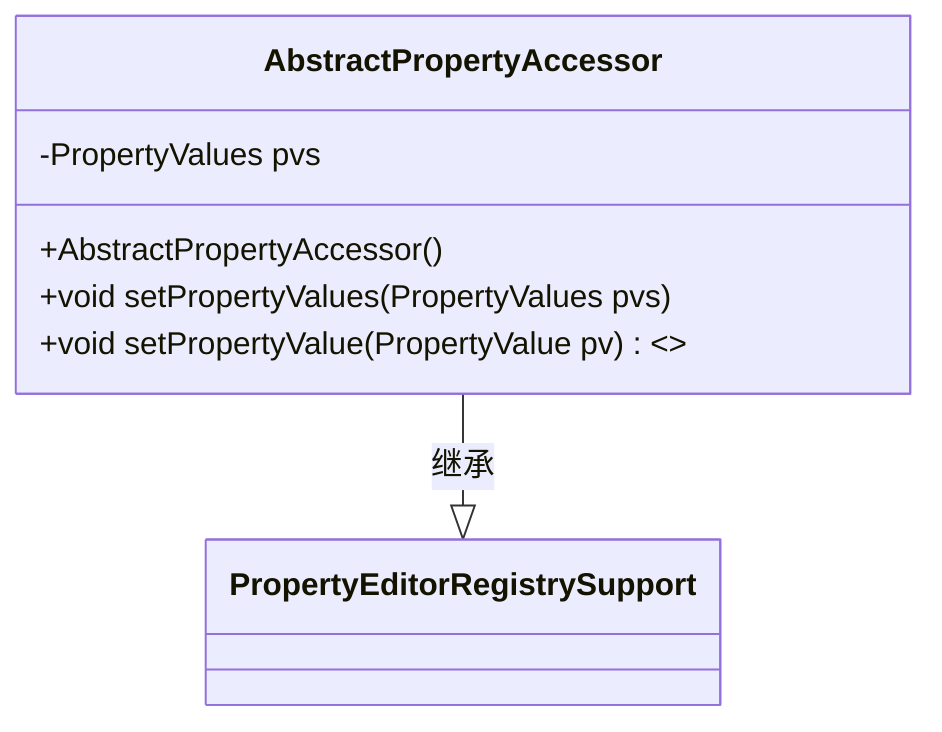
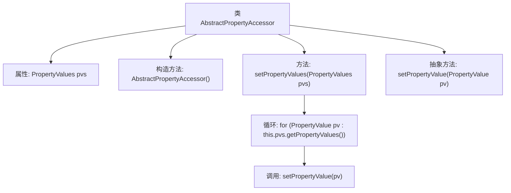

# 基础信息

|      |      |
|------|------|
| 名称 | AbstractPropertyAccessor |
| 编码语言 | .java |
| 代码路径 | Minis/src/com/minis/beans/AbstractPropertyAccessor.java |
| 包名 | com.minis.beans |
| 依赖项 | ['java.lang.reflect.Field', 'java.lang.reflect.InvocationTargetException', 'java.lang.reflect.Method'] |
| 概述说明 | AbstractPropertyAccessor继承PropertyEditorRegistrySupport，用于设置和处理属性值。 |

# 说明

抽象类AbstractPropertyAccessor继承自PropertyEditorRegistrySupport，主要负责设置和处理属性值。该类通过继承PropertyEditorRegistrySupport，具备了属性编辑器注册和管理的功能，能够有效地处理属性值的设置和转换。AbstractPropertyAccessor的设计旨在提供一个通用的基础结构，便于子类实现具体的属性访问和操作逻辑。

# 类列表 Class Summary

| 名称   | 类型  | 说明 |
|-------|------|-------------|
| AbstractPropertyAccessor | class | 抽象类AbstractPropertyAccessor继承PropertyEditorRegistrySupport，设置并处理属性值。 |

## 类 AbstractPropertyAccessor

|      |      |
|------|------|
| 访问范围 | public abstract |
| 类型 | class |
| 名称 | AbstractPropertyAccessor |
| 说明 | 抽象类AbstractPropertyAccessor继承PropertyEditorRegistrySupport，设置并处理属性值。 |

### UML类图

**描述：**  
`AbstractPropertyAccessor` 是一个抽象类，继承自 `PropertyEditorRegistrySupport`。它包含一个 `PropertyValues` 类型的私有成员 `pvs`，并提供了一个构造函数 `AbstractPropertyAccessor()`。该类还定义了一个公有方法 `setPropertyValues(PropertyValues pvs)`，用于设置 `pvs` 并遍历其中的 `PropertyValue` 对象，调用抽象方法 `setPropertyValue(PropertyValue pv)`。`setPropertyValue` 是一个抽象方法，需要在子类中实现。

### 内部方法调用关系图

这段代码定义了一个抽象类 `AbstractPropertyAccessor`，它继承自 `PropertyEditorRegistrySupport`。类中包含一个属性 `pvs`，一个构造方法，以及一个用于设置属性值的方法 `setPropertyValues`。该方法遍历传入的 `PropertyValues` 对象中的每个 `PropertyValue`，并调用抽象方法 `setPropertyValue` 来设置每个属性值。抽象方法 `setPropertyValue` 需要由子类实现，以提供具体的属性设置逻辑。

### 字段列表 Field List

| 名称  | 类型  | 说明 |
|-------|-------|------|
| pvs | PropertyValues | PropertyValues pvs; 定义了一个PropertyValues类型的变量pvs。 |

### 方法列表 Method List

| 名称  | 类型  | 说明 |
|-------|-------|------|
| setPropertyValue | void | 抽象方法，用于设置属性值。 |
| setPropertyValues | void | 设置属性值并逐个处理每个属性值。 |

