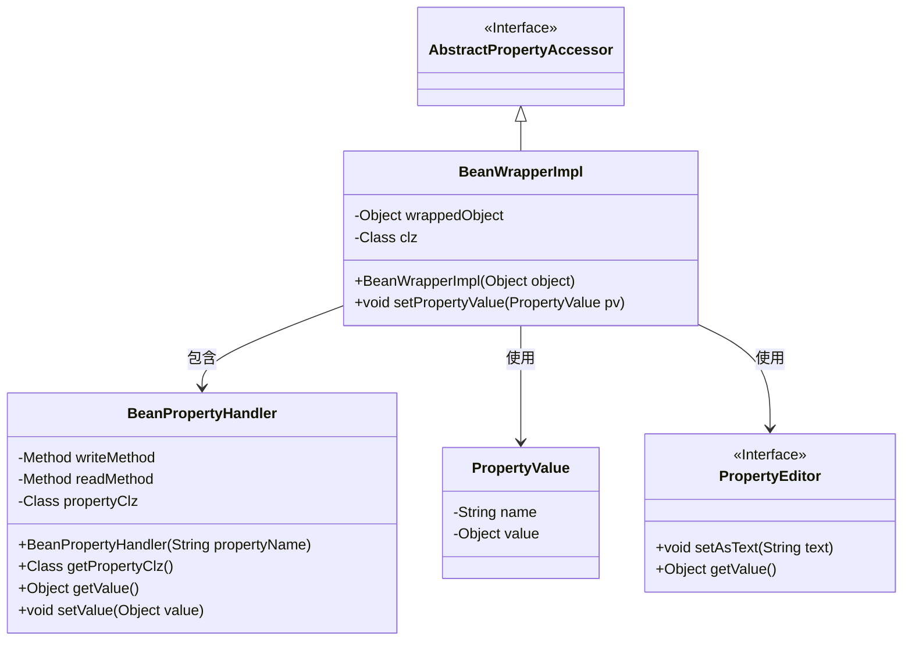
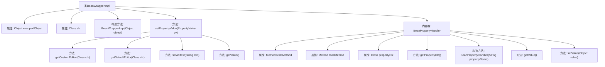

# 基础信息

|      |      |
|------|------|
| 名称 | BeanWrapperImpl |
| 编码语言 | .java |
| 代码路径 | Minis/src/com/minis/beans/BeanWrapperImpl.java |
| 包名 | com.minis.beans |
| 依赖项 | ['java.lang.reflect.Field', 'java.lang.reflect.InvocationTargetException', 'java.lang.reflect.Method'] |
| 概述说明 | BeanWrapperImpl类封装对象，支持属性设置与自定义编辑器。 |

# 说明

BeanWrapperImpl类是一个用于封装对象的工具，主要用于处理对象的属性设置。它允许开发人员通过自定义编辑器来灵活地管理和修改对象的属性值。该类提供了一种机制，使得在设置属性时可以进行更精细的控制和定制，从而满足不同的业务需求。通过使用BeanWrapperImpl，开发人员可以更方便地操作对象的属性，并确保属性设置过程的准确性和一致性。

# 类列表 Class Summary

| 名称   | 类型  | 说明 |
|-------|------|-------------|
| BeanWrapperImpl | class | BeanWrapperImpl类封装对象并处理属性设置，支持自定义编辑器。 |

## 类 BeanWrapperImpl

|      |      |
|------|------|
| 访问范围 | public |
| 类型 | class |
| 名称 | BeanWrapperImpl |
| 说明 | BeanWrapperImpl类封装对象并处理属性设置，支持自定义编辑器。 |

### UML类图

这段代码定义了一个 `BeanWrapperImpl` 类，它继承自 `AbstractPropertyAccessor` 接口，并包含一个内部类 `BeanPropertyHandler`。`BeanWrapperImpl` 类用于包装一个对象，并通过 `setPropertyValue` 方法设置对象的属性值。`BeanPropertyHandler` 类负责处理属性的读写操作，通过反射机制获取和设置属性值。`PropertyValue` 类用于存储属性的名称和值，`PropertyEditor` 接口用于编辑属性值。

### 内部方法调用关系图

这段代码定义了一个`BeanWrapperImpl`类，用于包装一个对象并处理其属性的设置和获取。`BeanWrapperImpl`类继承自`AbstractPropertyAccessor`，包含一个内部类`BeanPropertyHandler`，用于处理具体属性的读写操作。`setPropertyValue`方法根据属性名和值，通过`BeanPropertyHandler`和`PropertyEditor`来设置属性值。流程图中展示了类之间的关系和方法的调用顺序。

### 字段列表 Field List

| 名称  | 类型  | 说明 |
|-------|-------|------|
| wrappedObject | Object | 对象封装实例。 |
| clz | Class<?> | 定义了一个Class类型的变量clz。 |

### 方法列表 Method List

| 名称  | 类型  | 说明 |
|-------|-------|------|
| setPropertyValue | void | 方法设置属性值，优先使用自定义编辑器，否则使用默认编辑器，最后更新属性值。 |

