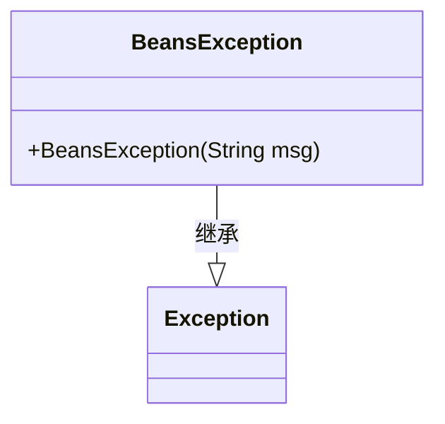
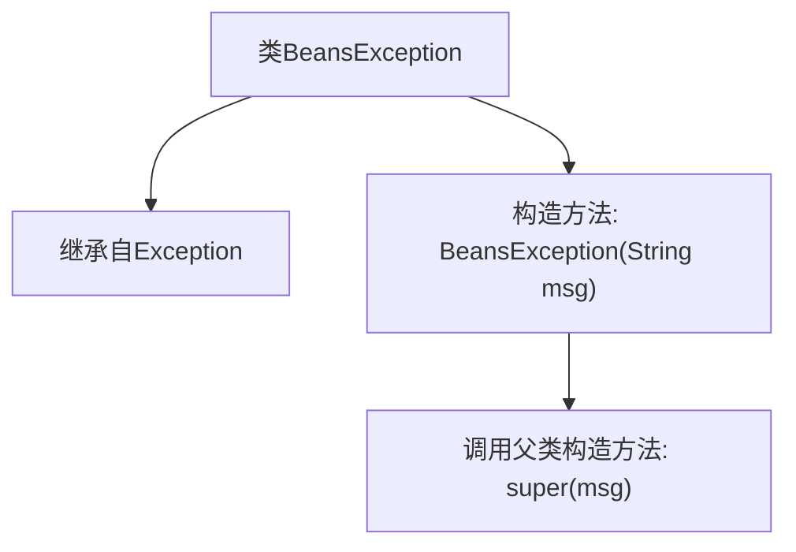

# 基础信息

|      |      |
|------|------|
| 名称 | BeansException |
| 编码语言 | .java |
| 代码路径 | Minis/src/com/minis/beans/BeansException.java |
| 包名 | com.minis.beans |
| 依赖项 | [] |
| 概述说明 | BeansException继承Exception，含字符串参数的构造函数。 |

# 说明

BeansException是一个继承自Exception的异常类，它包含一个带有字符串参数的构造函数。这个构造函数允许在创建BeansException实例时传递一个描述性字符串，以便在异常发生时提供更详细的错误信息。通过继承Exception，BeansException具备了标准异常处理的基本功能，同时通过自定义构造函数增强了其灵活性和实用性。

# 类列表 Class Summary

| 名称   | 类型  | 说明 |
|-------|------|-------------|
| BeansException | class | BeansException继承Exception，带字符串参数的构造函数。 |

## 类 BeansException

|      |      |
|------|------|
| 访问范围 | public |
| 类型 | class |
| 名称 | BeansException |
| 说明 | BeansException继承Exception，带字符串参数的构造函数。 |

### UML类图

这段代码定义了一个名为 `BeansException` 的异常类，它继承自 `Exception` 类。`BeansException` 类包含一个构造函数，该构造函数接受一个字符串参数 `msg`，并将其传递给父类 `Exception` 的构造函数。这个类通常用于在 Java 应用程序中处理与 Beans 相关的异常情况。通过继承 `Exception`，`BeansException` 类可以捕获和处理特定的异常类型，并提供自定义的错误信息。

### 内部方法调用关系图

这段代码定义了一个名为 `BeansException` 的类，该类继承自 `Exception` 类。`BeansException` 类包含一个构造方法，该构造方法接受一个字符串参数 `msg`，并通过 `super(msg)` 调用父类 `Exception` 的构造方法来初始化异常信息。这个类主要用于在Java应用中处理与Bean相关的异常情况，继承自 `Exception` 使得它可以被捕获和处理。

### 字段列表 Field List

| 名称  | 类型  | 说明 |
|-------|-------|------|

### 方法列表 Method List

| 名称  | 类型  | 说明 |
|-------|-------|------|

