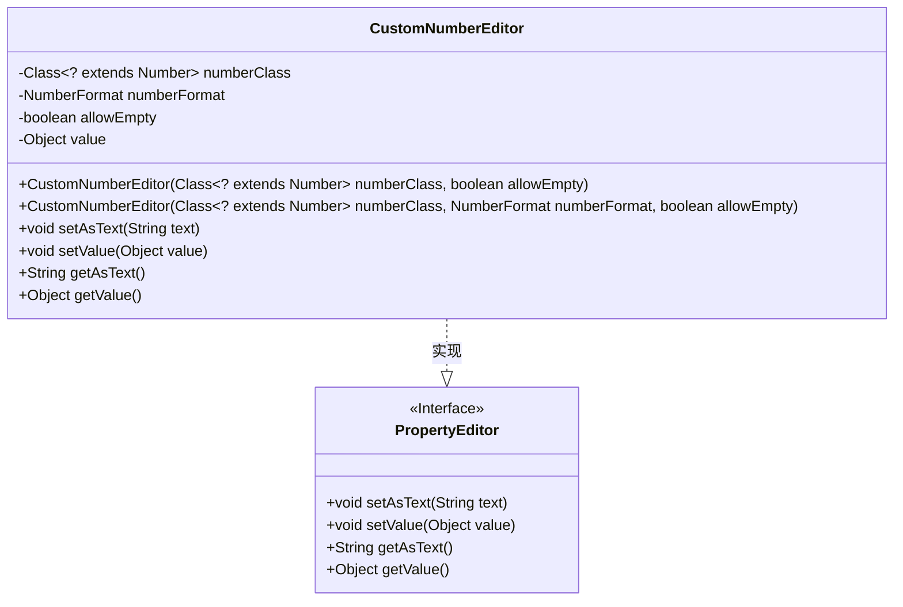
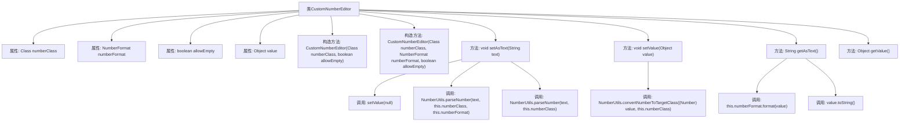

# 基础信息

|      |      |
|------|------|
| 名称 | CustomNumberEditor |
| 编码语言 | .java |
| 代码路径 | Minis/src/com/minis/beans/CustomNumberEditor.java |
| 包名 | com.minis.beans |
| 依赖项 | ['java.text.NumberFormat', 'com.minis.util.NumberUtils', 'com.minis.util.StringUtils'] |
| 概述说明 | CustomNumberEditor实现PropertyEditor，支持数字格式化和空值处理。 |

# 说明

CustomNumberEditor是一个实现了PropertyEditor接口的类，主要用于处理数字的格式化和空值处理。它能够确保在输入或输出数字时，按照指定的格式进行转换，同时能够有效处理空值情况，避免因空值导致的错误或异常。该编辑器在需要精确控制数字格式的场景中非常实用，提供了灵活且可靠的数字处理能力。

# 类列表 Class Summary

| 名称   | 类型  | 说明 |
|-------|------|-------------|
| CustomNumberEditor | class | CustomNumberEditor实现PropertyEditor，支持数字格式化和空值处理。 |

## 类 CustomNumberEditor

|      |      |
|------|------|
| 访问范围 | public |
| 类型 | class |
| 名称 | CustomNumberEditor |
| 说明 | CustomNumberEditor实现PropertyEditor，支持数字格式化和空值处理。 |

### UML类图

这段代码定义了一个 `CustomNumberEditor` 类，它实现了 `PropertyEditor` 接口。`CustomNumberEditor` 类用于处理数字类型的属性编辑，支持通过字符串设置和获取数字值，并且可以处理空字符串和自定义的数字格式。类中的 `setAsText` 方法根据是否允许空值和是否提供数字格式来解析字符串并设置值，`getAsText` 方法则根据数字格式将值转换为字符串。`setValue` 方法确保设置的值是目标数字类型的实例，而 `getValue` 方法返回当前存储的值。

### 内部方法调用关系图

这段代码定义了一个`CustomNumberEditor`类，用于处理数字类型的属性编辑。它包含两个构造方法，分别用于初始化数字类、数字格式和是否允许空值。类中的方法包括`setAsText`用于将字符串转换为数字，`setValue`用于设置值，`getAsText`用于将值转换为字符串，`getValue`用于获取当前值。代码通过条件判断和工具类`NumberUtils`实现了数字的解析和转换。

### 字段列表 Field List

| 名称  | 类型  | 说明 |
|-------|-------|------|
| numberClass | Class<? extends Number> | 私有类变量，存储Number子类的Class对象。 |
| numberFormat | NumberFormat | 声明一个私有的NumberFormat类型变量numberFormat。 |
| value | Object | 定义私有对象变量value。 |
| allowEmpty | boolean | 允许空值的布尔类型私有变量。 |

### 方法列表 Method List

| 名称  | 类型  | 说明 |
|-------|-------|------|
| getValue | Object | 该方法返回当前对象的value属性值。 |
| getAsText | String | 方法返回对象值文本，优先使用数字格式化，否则调用toString。 |
| setAsText | void | 根据输入文本设置值，支持空字符串转为null，支持自定义数字格式解析。 |
| setValue | void | 重写setValue方法，处理Number类型转换，其他类型直接赋值。 |

