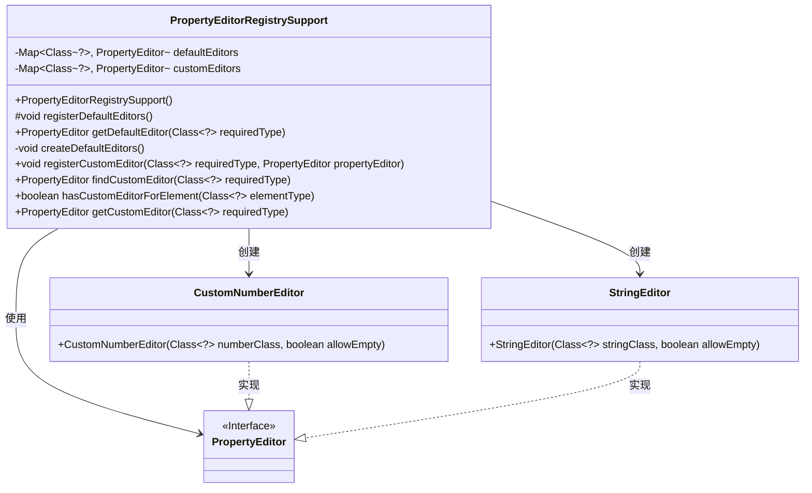
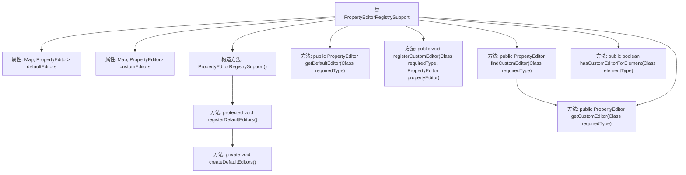

# 基础信息

|      |      |
|------|------|
| 名称 | PropertyEditorRegistrySupport |
| 编码语言 | .java |
| 代码路径 | Minis/src/com/minis/beans/PropertyEditorRegistrySupport.java |
| 包名 | com.minis.beans |
| 依赖项 | ['java.math.BigDecimal', 'java.math.BigInteger', 'java.util.HashMap', 'java.util.LinkedHashMap', 'java.util.Map'] |
| 概述说明 | PropertyEditorRegistrySupport类负责管理默认和自定义属性编辑器的注册与查找。 |

# 说明

PropertyEditorRegistrySupport类负责管理默认和自定义的属性编辑器，提供了注册和查找功能。通过该类，用户可以方便地注册自定义的属性编辑器，并在需要时快速查找和使用这些编辑器。该类支持对属性编辑器的统一管理，确保系统在处理属性编辑时的一致性和灵活性。

# 类列表 Class Summary

| 名称   | 类型  | 说明 |
|-------|------|-------------|
| PropertyEditorRegistrySupport | class | PropertyEditorRegistrySupport类管理默认和自定义属性编辑器，支持注册和查找。 |

## 类 PropertyEditorRegistrySupport

|      |      |
|------|------|
| 访问范围 | public |
| 类型 | class |
| 名称 | PropertyEditorRegistrySupport |
| 说明 | PropertyEditorRegistrySupport类管理默认和自定义属性编辑器，支持注册和查找。 |

### UML类图

### 描述
`PropertyEditorRegistrySupport` 类用于管理和注册属性编辑器（`PropertyEditor`），支持默认编辑器和自定义编辑器的注册与查找。默认编辑器通过 `createDefaultEditors` 方法初始化，主要处理基本数据类型和常用类（如 `Integer`、`Long`、`BigDecimal` 等）。自定义编辑器通过 `registerCustomEditor` 方法注册，并通过 `getCustomEditor` 方法查找。`CustomNumberEditor` 和 `StringEditor` 是 `PropertyEditor` 接口的具体实现，分别用于处理数字和字符串类型的编辑。

### 内部方法调用关系图

这段代码定义了一个名为`PropertyEditorRegistrySupport`的类，用于管理不同类型的`PropertyEditor`。类中包含两个主要属性：`defaultEditors`和`customEditors`，分别用于存储默认和自定义的编辑器。构造方法初始化时会调用`registerDefaultEditors`方法，该方法进一步调用`createDefaultEditors`来创建默认编辑器。类还提供了多个方法来获取、注册和查找编辑器，如`getDefaultEditor`、`registerCustomEditor`、`findCustomEditor`等。通过这些方法，用户可以根据需要获取或注册特定类型的编辑器。

### 字段列表 Field List

| 名称  | 类型  | 说明 |
|-------|-------|------|
| customEditors | Map<Class<?>, PropertyEditor> | 自定义编辑器映射，存储类与属性编辑器的对应关系。 |
| defaultEditors | Map<Class<?>, PropertyEditor> | 默认编辑器映射，键为类类型，值为属性编辑器。 |

### 方法列表 Method List

| 名称  | 类型  | 说明 |
|-------|-------|------|
| findCustomEditor | PropertyEditor | 查找指定类型的自定义属性编辑器。 |
| getDefaultEditor | PropertyEditor | 获取指定类型的默认属性编辑器。 |
| hasCustomEditorForElement | boolean | 方法检查元素类型是否有自定义编辑器。 |
| registerDefaultEditors | void | 注册默认编辑器方法，调用创建默认编辑器功能。 |
| registerCustomEditor | void | 注册自定义编辑器，将指定类型与编辑器映射存储。 |
| getCustomEditor | PropertyEditor | 根据类型获取自定义属性编辑器，若类型为空或无编辑器则返回空。 |
| createDefaultEditors | void | 初始化默认编辑器，包含数值类型和字符串类型的自定义编辑器。 |

