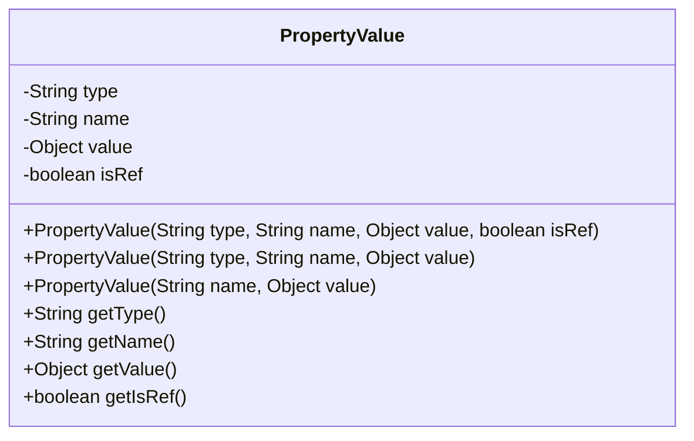
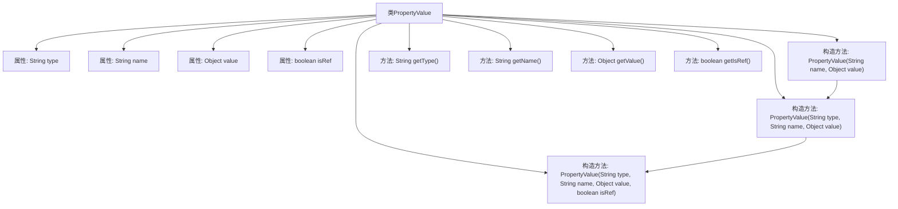

# 基础信息

|      |      |
|------|------|
| 名称 | PropertyValue |
| 编码语言 | .java |
| 代码路径 | Minis/src/com/minis/beans/PropertyValue.java |
| 包名 | com.minis.beans |
| 依赖项 | [] |
| 概述说明 | PropertyValue类封装类型、名称、值和引用标志，提供构造和获取方法。 |

# 说明

PropertyValue类用于封装类型、名称、值和引用标志等属性。它提供了多个构造方法，以便灵活地创建对象实例。此外，该类还包含一系列获取方法，用于访问和获取封装在对象中的类型、名称、值和引用标志等信息。通过这些方法，用户可以方便地操作和查询PropertyValue对象的属性值。

# 类列表 Class Summary

| 名称   | 类型  | 说明 |
|-------|------|-------------|
| PropertyValue | class | PropertyValue类封装类型、名称、值和引用标志，提供多个构造方法和获取方法。 |

## 类 PropertyValue

|      |      |
|------|------|
| 访问范围 | public |
| 类型 | class |
| 名称 | PropertyValue |
| 说明 | PropertyValue类封装类型、名称、值和引用标志，提供多个构造方法和获取方法。 |

### UML类图

**描述：**
`PropertyValue` 类用于封装属性的类型、名称、值以及是否为引用的标志。该类提供了三个构造函数，允许用户以不同的方式初始化属性值。通过公有方法，用户可以获取属性的类型、名称、值以及引用标志。该类的主要作用是简化属性值的管理和访问，确保属性值的封装性和一致性。

### 内部方法调用关系图

这段代码定义了一个名为 `PropertyValue` 的类，该类包含四个私有属性：`type`、`name`、`value` 和 `isRef`。类中提供了三个构造方法，分别用于初始化这些属性，其中两个构造方法通过调用另一个构造方法来实现。此外，类中还提供了四个公共方法，分别用于获取属性的值。流程图展示了类的结构、属性、构造方法以及方法之间的调用关系。

### 字段列表 Field List

| 名称  | 类型  | 说明 |
|-------|-------|------|
| value | Object | 私有不可变对象值。 |
| name | String | 定义了一个私有的不可变字符串变量name。 |
| isRef | boolean | 私有布尔变量isRef声明为final。 |
| type | String | 定义一个不可变的私有字符串变量type。 |

### 方法列表 Method List

| 名称  | 类型  | 说明 |
|-------|-------|------|
| getName | String | 返回对象的名称属性。 |
| getIsRef | boolean | 返回布尔值isRef的状态。 |
| getValue | Object | 该方法返回对象的`value`属性值。 |
| getType | String | 获取当前对象的类型属性值。 |

