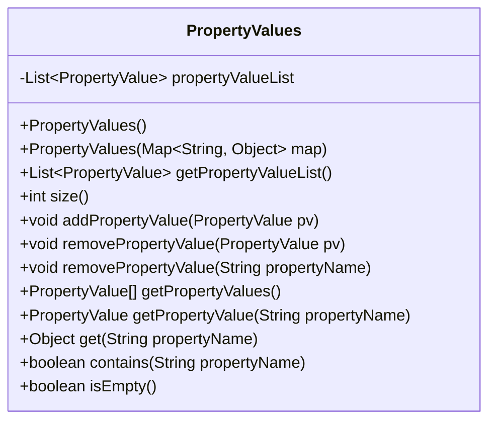
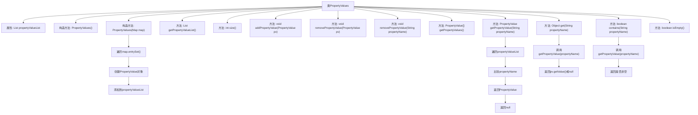

# 基础信息

|      |      |
|------|------|
| 名称 | PropertyValues |
| 编码语言 | .java |
| 代码路径 | Minis/src/com/minis/beans/PropertyValues.java |
| 包名 | com.minis.beans |
| 依赖项 | ['java.util.ArrayList', 'java.util.List', 'java.util.Map'] |
| 概述说明 | PropertyValues类管理PropertyValue列表，支持增删查及空状态判断。 |

# 说明

PropertyValues类负责管理PropertyValue对象的列表，提供了多种操作功能。该类支持向列表中添加新的PropertyValue对象，允许从列表中删除指定的PropertyValue对象，并提供了查询功能以便检索列表中的特定PropertyValue对象。此外，PropertyValues类还具备判断列表是否为空状态的能力，帮助用户快速了解当前列表中是否存在PropertyValue对象。这些功能共同确保了PropertyValue列表的高效管理和灵活操作。

# 类列表 Class Summary

| 名称   | 类型  | 说明 |
|-------|------|-------------|
| PropertyValues | class | PropertyValues类管理PropertyValue列表，支持添加、删除、查询和判断空状态。 |

## 类 PropertyValues

|      |      |
|------|------|
| 访问范围 | public |
| 类型 | class |
| 名称 | PropertyValues |
| 说明 | PropertyValues类管理PropertyValue列表，支持添加、删除、查询和判断空状态。 |

### UML类图

### 描述
`PropertyValues` 类用于管理一组 `PropertyValue` 对象，提供了对属性值的增删改查操作。类中包含一个私有的 `List<PropertyValue>` 属性，用于存储属性值列表。构造方法支持通过 `Map` 初始化属性值，并提供了一系列方法用于操作和查询属性值列表，如获取属性值、添加属性值、删除属性值等。

### 内部方法调用关系图

这段代码定义了一个名为`PropertyValues`的类，用于管理`PropertyValue`对象的列表。类中包含多个方法，用于添加、删除、获取和检查属性值。构造方法支持从`Map`对象初始化属性列表。代码通过遍历列表来查找特定属性，并提供了多种操作属性列表的方式。

### 字段列表 Field List

| 名称  | 类型  | 说明 |
|-------|-------|------|
| propertyValueList | List<PropertyValue> | 私有属性propertyValueList存储PropertyValue对象的列表。 |

### 方法列表 Method List

| 名称  | 类型  | 说明 |
|-------|-------|------|
| size | int | 该方法返回属性值列表的大小。 |
| removePropertyValue | void | 该方法从属性值列表中移除指定属性值。 |
| getPropertyValues | PropertyValue[] | 该方法返回属性值列表的数组形式。 |
| isEmpty | boolean | 检查属性值列表是否为空。 |
| getPropertyValueList | List<PropertyValue> | 获取属性值列表的方法。 |
| removePropertyValue | void | 移除指定属性名的属性值。 |
| addPropertyValue | void | 方法将属性值添加到属性值列表中。 |
| get | Object | 获取指定属性值，若存在则返回值，否则返回空。 |
| getPropertyValue | PropertyValue | 方法通过遍历列表返回指定属性名的属性值，未找到则返回空。 |
| contains | boolean | 检查属性是否存在，返回布尔值。 |

