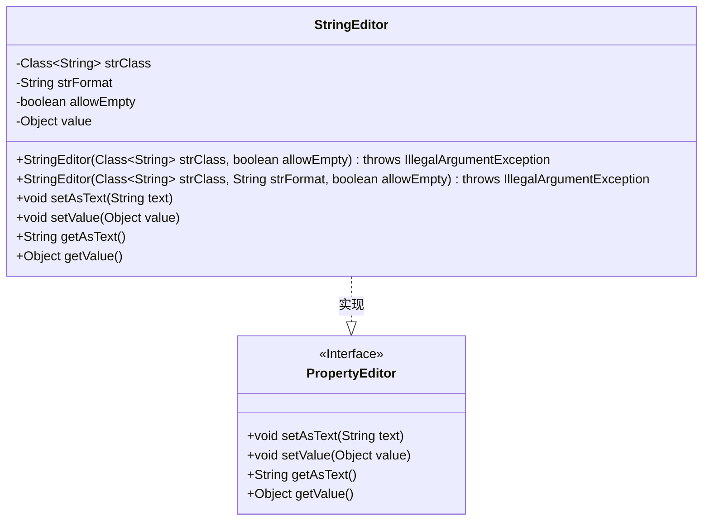
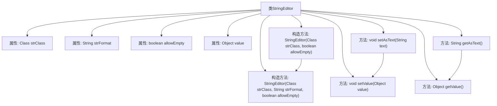

# 基础信息

|      |      |
|------|------|
| 名称 | StringEditor |
| 编码语言 | .java |
| 代码路径 | Minis/src/com/minis/beans/StringEditor.java |
| 包名 | com.minis.beans |
| 依赖项 | ['java.text.NumberFormat', 'com.minis.util.NumberUtils', 'com.minis.util.StringUtils'] |
| 概述说明 | StringEditor类实现PropertyEditor接口，支持字符串编辑、空值和自定义格式。 |

# 说明

StringEditor类实现了PropertyEditor接口，专门用于字符串的编辑操作。该类支持处理空值，并允许用户根据需求自定义字符串的格式。通过实现PropertyEditor接口，StringEditor类能够灵活地处理字符串的输入和输出，确保在不同场景下都能有效编辑和格式化字符串内容。

# 类列表 Class Summary

| 名称   | 类型  | 说明 |
|-------|------|-------------|
| StringEditor | class | StringEditor类实现PropertyEditor接口，支持字符串编辑，允许空值和自定义格式。 |

## 类 StringEditor

|      |      |
|------|------|
| 访问范围 | public |
| 类型 | class |
| 名称 | StringEditor |
| 说明 | StringEditor类实现PropertyEditor接口，支持字符串编辑，允许空值和自定义格式。 |

### UML类图

**描述**：`StringEditor`类实现了`PropertyEditor`接口，用于编辑字符串类型的属性。它包含两个构造函数，分别用于初始化字符串类、格式和是否允许空值。类中提供了设置和获取文本值的方法，以及设置和获取对象值的方法。通过实现`PropertyEditor`接口，`StringEditor`能够处理字符串的格式化和解析操作。

### 内部方法调用关系图

这段代码定义了一个`StringEditor`类，该类实现了`PropertyEditor`接口。`StringEditor`类包含四个属性：`strClass`、`strFormat`、`allowEmpty`和`value`。它提供了两个构造方法，分别用于初始化这些属性。类中还实现了`setAsText`、`setValue`、`getAsText`和`getValue`方法，用于设置和获取文本值。流程图展示了类的结构及其方法之间的调用关系。

### 字段列表 Field List

| 名称  | 类型  | 说明 |
|-------|-------|------|
| strClass | Class<String> | 声明了一个私有的字符串类对象。 |
| strFormat | String | 定义了一个私有字符串变量strFormat。 |
| allowEmpty | boolean | 允许空值的布尔类型私有变量。 |
| value | Object | 私有对象变量value声明。 |

### 方法列表 Method List

| 名称  | 类型  | 说明 |
|-------|-------|------|
| getValue | Object | 重写getValue方法，返回当前对象的value值。 |
| setValue | void | 重写setValue方法，将传入值赋给当前对象。 |
| setAsText | void | 重写setAsText方法，直接设置值为输入文本。 |
| getAsText | String | 重写getAsText方法，返回value的字符串表示。 |

