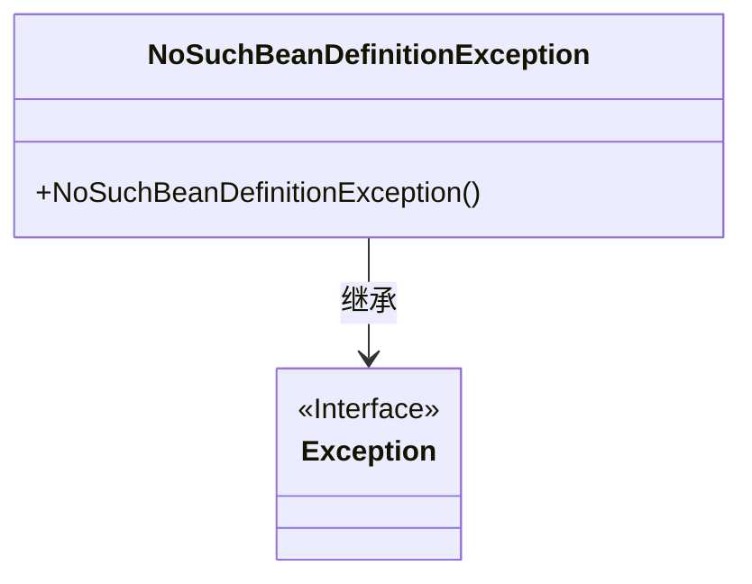
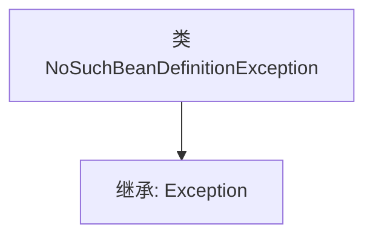

# 基础信息

|      |      |
|------|------|
| 名称 | NoSuchBeanDefinitionException |
| 编码语言 | .java |
| 代码路径 | Minis/src/com/minis/beans/factory/NoSuchBeanDefinitionException.java |
| 包名 | com.minis.beans.factory |
| 依赖项 | [] |
| 概述说明 | NoSuchBeanDefinitionException是Exception的子类。 |

# 说明

NoSuchBeanDefinitionException是一个继承自Exception的异常类，用于表示在Spring框架中无法找到指定Bean定义的错误情况。该异常通常发生在应用程序尝试获取或注入一个未定义的Bean时，帮助开发者识别和处理相关配置问题。

# 类列表 Class Summary

| 名称   | 类型  | 说明 |
|-------|------|-------------|
| NoSuchBeanDefinitionException | class | NoSuchBeanDefinitionException是继承自Exception的异常类。 |

## 类 NoSuchBeanDefinitionException

|      |      |
|------|------|
| 访问范围 | public |
| 类型 | class |
| 名称 | NoSuchBeanDefinitionException |
| 说明 | NoSuchBeanDefinitionException是继承自Exception的异常类。 |

### UML类图

这段代码定义了一个名为 `NoSuchBeanDefinitionException` 的异常类，它继承自 `Exception` 类。`NoSuchBeanDefinitionException` 类是一个自定义异常，通常用于在 Spring 框架中表示当容器中找不到指定的 Bean 定义时抛出的异常。这个类通过继承 `Exception` 类，具备了异常处理的基本功能，可以在程序中进行捕获和处理。

### 内部方法调用关系图

这段代码定义了一个名为`NoSuchBeanDefinitionException`的类，该类继承自`Exception`类。`NoSuchBeanDefinitionException`是一个自定义异常类，通常用于在Spring框架中表示未找到指定Bean定义的情况。通过继承`Exception`类，`NoSuchBeanDefinitionException`具备了异常处理的基本功能，可以在程序中抛出和捕获。

### 字段列表 Field List

| 名称  | 类型  | 说明 |
|-------|-------|------|

### 方法列表 Method List

| 名称  | 类型  | 说明 |
|-------|-------|------|

