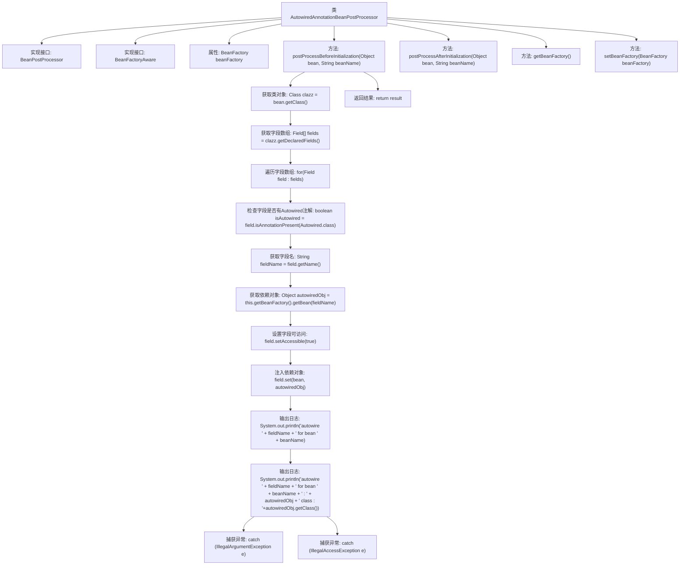

# 基础信息

|      |      |
|------|------|
| 名称 | AutowiredAnnotationBeanPostProcessor |
| 编码语言 | .java |
| 代码路径 | Minis/src/com/minis/beans/factory/annotation/AutowiredAnnotationBeanPostProcessor.java |
| 包名 | com.minis.beans.factory.annotation |
| 依赖项 | ['java.lang.reflect.Field', 'com.minis.beans.BeansException', 'com.minis.beans.factory.BeanFactory', 'com.minis.beans.factory.BeanFactoryAware', 'com.minis.beans.factory.config.BeanPostProcessor'] |
| 概述说明 | AutowiredAnnotationBeanPostProcessor在Bean初始化前自动注入Autowired注解字段。 |

# 说明

AutowiredAnnotationBeanPostProcessor是Spring框架中的一个关键组件，负责在Bean初始化之前自动处理带有Autowired注解的字段。它通过扫描Bean中的Autowired注解，识别需要依赖注入的字段，并在Bean实例化过程中自动注入相应的依赖对象。这一过程确保了Bean在初始化时具备所有必要的依赖，简化了开发者的手动配置工作，提高了代码的可维护性和可读性。

# 类列表 Class Summary

| 名称   | 类型  | 说明 |
|-------|------|-------------|
| AutowiredAnnotationBeanPostProcessor | class | AutowiredAnnotationBeanPostProcessor处理Bean初始化前自动注入带Autowired注解的字段。 |


## 类 AutowiredAnnotationBeanPostProcessor

|      |      |
|------|------|
| 访问范围 | public |
| 类型 | class |
| 名称 | AutowiredAnnotationBeanPostProcessor |
| 说明 | AutowiredAnnotationBeanPostProcessor处理Bean初始化前自动注入带Autowired注解的字段。 |


### UML类图

```mermaid
classDiagram
    class AutowiredAnnotationBeanPostProcessor {
        -BeanFactory beanFactory
        +Object postProcessBeforeInitialization(Object bean, String beanName) throws BeansException
        +Object postProcessAfterInitialization(Object bean, String beanName) throws BeansException
        +BeanFactory getBeanFactory()
        +void setBeanFactory(BeanFactory beanFactory)
    }
    <<Interface>> AutowiredAnnotationBeanPostProcessor {
        <<Interface>>
    }
    class BeanPostProcessor {
        <<Interface>>
        +Object postProcessBeforeInitialization(Object bean, String beanName) throws BeansException
        +Object postProcessAfterInitialization(Object bean, String beanName) throws BeansException
    }
    class BeanFactoryAware {
        <<Interface>>
        +void setBeanFactory(BeanFactory beanFactory)
    }
    AutowiredAnnotationBeanPostProcessor --> BeanPostProcessor : 实现
    AutowiredAnnotationBeanPostProcessor --> BeanFactoryAware : 实现
```

这段代码定义了一个`AutowiredAnnotationBeanPostProcessor`类，它实现了`BeanPostProcessor`和`BeanFactoryAware`接口。该类的主要功能是在Bean初始化之前，通过反射机制自动注入带有`@Autowired`注解的字段。`postProcessBeforeInitialization`方法会遍历Bean的所有字段，检查是否有`@Autowired`注解，如果有，则从`BeanFactory`中获取相应的Bean并注入到字段中。`postProcessAfterInitialization`方法目前为空，留待后续实现。该类还提供了`getBeanFactory`和`setBeanFactory`方法，用于获取和设置`BeanFactory`实例。


### 内部方法调用关系图



**描述：**  
`AutowiredAnnotationBeanPostProcessor`类实现了`BeanPostProcessor`和`BeanFactoryAware`接口，用于在Spring容器中处理Bean的依赖注入。在`postProcessBeforeInitialization`方法中，通过反射获取Bean的所有字段，检查是否有`@Autowired`注解，并自动注入相应的依赖对象。方法中还包含异常处理和日志输出，确保依赖注入过程的正确性和可追踪性。`postProcessAfterInitialization`方法暂时未实现，留待后续扩展。

### 字段列表 Field List

| 名称  | 类型  | 说明 |
|-------|-------|------|
| beanFactory | BeanFactory | 声明了一个私有的BeanFactory对象。 |

### 方法列表 Method List

| 名称  | 类型  | 说明 |
|-------|-------|------|
| getBeanFactory | BeanFactory | 获取BeanFactory实例的方法。 |
| postProcessBeforeInitialization | Object | 方法在Bean初始化前自动装配Autowired字段并注入依赖对象。 |
| setBeanFactory | void | 设置BeanFactory实例到当前对象。 |
| postProcessAfterInitialization | Object | Spring Bean初始化后处理方法，返回原始Bean对象。 |


