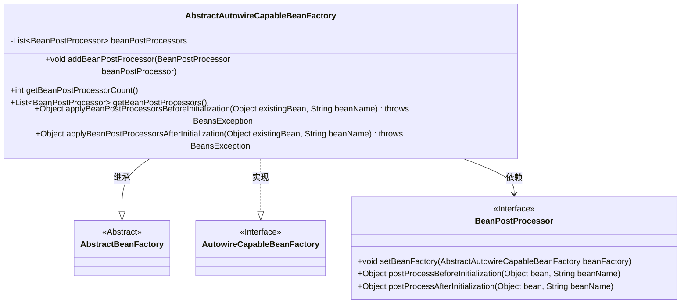
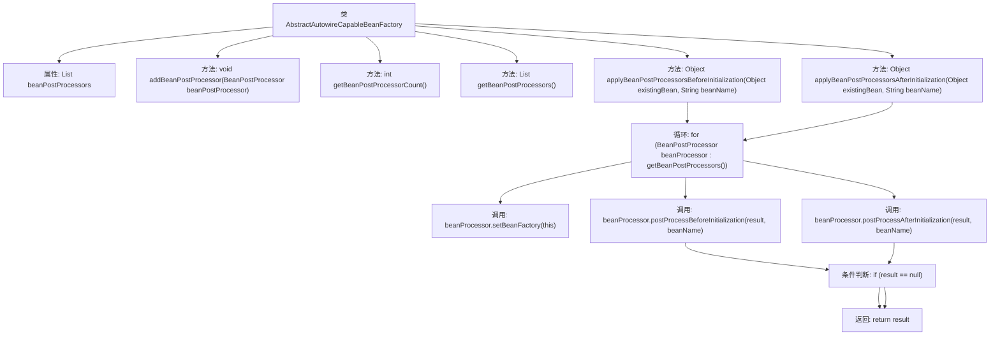

# 基础信息

|      |      |
|------|------|
| 名称 | AbstractAutowireCapableBeanFactory |
| 编码语言 | .java |
| 代码路径 | Minis/src/com/minis/beans/factory/config/AbstractAutowireCapableBeanFactory.java |
| 包名 | com.minis.beans.factory.config |
| 依赖项 | ['java.util.ArrayList', 'java.util.List', 'com.minis.beans.BeansException', 'com.minis.beans.factory.support.AbstractBeanFactory'] |
| 概述说明 | AbstractAutowireCapableBeanFactory负责管理BeanPostProcessor，支持前后初始化处理。 |

# 说明

AbstractAutowireCapableBeanFactory负责管理BeanPostProcessor，提供Bean初始化前后的处理支持。该工厂类确保在Bean创建过程中，能够调用注册的BeanPostProcessor进行前置和后置处理，从而实现对Bean生命周期的精细控制。这一机制允许开发者在Bean初始化前后插入自定义逻辑，增强应用的灵活性和可扩展性。

# 类列表 Class Summary

| 名称   | 类型  | 说明 |
|-------|------|-------------|
| AbstractAutowireCapableBeanFactory | class | AbstractAutowireCapableBeanFactory管理BeanPostProcessor，支持前后初始化处理。 |

## 类 AbstractAutowireCapableBeanFactory

|      |      |
|------|------|
| 访问范围 | public abstract |
| 类型 | class |
| 名称 | AbstractAutowireCapableBeanFactory |
| 说明 | AbstractAutowireCapableBeanFactory管理BeanPostProcessor，支持前后初始化处理。 |

### UML类图

这段代码定义了一个抽象类 `AbstractAutowireCapableBeanFactory`，它继承自 `AbstractBeanFactory` 并实现了 `AutowireCapableBeanFactory` 接口。该类主要用于管理 `BeanPostProcessor` 对象，提供了添加、获取和调用 `BeanPostProcessor` 的方法。`BeanPostProcessor` 是一个接口，定义了在 Bean 初始化前后进行处理的方法。`AbstractAutowireCapableBeanFactory` 通过依赖 `BeanPostProcessor` 来实现 Bean 的初始化和后处理逻辑。

### 内部方法调用关系图

这段代码描述了一个抽象类 `AbstractAutowireCapableBeanFactory`，它继承自 `AbstractBeanFactory` 并实现了 `AutowireCapableBeanFactory` 接口。该类管理了一组 `BeanPostProcessor` 对象，并提供了添加、获取和遍历这些处理器的方法。其中，`applyBeanPostProcessorsBeforeInitialization` 和 `applyBeanPostProcessorsAfterInitialization` 方法分别用于在 Bean 初始化的前后调用每个 `BeanPostProcessor` 的相应方法。如果在处理过程中返回了 `null`，则立即终止处理并返回 `null`。

### 字段列表 Field List

| 名称  | 类型  | 说明 |
|-------|-------|------|
| beanPostProcessors = new ArrayList<BeanPostProcessor>() | List<BeanPostProcessor> | 定义了一个私有的BeanPostProcessor列表实例。 |

### 方法列表 Method List

| 名称  | 类型  | 说明 |
|-------|-------|------|
| getBeanPostProcessors | List<BeanPostProcessor> | 返回BeanPostProcessor列表实例。 |
| getBeanPostProcessorCount | int | 获取BeanPostProcessor数量的方法。 |
| applyBeanPostProcessorsAfterInitialization | Object | 对Bean初始化后应用所有BeanPostProcessor处理。 |
| applyBeanPostProcessorsBeforeInitialization | Object | 在初始化前应用Bean后处理器，处理并返回结果。 |
| addBeanPostProcessor | void | 该方法移除并重新添加BeanPostProcessor，确保唯一性。 |

