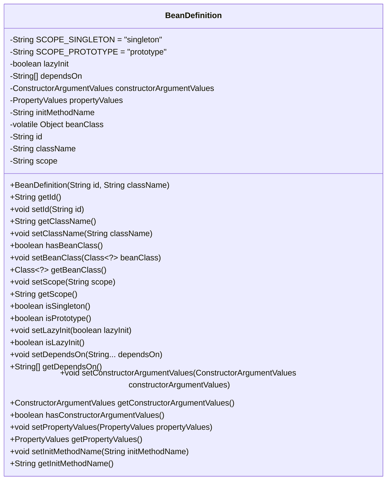

# 基础信息

|      |      |
|------|------|
| 名称 | BeanDefinition |
| 编码语言 | .java |
| 代码路径 | Minis/src/com/minis/beans/factory/config/BeanDefinition.java |
| 包名 | com.minis.beans.factory.config |
| 依赖项 | ['com.minis.beans.PropertyValues'] |
| 概述说明 | BeanDefinition类定义Bean的配置信息，涵盖ID、类名、作用域、依赖等。 |

# 说明

BeanDefinition类用于定义Bean的配置信息，包含了Bean的唯一标识ID、对应的类名、作用域范围、依赖关系、构造函数参数、属性值以及初始化方法等关键元素。这些信息共同构成了Bean的完整配置，确保其在Spring容器中能够正确实例化和管理。

# 类列表 Class Summary

| 名称   | 类型  | 说明 |
|-------|------|-------------|
| BeanDefinition | class | BeanDefinition类定义Bean的配置信息，包括ID、类名、作用域、依赖、构造函数参数、属性值和初始化方法等。 |

## 类 BeanDefinition

|      |      |
|------|------|
| 访问范围 | public |
| 类型 | class |
| 名称 | BeanDefinition |
| 说明 | BeanDefinition类定义Bean的配置信息，包括ID、类名、作用域、依赖、构造函数参数、属性值和初始化方法等。 |

### UML类图

**描述：**
`BeanDefinition` 类用于定义和管理Bean的元数据信息，包括Bean的作用域、依赖关系、构造函数参数、属性值、初始化方法等。该类提供了丰富的getter和setter方法来访问和修改这些属性，并支持判断Bean是否为单例或原型模式。通过`hasBeanClass`和`getBeanClass`方法，可以检查和获取Bean的类对象。此外，类中还包含了对构造函数参数和属性值的空值检查和处理逻辑。

### 内部方法调用关系图

该流程图展示了`BeanDefinition`类的结构和其内部方法之间的调用关系。类中包含多个属性和方法，用于管理Bean的定义信息，如ID、类名、作用域、懒加载设置、依赖项、构造函数参数值、属性值、初始化方法等。每个方法都与其对应的属性相关联，确保Bean的配置和状态管理。

### 字段列表 Field List

| 名称  | 类型  | 说明 |
|-------|-------|------|
| SCOPE_PROTOTYPE = "prototype" | String | SCOPE_PROTOTYPE定义为“prototype”。 |
| SCOPE_SINGLETON = "singleton" | String | SCOPE_SINGLETON定义为单例模式。 |
| constructorArgumentValues | ConstructorArgumentValues | 私有构造函数参数值变量。 |
| dependsOn | String[] | 定义私有字符串数组变量dependsOn。 |
| id | String | 定义了一个私有的字符串类型变量id。 |
| beanClass | Object | 私有易变对象类型beanClass变量。 |
| propertyValues | PropertyValues | 声明私有属性变量propertyValues。 |
| lazyInit = true | boolean | 私有布尔变量lazyInit默认值为true。 |
| className | String | 定义了一个私有字符串变量className。 |
| scope=SCOPE_SINGLETON | String | 私有字符串变量scope被初始化为SCOPE_SINGLETON。 |
| initMethodName | String | 私有字符串变量initMethodName。 |

### 方法列表 Method List

| 名称  | 类型  | 说明 |
|-------|-------|------|
| getDependsOn | String[] | 获取依赖项数组的方法。 |
| setLazyInit | void | 设置懒初始化属性。 |
| isLazyInit | boolean | 该方法返回对象的延迟初始化状态。 |
| setId | void | 设置对象的ID属性。 |
| setBeanClass | void | 设置bean类的实例变量。 |
| setInitMethodName | void | 设置初始化方法名称。 |
| hasBeanClass | boolean | 方法检查beanClass是否为Class类型实例。 |
| getInitMethodName | String | 该方法返回初始化方法名称。 |
| getId | String | 方法getId返回字符串类型的id值。 |
| getConstructorArgumentValues | ConstructorArgumentValues | 该方法返回构造器参数值对象。 |
| getScope | String | 方法getScope返回当前对象的scope属性值。 |
| getClassName | String | 获取类名的方法。 |
| setConstructorArgumentValues | void | 设置构造函数参数值，若为空则新建实例。 |
| getBeanClass | Class<?> | 获取当前Bean类的Class对象。 |
| isSingleton | boolean | 该方法检查当前作用域是否为单例模式。 |
| hasConstructorArgumentValues | boolean | 检查构造参数值是否为空。 |
| setScope | void | 设置类的scope属性值为传入的scope参数。 |
| setClassName | void | 设置类名的方法，将传入的className赋值给当前对象的className属性。 |
| setPropertyValues | void | 设置属性值，若为空则初始化新对象。 |
| isPrototype | boolean | 该方法检查对象是否为原型作用域。 |
| setDependsOn | void | 该方法用于设置依赖项，接受可变字符串参数并赋值给类成员变量。 |
| getPropertyValues | PropertyValues | 获取属性值的公共方法返回当前对象的属性值。 |

