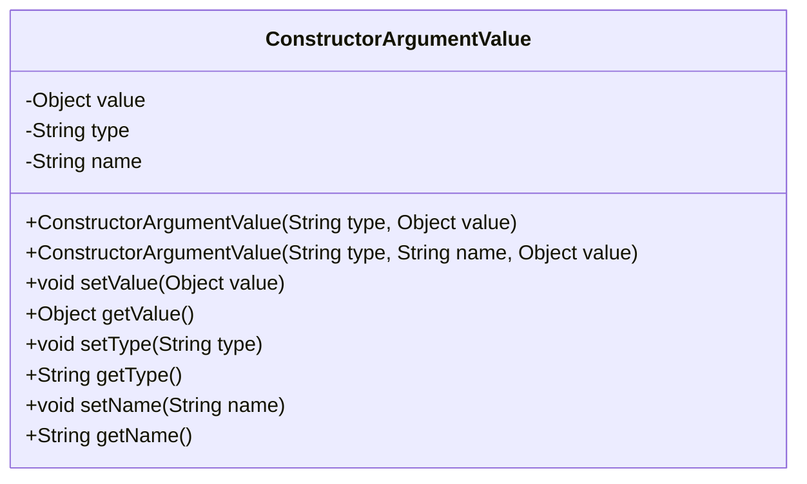
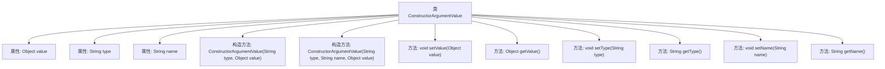

# 基础信息

|      |      |
|------|------|
| 名称 | ConstructorArgumentValue |
| 编码语言 | .java |
| 代码路径 | Minis/src/com/minis/beans/factory/config/ConstructorArgumentValue.java |
| 包名 | com.minis.beans.factory.config |
| 依赖项 | [] |
| 概述说明 | 类ConstructorArgumentValue包含值、类型和名称属性，提供构造函数和访问方法。 |

# 说明

类ConstructorArgumentValue包含三个主要属性：值、类型和名称。该类提供了构造函数用于初始化这些属性，并包含访问方法以便获取或操作这些属性的值。

# 类列表 Class Summary

| 名称   | 类型  | 说明 |
|-------|------|-------------|
| ConstructorArgumentValue | class | 类ConstructorArgumentValue包含值、类型和名称属性，提供构造函数和访问方法。 |

## 类 ConstructorArgumentValue

|      |      |
|------|------|
| 访问范围 | public |
| 类型 | class |
| 名称 | ConstructorArgumentValue |
| 说明 | 类ConstructorArgumentValue包含值、类型和名称属性，提供构造函数和访问方法。 |

### UML类图

**描述：**  
`ConstructorArgumentValue` 类用于存储构造函数参数的详细信息，包括参数的值、类型和名称。该类提供了两个构造函数，分别用于初始化带有类型和值的参数，以及带有类型、名称和值的参数。此外，类中还提供了用于设置和获取这些属性的方法，使得外部代码可以灵活地操作这些参数信息。

### 内部方法调用关系图

这段代码定义了一个名为 `ConstructorArgumentValue` 的类，该类包含三个属性：`value`、`type` 和 `name`。类提供了两个构造方法，分别用于初始化 `type` 和 `value`，以及 `type`、`name` 和 `value`。此外，类还提供了多个 setter 和 getter 方法，用于设置和获取这些属性的值。通过流程图可以清晰地看到类的结构及其方法之间的调用关系。

### 字段列表 Field List

| 名称  | 类型  | 说明 |
|-------|-------|------|
| type | String | 定义一个私有字符串类型的变量type。 |
| name | String | 声明一个私有的字符串类型变量name。 |
| value | Object | 定义一个私有对象变量value。 |

### 方法列表 Method List

| 名称  | 类型  | 说明 |
|-------|-------|------|
| setName | void | 设置对象名称的方法。 |
| getName | String | 该方法返回对象的名称属性。 |
| setValue | void | 设置对象值为指定值的方法。 |
| setType | void | 设置对象类型的公共方法。 |
| getType | String | 该方法返回当前对象的类型字符串。 |
| getValue | Object | 获取对象的值并返回。 |

