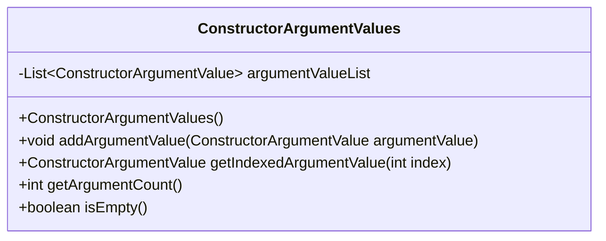
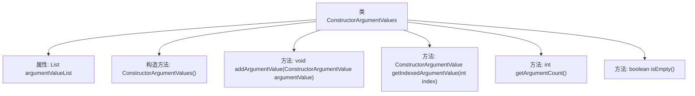

# 基础信息

|      |      |
|------|------|
| 名称 | ConstructorArgumentValues |
| 编码语言 | .java |
| 代码路径 | Minis/src/com/minis/beans/factory/config/ConstructorArgumentValues.java |
| 包名 | com.minis.beans.factory.config |
| 依赖项 | ['java.util.ArrayList', 'java.util.List'] |
| 概述说明 | 类ConstructorArgumentValues管理构造参数，支持增、取、计数及判空功能。 |

# 说明

类ConstructorArgumentValues用于管理构造参数列表，提供添加、获取、计数和判空等操作功能。该类能够有效地处理构造参数的存储和检索，确保参数列表的完整性和可操作性。通过添加操作，用户可以将新的构造参数加入列表；获取操作允许用户从列表中提取特定参数；计数操作用于统计当前列表中的参数数量；判空操作则用于检查列表是否为空。这些功能共同构成了一个高效且灵活的构造参数管理工具。

# 类列表 Class Summary

| 名称   | 类型  | 说明 |
|-------|------|-------------|
| ConstructorArgumentValues | class | 类ConstructorArgumentValues管理构造参数列表，支持添加、获取、计数和判空操作。 |

## 类 ConstructorArgumentValues

|      |      |
|------|------|
| 访问范围 | public |
| 类型 | class |
| 名称 | ConstructorArgumentValues |
| 说明 | 类ConstructorArgumentValues管理构造参数列表，支持添加、获取、计数和判空操作。 |

### UML类图

**描述：**  
`ConstructorArgumentValues` 类用于管理构造函数参数的列表。它包含一个私有的 `argumentValueList` 列表，用于存储 `ConstructorArgumentValue` 对象。类提供了添加参数、获取指定索引的参数、获取参数数量以及检查列表是否为空的方法。这些方法使得对构造函数参数的管理更加方便和高效。

### 内部方法调用关系图

这段代码定义了一个名为`ConstructorArgumentValues`的类，用于管理`ConstructorArgumentValue`对象的列表。类中包含一个私有的`List`属性`argumentValueList`，用于存储`ConstructorArgumentValue`对象。类提供了默认构造方法，以及四个公共方法：`addArgumentValue`用于向列表中添加对象，`getIndexedArgumentValue`用于获取指定索引的对象，`getArgumentCount`用于返回列表的大小，`isEmpty`用于检查列表是否为空。这些方法共同提供了对`argumentValueList`的基本操作和管理功能。

### 字段列表 Field List

| 名称  | 类型  | 说明 |
|-------|-------|------|
| argumentValueList = new ArrayList<ConstructorArgumentValue>() | List<ConstructorArgumentValue> | 私有构造函数参数值列表初始化为空数组列表。 |

### 方法列表 Method List

| 名称  | 类型  | 说明 |
|-------|-------|------|
| getIndexedArgumentValue | ConstructorArgumentValue | 获取指定索引的构造函数参数值。 |
| getArgumentCount | int | 该方法返回参数值列表的大小。 |
| isEmpty | boolean | 该方法检查参数值列表是否为空。 |
| addArgumentValue | void | 方法`addArgumentValue`将`argumentValue`添加到`argumentValueList`中。 |

