# 基础信息

|      |      |
|------|------|
| 名称 | AbstractBeanFactory |
| 编码语言 | .java |
| 代码路径 | Minis/src/com/minis/beans/factory/support/AbstractBeanFactory.java |
| 包名 | com.minis.beans.factory.support |
| 依赖项 | ['java.lang.reflect.Constructor', 'java.lang.reflect.InvocationTargetException', 'java.lang.reflect.Method', 'java.util.ArrayList', 'java.util.HashMap', 'java.util.List', 'java.util.Map', 'java.util.concurrent.ConcurrentHashMap', 'com.minis.beans.BeansException', 'com.minis.beans.PropertyValue', 'com.minis.beans.PropertyValues', 'com.minis.beans.factory.BeanFactoryAware', 'com.minis.beans.factory.FactoryBean', 'com.minis.beans.factory.config.BeanDefinition', 'com.minis.beans.factory.config.ConfigurableBeanFactory', 'com.minis.beans.factory.config.ConstructorArgumentValue', 'com.minis.beans.factory.config.ConstructorArgumentValues'] |
| 概述说明 | AbstractBeanFactory实现Bean管理，处理定义、创建和初始化。 |

# 说明

抽象类AbstractBeanFactory实现了Bean工厂和注册功能，主要负责管理Bean的定义、创建和初始化过程。它作为Bean工厂的核心类，提供了统一的接口和方法来处理Bean的生命周期，确保Bean的创建和初始化按照预定的流程进行。通过注册功能，AbstractBeanFactory能够有效地管理和维护Bean的定义信息，为后续的Bean实例化和依赖注入提供基础支持。

# 类列表 Class Summary

| 名称   | 类型  | 说明 |
|-------|------|-------------|
| AbstractBeanFactory | class | 抽象类AbstractBeanFactory实现Bean工厂和注册功能，管理Bean定义、创建和初始化。 |


## 类 AbstractBeanFactory

|      |      |
|------|------|
| 访问范围 | public abstract |
| 类型 | class |
| 名称 | AbstractBeanFactory |
| 说明 | 抽象类AbstractBeanFactory实现Bean工厂和注册功能，管理Bean定义、创建和初始化。 |


### UML类图

```mermaid
classDiagram
    class AbstractBeanFactory {
        -Map~String, BeanDefinition~ beanDefinitionMap
        -List~String~ beanDefinitionNames
        -Map~String, Object~ earlySingletonObjects
        +AbstractBeanFactory()
        +void refresh()
        +Object getBean(String beanName) throws BeansException
        -void invokeInitMethod(BeanDefinition bd, Object obj)
        +boolean containsBean(String name)
        +void registerBean(String beanName, Object obj)
        +void registerBeanDefinition(String name, BeanDefinition bd)
        +void removeBeanDefinition(String name)
        +BeanDefinition getBeanDefinition(String name)
        +boolean containsBeanDefinition(String name)
        +boolean isSingleton(String name)
        +boolean isPrototype(String name)
        +Class~?~ getType(String name)
        -Object createBean(BeanDefinition bd)
        -Object doCreateBean(BeanDefinition bd)
        -void populateBean(BeanDefinition bd, Class~?~ clz, Object obj)
        -void handleProperties(BeanDefinition bd, Class~?~ clz, Object obj)
        +Object getObjectForBeanInstance(Object beanInstance, String beanName)
        +Object applyBeanPostProcessorsBeforeInitialization(Object existingBean, String beanName) throws BeansException
        +Object applyBeanPostProcessorsAfterInitialization(Object existingBean, String beanName) throws BeansException
    }

    class FactoryBeanRegistrySupport {
        // Details of FactoryBeanRegistrySupport class not provided
    }

    interface ConfigurableBeanFactory {
        <<Interface>>
        +boolean containsBean(String name)
        +void registerBean(String beanName, Object obj)
        +void registerBeanDefinition(String name, BeanDefinition bd)
        +void removeBeanDefinition(String name)
        +BeanDefinition getBeanDefinition(String name)
        +boolean containsBeanDefinition(String name)
        +boolean isSingleton(String name)
        +boolean isPrototype(String name)
        +Class~?~ getType(String name)
    }

    interface BeanDefinitionRegistry {
        <<Interface>>
        +void registerBeanDefinition(String name, BeanDefinition bd)
        +void removeBeanDefinition(String name)
        +BeanDefinition getBeanDefinition(String name)
        +boolean containsBeanDefinition(String name)
    }

    AbstractBeanFactory --|> FactoryBeanRegistrySupport : 继承
    AbstractBeanFactory ..|> ConfigurableBeanFactory : 实现
    AbstractBeanFactory ..|> BeanDefinitionRegistry : 实现
```

### 描述
`AbstractBeanFactory` 是一个抽象类，继承了 `FactoryBeanRegistrySupport` 并实现了 `ConfigurableBeanFactory` 和 `BeanDefinitionRegistry` 接口。它负责管理 Bean 的定义和实例化，包括 Bean 的注册、获取、初始化以及属性注入等操作。`AbstractBeanFactory` 通过 `beanDefinitionMap` 和 `beanDefinitionNames` 来存储 Bean 的定义，并通过 `earlySingletonObjects` 来处理单例 Bean 的早期引用。它还提供了 `refresh()` 方法来刷新所有 Bean 的实例，并支持通过 `getBean()` 方法获取 Bean 实例。


### 内部方法调用关系图

```mermaid
graph TD
    A["类AbstractBeanFactory"]
    B["属性: Map<String,BeanDefinition> beanDefinitionMap"]
    C["属性: List<String> beanDefinitionNames"]
    D["属性: Map<String, Object> earlySingletonObjects"]
    E["构造方法: AbstractBeanFactory()"]
    F["方法: refresh()"]
    G["方法: getBean(String beanName)"]
    H["方法: invokeInitMethod(BeanDefinition bd, Object obj)"]
    I["方法: registerBean(String beanName, Object obj)"]
    J["方法: registerBeanDefinition(String name, BeanDefinition bd)"]
    K["方法: removeBeanDefinition(String name)"]
    L["方法: getBeanDefinition(String name)"]
    M["方法: containsBeanDefinition(String name)"]
    N["方法: isSingleton(String name)"]
    O["方法: isPrototype(String name)"]
    P["方法: getType(String name)"]
    Q["方法: createBean(BeanDefinition bd)"]
    R["方法: doCreateBean(BeanDefinition bd)"]
    S["方法: populateBean(BeanDefinition bd, Class<?> clz, Object obj)"]
    T["方法: handleProperties(BeanDefinition bd, Class<?> clz, Object obj)"]
    U["方法: getObjectForBeanInstance(Object beanInstance, String beanName)"]
    V["抽象方法: applyBeanPostProcessorsBeforeInitialization(Object existingBean, String beanName)"]
    W["抽象方法: applyBeanPostProcessorsAfterInitialization(Object existingBean, String beanName)"]

    A --> B
    A --> C
    A --> D
    A --> E
    A --> F
    A --> G
    A --> H
    A --> I
    A --> J
    A --> K
    A --> L
    A --> M
    A --> N
    A --> O
    A --> P
    A --> Q
    Q --> R
    Q --> S
    S --> T
    A --> U
    A --> V
    A --> W
```



这段代码定义了一个抽象类 `AbstractBeanFactory`，用于管理和创建Bean实例。它包含了多个方法用于注册、获取、删除Bean定义，以及处理Bean的初始化和属性注入。类中使用了多个Map和List来存储Bean定义和实例，并通过反射机制创建和初始化Bean。抽象方法 `applyBeanPostProcessorsBeforeInitialization` 和 `applyBeanPostProcessorsAfterInitialization` 用于在Bean初始化前后进行处理。整体流程涉及Bean的创建、属性注入、初始化方法调用以及后处理器的应用。

### 字段列表 Field List

| 名称  | 类型  | 说明 |
|-------|-------|------|
| beanDefinitionMap=new ConcurrentHashMap<>(256) | Map<String,BeanDefinition> | 使用ConcurrentHashMap存储BeanDefinition，初始容量为256。 |
| earlySingletonObjects = new HashMap<String, Object>(16) | Map<String, Object> | 定义了一个16大小的HashMap，用于存储早期单例对象。 |
| beanDefinitionNames=new ArrayList<>() | List<String> | 创建一个受保护的字符串列表用于存储Bean定义名称。 |

### 方法列表 Method List

| 名称  | 类型  | 说明 |
|-------|-------|------|
| isSingleton | boolean | 该方法检查指定名称的Bean是否为单例模式。 |
| registerBean | void | 注册单例Bean到容器中。 |
| applyBeanPostProcessorsBeforeInitialization | Object | 该方法在初始化前对Bean应用后处理器。 |
| refresh | void | 刷新所有Bean实例，捕获并打印异常。 |
| isPrototype | boolean | 检查指定名称的Bean是否为原型模式。 |
| getBean | Object | 获取Bean实例，处理单例、工厂Bean及初始化过程。 |
| containsBean | boolean | 重写containsBean方法，调用containsSingleton检查单例bean是否存在。 |
| populateBean | void | 方法populateBean处理Bean属性填充。 |
| registerBeanDefinition | void | 注册Bean定义并存储，若非懒加载则立即获取Bean实例。 |
| removeBeanDefinition | void | 删除指定名称的Bean定义及其相关映射和单例实例。 |
| handleProperties | void | 处理Bean属性，根据类型设置值或引用依赖Bean。 |
| invokeInitMethod | void | 通过反射调用Bean的初始化方法，处理异常情况。 |
| doCreateBean | Object | 根据Bean定义创建实例，处理构造函数参数并返回对象。 |
| containsBeanDefinition | boolean | 检查Bean定义映射中是否包含指定名称的Bean。 |
| createBean | Object | 创建Bean实例并填充属性，存储早期单例对象。 |
| applyBeanPostProcessorsAfterInitialization | Object | 该方法在Bean初始化后应用所有BeanPostProcessor处理现有Bean。 |
| getType | Class<?> | 重写方法，根据名称获取类类型。 |
| getObjectForBeanInstance | Object | 该方法判断实例是否为FactoryBean，若是则获取其对象，否则返回原实例。 |
| getBeanDefinition | BeanDefinition | 重写方法，通过名称从映射中获取Bean定义。 |


