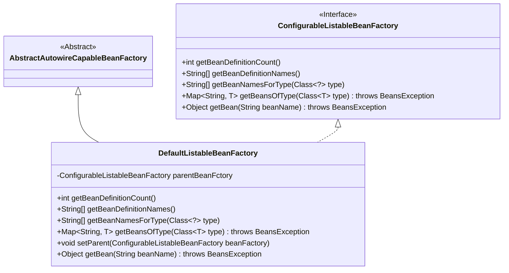
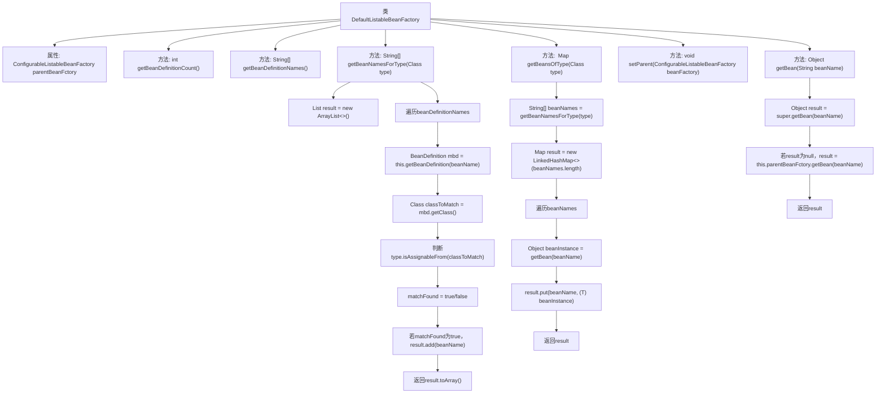

# 基础信息

|      |      |
|------|------|
| 名称 | DefaultListableBeanFactory |
| 编码语言 | .java |
| 代码路径 | Minis/src/com/minis/beans/factory/support/DefaultListableBeanFactory.java |
| 包名 | com.minis.beans.factory.support |
| 依赖项 | ['java.util.ArrayList', 'java.util.LinkedHashMap', 'java.util.List', 'java.util.Map', 'com.minis.beans.BeansException', 'com.minis.beans.factory.config.AbstractAutowireCapableBeanFactory', 'com.minis.beans.factory.config.BeanDefinition', 'com.minis.beans.factory.config.ConfigurableListableBeanFactory'] |
| 概述说明 | DefaultListableBeanFactory继承AbstractAutowireCapableBeanFactory，实现ConfigurableListableBeanFactory，支持Bean定义、类型查询及父工厂。 |

# 说明

DefaultListableBeanFactory继承自AbstractAutowireCapableBeanFactory，并实现了ConfigurableListableBeanFactory接口。它提供了Bean定义的管理、类型查询功能，并支持与父工厂的协作，确保Bean的创建和依赖注入能够高效进行。

# 类列表 Class Summary

| 名称   | 类型  | 说明 |
|-------|------|-------------|
| DefaultListableBeanFactory | class | DefaultListableBeanFactory继承AbstractAutowireCapableBeanFactory，实现ConfigurableListableBeanFactory，提供Bean定义、类型查询及父工厂支持。 |

## 类 DefaultListableBeanFactory

|      |      |
|------|------|
| 访问范围 | public |
| 类型 | class |
| 名称 | DefaultListableBeanFactory |
| 说明 | DefaultListableBeanFactory继承AbstractAutowireCapableBeanFactory，实现ConfigurableListableBeanFactory，提供Bean定义、类型查询及父工厂支持。 |

### UML类图

这段代码定义了一个 `DefaultListableBeanFactory` 类，它继承自 `AbstractAutowireCapableBeanFactory` 并实现了 `ConfigurableListableBeanFactory` 接口。`DefaultListableBeanFactory` 主要用于管理 Spring 容器中的 Bean 定义和实例，提供了获取 Bean 定义数量、名称、类型匹配的 Bean 名称及实例的方法。该类还支持设置父级 BeanFactory，并在获取 Bean 时优先从父级查找。

### 内部方法调用关系图

这段代码定义了一个`DefaultListableBeanFactory`类，它继承自`AbstractAutowireCapableBeanFactory`并实现了`ConfigurableListableBeanFactory`接口。类中包含了多个方法，用于获取Bean的定义、名称、类型等。`getBeanNamesForType`方法通过遍历Bean定义列表，判断Bean类型是否匹配，并将匹配的Bean名称加入结果列表。`getBeansOfType`方法则根据Bean名称获取Bean实例，并将其存入Map中返回。`getBean`方法尝试从当前工厂获取Bean，若失败则从父工厂获取。

### 字段列表 Field List

| 名称  | 类型  | 说明 |
|-------|-------|------|
| parentBeanFctory | ConfigurableListableBeanFactory | 可配置列表Bean工厂的父工厂。 |

### 方法列表 Method List

| 名称  | 类型  | 说明 |
|-------|-------|------|
| setParent | void | 设置父级可配置列表Bean工厂。 |
| getBeanDefinitionNames | String[] | 重写方法，返回Bean定义名称数组。 |
| getBean | Object | 重写getBean方法，优先从父类获取bean，若为空则从父工厂获取。 |
| getBeanDefinitionCount | int | 重写方法，返回bean定义映射的大小。 |
| getBeanNamesForType | String[] | 方法返回与指定类型匹配的Bean名称数组。 |
| getBeansOfType | Map<String, T> | 方法返回指定类型的所有Bean实例及其名称的映射。 |

