# 基础信息

|      |      |
|------|------|
| 名称 | DefaultSingletonBeanRegistry |
| 编码语言 | .java |
| 代码路径 | Minis/src/com/minis/beans/factory/support/DefaultSingletonBeanRegistry.java |
| 包名 | com.minis.beans.factory.support |
| 依赖项 | ['java.util.ArrayList', 'java.util.LinkedHashSet', 'java.util.List', 'java.util.Map', 'java.util.Set', 'java.util.concurrent.ConcurrentHashMap', 'com.minis.beans.factory.config.SingletonBeanRegistry'] |
| 概述说明 | DefaultSingletonBeanRegistry负责单例Bean的注册与管理，处理Bean名称、对象及依赖关系。 |

# 说明

DefaultSingletonBeanRegistry是一个用于实现单例Bean注册的类，主要负责管理Bean的名称、对象及其依赖关系。它通过维护一个注册表来存储单例Bean的实例，确保在应用程序中每个Bean名称只对应一个实例。该类还处理Bean之间的依赖关系，确保在需要时能够正确地注入依赖，从而保证单例Bean的创建和使用过程高效且一致。

# 类列表 Class Summary

| 名称   | 类型  | 说明 |
|-------|------|-------------|
| DefaultSingletonBeanRegistry | class | DefaultSingletonBeanRegistry实现单例Bean注册，管理Bean名称、对象及依赖关系。 |


## 类 DefaultSingletonBeanRegistry

|      |      |
|------|------|
| 访问范围 | public |
| 类型 | class |
| 名称 | DefaultSingletonBeanRegistry |
| 说明 | DefaultSingletonBeanRegistry实现单例Bean注册，管理Bean名称、对象及依赖关系。 |


### UML类图

```mermaid
classDiagram
    class DefaultSingletonBeanRegistry {
        -List~String~ beanNames
        -Map~String, Object~ singletonObjects
        -Map~String, Set~String~~ dependentBeanMap
        -Map~String, Set~String~~ dependenciesForBeanMap
        +void registerSingleton(String beanName, Object singletonObject)
        +Object getSingleton(String beanName)
        +boolean containsSingleton(String beanName)
        +String[] getSingletonNames()
        +void removeSingleton(String beanName)
        +void registerDependentBean(String beanName, String dependentBeanName)
        +boolean hasDependentBean(String beanName)
        +String[] getDependentBeans(String beanName)
        +String[] getDependenciesForBean(String beanName)
    }
    <<Interface>> SingletonBeanRegistry {
        +void registerSingleton(String beanName, Object singletonObject)
        +Object getSingleton(String beanName)
        +boolean containsSingleton(String beanName)
        +String[] getSingletonNames()
    }
    DefaultSingletonBeanRegistry --> SingletonBeanRegistry : 实现
```

类图描述：`DefaultSingletonBeanRegistry` 类实现了 `SingletonBeanRegistry` 接口，用于管理单例 Bean 的注册、获取和依赖关系。它包含多个 Map 和 List 数据结构来存储 Bean 名称、单例对象以及 Bean 之间的依赖关系。类中的方法提供了对单例 Bean 的注册、获取、删除以及依赖关系的管理功能。


### 内部方法调用关系图

```mermaid
graph TD
    A["类DefaultSingletonBeanRegistry"]
    B["属性: List<String> beanNames"]
    C["属性: Map<String, Object> singletonObjects"]
    D["属性: Map<String, Set<String>> dependentBeanMap"]
    E["属性: Map<String, Set<String>> dependenciesForBeanMap"]
    F["方法: registerSingleton(String beanName, Object singletonObject)"]
    G["方法: getSingleton(String beanName)"]
    H["方法: containsSingleton(String beanName)"]
    I["方法: getSingletonNames()"]
    J["方法: removeSingleton(String beanName)"]
    K["方法: registerDependentBean(String beanName, String dependentBeanName)"]
    L["方法: hasDependentBean(String beanName)"]
    M["方法: getDependentBeans(String beanName)"]
    N["方法: getDependenciesForBean(String beanName)"]

    A --> B
    A --> C
    A --> D
    A --> E
    A --> F
    A --> G
    A --> H
    A --> I
    A --> J
    A --> K
    A --> L
    A --> M
    A --> N
```



该流程图展示了`DefaultSingletonBeanRegistry`类的结构和其内部方法的关系。类中包含了多个属性，如`beanNames`、`singletonObjects`等，以及一系列方法用于注册、获取、删除单例Bean，以及处理Bean之间的依赖关系。每个方法都与类直接关联，展示了类如何管理单例Bean的生命周期和依赖关系。

### 字段列表 Field List

| 名称  | 类型  | 说明 |
|-------|-------|------|
| dependenciesForBeanMap = new ConcurrentHashMap<>(64) | Map<String,Set<String>> | 使用ConcurrentHashMap存储Bean的依赖关系。 |
| beanNames=new ArrayList<>() | List<String> | 声明并初始化一个受保护的字符串列表变量beanNames。 |
| singletonObjects =new ConcurrentHashMap<>(256) | Map<String, Object> | 使用ConcurrentHashMap初始化大小为256的单例对象映射。 |
| dependentBeanMap = new ConcurrentHashMap<>(64) | Map<String,Set<String>> | 保护性并发映射，键为字符串，值为字符串集合，初始容量64。 |

### 方法列表 Method List

| 名称  | 类型  | 说明 |
|-------|-------|------|
| hasDependentBean | boolean | 检查指定Bean是否有依赖Bean。 |
| removeSingleton | void | 移除指定单例Bean，同步操作确保线程安全。 |
| containsSingleton | boolean | 检查单例对象是否包含指定bean名称。 |
| registerDependentBean | void | 注册Bean依赖关系，确保线程安全操作。 |
| getSingletonNames | String[] | 重写方法返回beanNames数组。 |
| registerSingleton | void | 注册单例Bean，检查冲突并更新对象和名称列表。 |
| getDependenciesForBean | String[] | 获取指定Bean的依赖项，若无则返回空数组。 |
| getSingleton | Object | 该方法通过beanName从singletonObjects中获取单例对象。 |
| getDependentBeans | String[] | 获取指定bean的依赖bean数组，若无依赖则返回空数组。 |


