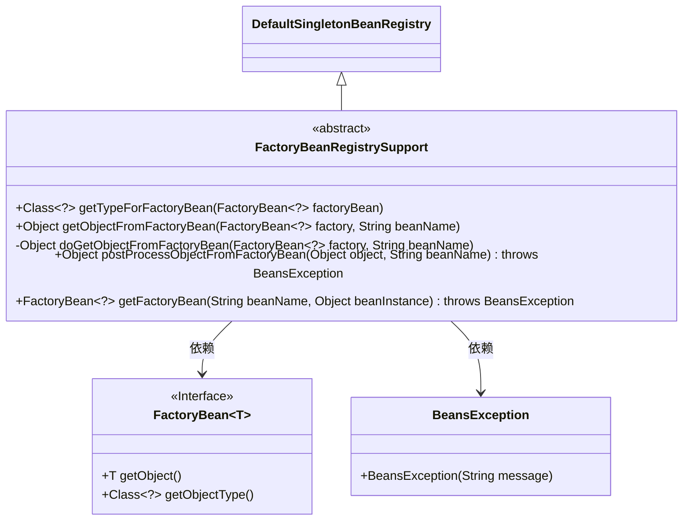
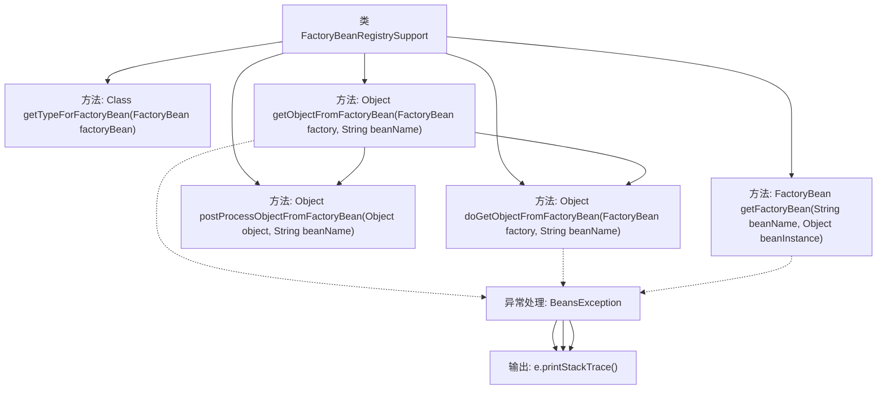

# 基础信息

|      |      |
|------|------|
| 名称 | FactoryBeanRegistrySupport |
| 编码语言 | .java |
| 代码路径 | Minis/src/com/minis/beans/factory/support/FactoryBeanRegistrySupport.java |
| 包名 | com.minis.beans.factory.support |
| 依赖项 | ['com.minis.beans.BeansException', 'com.minis.beans.factory.FactoryBean'] |
| 概述说明 | FactoryBeanRegistrySupport扩展DefaultSingletonBeanRegistry，支持工厂Bean注册与对象获取。 |

# 说明

FactoryBeanRegistrySupport类继承自DefaultSingletonBeanRegistry，专门用于支持工厂Bean的注册和对象获取功能。该类扩展了父类的功能，提供了对工厂Bean的管理和操作，使得在Spring框架中可以更方便地注册和获取由工厂Bean创建的对象。

# 类列表 Class Summary

| 名称   | 类型  | 说明 |
|-------|------|-------------|
| FactoryBeanRegistrySupport | class | FactoryBeanRegistrySupport类扩展了DefaultSingletonBeanRegistry，提供工厂Bean的注册与对象获取功能。 |

## 类 FactoryBeanRegistrySupport

|      |      |
|------|------|
| 访问范围 | public abstract |
| 类型 | class |
| 名称 | FactoryBeanRegistrySupport |
| 说明 | FactoryBeanRegistrySupport类扩展了DefaultSingletonBeanRegistry，提供工厂Bean的注册与对象获取功能。 |

### UML类图

### 描述
该代码定义了一个抽象类 `FactoryBeanRegistrySupport`，它继承自 `DefaultSingletonBeanRegistry`，并提供了与 `FactoryBean` 相关的操作。`FactoryBeanRegistrySupport` 包含多个方法，用于从 `FactoryBean` 中获取对象类型、获取对象实例、处理对象实例以及验证 `FactoryBean` 实例。`FactoryBean` 是一个泛型接口，定义了获取对象和对象类型的方法。`BeansException` 是一个异常类，用于处理与 `FactoryBean` 相关的异常。

### 内部方法调用关系图

这段代码展示了`FactoryBeanRegistrySupport`类的核心方法及其调用关系。`getObjectFromFactoryBean`方法通过调用`doGetObjectFromFactoryBean`获取对象，并尝试通过`postProcessObjectFromFactoryBean`进行后处理。`getFactoryBean`方法用于验证并返回`FactoryBean`实例。所有方法都包含异常处理，确保在出现`BeansException`时能够捕获并输出错误信息。

### 字段列表 Field List

| 名称  | 类型  | 说明 |
|-------|-------|------|

### 方法列表 Method List

| 名称  | 类型  | 说明 |
|-------|-------|------|
| getTypeForFactoryBean | Class<?> | 该方法返回FactoryBean对象的类型。 |
| doGetObjectFromFactoryBean | Object | 从工厂Bean获取对象，捕获异常并返回对象。 |
| getFactoryBean | FactoryBean<?> | 获取指定Bean的FactoryBean实例，若非FactoryBean则抛出异常。 |
| postProcessObjectFromFactoryBean | Object | 保护方法处理工厂Bean对象并返回。 |
| getObjectFromFactoryBean | Object | 从工厂Bean获取对象并进行后处理。 |

