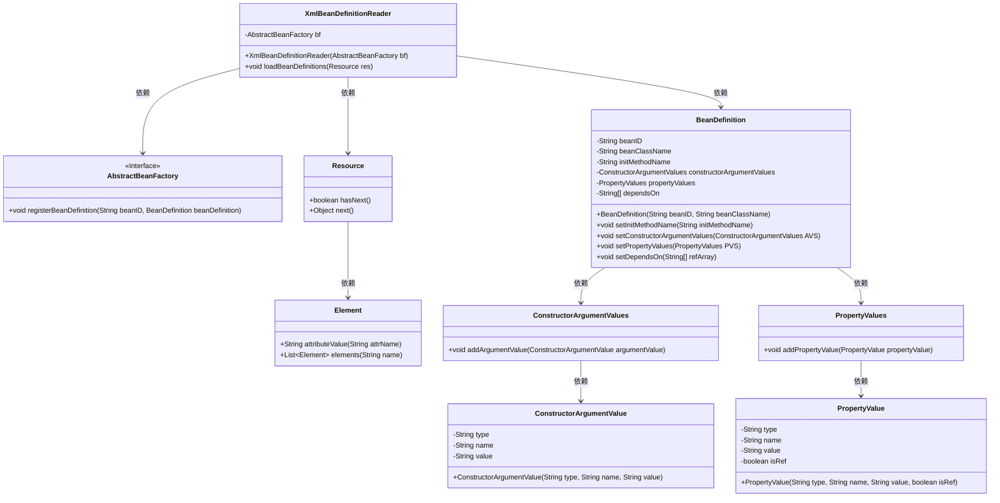
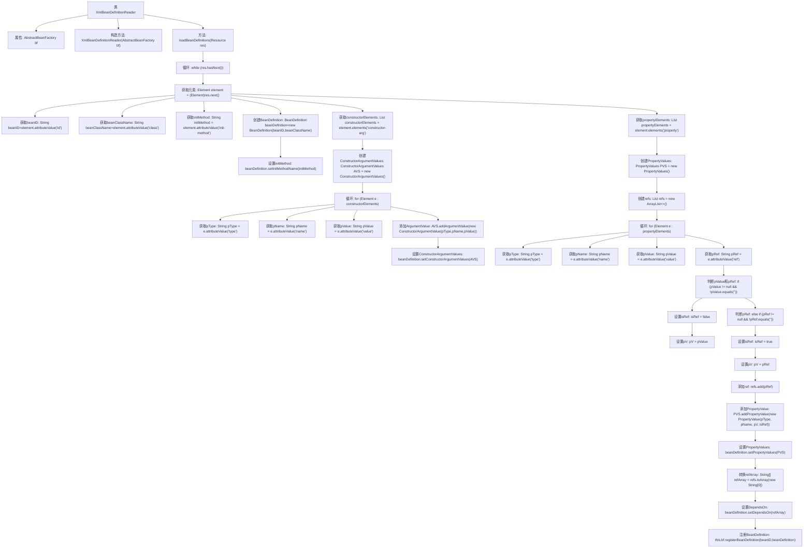

# 基础信息

|      |      |
|------|------|
| 名称 | XmlBeanDefinitionReader |
| 编码语言 | .java |
| 代码路径 | Minis/src/com/minis/beans/factory/xml/XmlBeanDefinitionReader.java |
| 包名 | com.minis.beans.factory.xml |
| 依赖项 | ['java.util.ArrayList', 'java.util.List', 'org.dom4j.Element', 'com.minis.beans.PropertyValue', 'com.minis.beans.PropertyValues', 'com.minis.beans.factory.config.BeanDefinition', 'com.minis.beans.factory.config.ConstructorArgumentValue', 'com.minis.beans.factory.config.ConstructorArgumentValues', 'com.minis.beans.factory.support.AbstractBeanFactory', 'com.minis.core.Resource'] |
| 概述说明 | XmlBeanDefinitionReader类从XML加载Bean定义并注册到BeanFactory。 |

# 说明

XmlBeanDefinitionReader类的主要功能是从XML资源中加载Bean定义，并将其注册到BeanFactory中。该类通过解析XML文件，提取其中定义的Bean信息，然后将这些信息注册到BeanFactory中，以便后续在应用程序中使用。这个过程是Spring框架中依赖注入和Bean管理的重要组成部分，确保了Bean的配置和初始化能够顺利进行。

# 类列表 Class Summary

| 名称   | 类型  | 说明 |
|-------|------|-------------|
| XmlBeanDefinitionReader | class | XmlBeanDefinitionReader类用于从XML资源加载Bean定义，并注册到BeanFactory中。 |

## 类 XmlBeanDefinitionReader

|      |      |
|------|------|
| 访问范围 | public |
| 类型 | class |
| 名称 | XmlBeanDefinitionReader |
| 说明 | XmlBeanDefinitionReader类用于从XML资源加载Bean定义，并注册到BeanFactory中。 |

### UML类图

这段代码描述了一个`XmlBeanDefinitionReader`类，它从XML资源中读取Bean定义并将其注册到`AbstractBeanFactory`中。`XmlBeanDefinitionReader`依赖于`Resource`来解析XML元素，并创建`BeanDefinition`对象。`BeanDefinition`对象包含了Bean的ID、类名、初始化方法、构造函数参数和属性值等信息。`ConstructorArgumentValues`和`PropertyValues`分别用于存储构造函数参数和属性值，而`ConstructorArgumentValue`和`PropertyValue`则分别表示单个构造函数参数和属性值。整个过程通过`AbstractBeanFactory`的`registerBeanDefinition`方法将Bean定义注册到工厂中。

### 内部方法调用关系图

这段代码描述了一个`XmlBeanDefinitionReader`类，该类用于从XML资源中加载Bean定义，并将其注册到`AbstractBeanFactory`中。代码首先解析XML元素，获取Bean的ID、类名和初始化方法，然后处理构造器参数和属性，最后将Bean定义注册到工厂中。流程图展示了从读取XML资源到注册Bean定义的完整过程，包括构造器参数和属性的处理。

### 字段列表 Field List

| 名称  | 类型  | 说明 |
|-------|-------|------|
| bf | AbstractBeanFactory | AbstractBeanFactory 实例化对象 bf。 |

### 方法列表 Method List

| 名称  | 类型  | 说明 |
|-------|-------|------|
| loadBeanDefinitions | void | 加载Bean定义，解析构造器和属性，注册到Bean工厂。 |

