# 基础信息

|      |      |
|------|------|
| 名称 | AbstractApplicationContext |
| 编码语言 | .java |
| 代码路径 | Minis/src/com/minis/context/AbstractApplicationContext.java |
| 包名 | com.minis.context |
| 依赖项 | ['java.util.ArrayList', 'java.util.List', 'java.util.Map', 'java.util.concurrent.atomic.AtomicBoolean', 'com.minis.beans.BeansException', 'com.minis.beans.factory.config.BeanFactoryPostProcessor', 'com.minis.beans.factory.config.BeanPostProcessor', 'com.minis.beans.factory.config.ConfigurableListableBeanFactory', 'com.minis.core.env.Environment'] |
| 概述说明 | 抽象类管理Bean工厂、事件发布及环境配置。 |

# 说明

抽象类通过实现应用上下文，负责管理Bean工厂、事件发布以及环境配置。它提供了统一的接口和方法，用于创建和配置Bean实例，支持事件的发布和监听，同时管理应用程序的环境配置信息。这种设计使得应用上下文能够集中处理核心功能，确保系统的模块化和可扩展性。

# 类列表 Class Summary

| 名称   | 类型  | 说明 |
|-------|------|-------------|
| AbstractApplicationContext | class | 抽象类实现应用上下文，管理Bean工厂、事件发布及环境配置。 |

## 类 AbstractApplicationContext

|      |      |
|------|------|
| 访问范围 | public abstract |
| 类型 | class |
| 名称 | AbstractApplicationContext |
| 说明 | 抽象类实现应用上下文，管理Bean工厂、事件发布及环境配置。 |

### UML类图

```mermaid
classDiagram
    class AbstractApplicationContext {
        -Environment environment
        -List~BeanFactoryPostProcessor~ beanFactoryPostProcessors
        -long startupDate
        -AtomicBoolean active
        -AtomicBoolean closed
        -ApplicationEventPublisher applicationEventPublisher
        +Object getBean(String beanName) throws BeansException
        +boolean containsBean(String name)
        +boolean isSingleton(String name)
        +boolean isPrototype(String name)
        +Class~?~ getType(String name)
        +List~BeanFactoryPostProcessor~ getBeanFactoryPostProcessors()
        +void refresh() throws BeansException, IllegalStateException
        +void registerSingleton(String beanName, Object singletonObject)
        +Object getSingleton(String beanName)
        +boolean containsSingleton(String beanName)
        +String[] getSingletonNames()
        +boolean containsBeanDefinition(String beanName)
        +int getBeanDefinitionCount()
        +String[] getBeanDefinitionNames()
        +String[] getBeanNamesForType(Class~?~ type)
        +Map~String, T~ getBeansOfType(Class~T~ type) throws BeansException
        +void addBeanPostProcessor(BeanPostProcessor beanPostProcessor)
        +int getBeanPostProcessorCount()
        +void registerDependentBean(String beanName, String dependentBeanName)
        +String[] getDependentBeans(String beanName)
        +String[] getDependenciesForBean(String beanName)
        +String getApplicationName()
        +long getStartupDate()
        +ConfigurableListableBeanFactory getBeanFactory() throws IllegalStateException
        +void setEnvironment(Environment environment)
        +Environment getEnvironment()
        +void addBeanFactoryPostProcessor(BeanFactoryPostProcessor postProcessor)
        +void close()
        +boolean isActive()
        +ApplicationEventPublisher getApplicationEventPublisher()
        +void setApplicationEventPublisher(ApplicationEventPublisher applicationEventPublisher)
        +void registerListeners()
        +void initApplicationEventPublisher()
        +void postProcessBeanFactory(ConfigurableListableBeanFactory bf)
        +void registerBeanPostProcessors(ConfigurableListableBeanFactory bf)
        +void onRefresh()
        +void finishRefresh()
    }

    class ApplicationContext {
        <<Interface>>
        +Object getBean(String beanName) throws BeansException
        +boolean containsBean(String name)
        +boolean isSingleton(String name)
        +boolean isPrototype(String name)
        +Class~?~ getType(String name)
        +void registerSingleton(String beanName, Object singletonObject)
        +Object getSingleton(String beanName)
        +boolean containsSingleton(String beanName)
        +String[] getSingletonNames()
        +boolean containsBeanDefinition(String beanName)
        +int getBeanDefinitionCount()
        +String[] getBeanDefinitionNames()
        +String[] getBeanNamesForType(Class~?~ type)
        +Map~String, T~ getBeansOfType(Class~T~ type) throws BeansException
        +void addBeanPostProcessor(BeanPostProcessor beanPostProcessor)
        +int getBeanPostProcessorCount()
        +void registerDependentBean(String beanName, String dependentBeanName)
        +String[] getDependentBeans(String beanName)
        +String[] getDependenciesForBean(String beanName)
        +String getApplicationName()
        +long getStartupDate()
        +ConfigurableListableBeanFactory getBeanFactory() throws IllegalStateException
        +void setEnvironment(Environment environment)
        +Environment getEnvironment()
        +void addBeanFactoryPostProcessor(BeanFactoryPostProcessor postProcessor)
        +void close()
        +boolean isActive()
    }

    AbstractApplicationContext --> ApplicationContext : 实现
```

### 描述
`AbstractApplicationContext` 是一个抽象类，实现了 `ApplicationContext` 接口。它提供了对 Spring 应用上下文的基本操作，如获取 Bean、注册 Bean、管理 Bean 工厂等。类中包含了一些私有成员变量，如 `environment`、`beanFactoryPostProcessors` 等，用于管理应用上下文的状态和行为。此外，`AbstractApplicationContext` 还定义了一些抽象方法，如 `registerListeners`、`initApplicationEventPublisher` 等，这些方法需要由子类实现以完成具体的上下文初始化逻辑。

### 内部方法调用关系图

```mermaid
graph TD
    A["类AbstractApplicationContext"]
    B["属性: Environment environment"]
    C["属性: List<BeanFactoryPostProcessor> beanFactoryPostProcessors"]
    D["属性: long startupDate"]
    E["属性: AtomicBoolean active"]
    F["属性: AtomicBoolean closed"]
    G["属性: ApplicationEventPublisher applicationEventPublisher"]
    H["方法: Object getBean(String beanName)"]
    I["方法: boolean containsBean(String name)"]
    J["方法: boolean isSingleton(String name)"]
    K["方法: boolean isPrototype(String name)"]
    L["方法: Class<?> getType(String name)"]
    M["方法: List<BeanFactoryPostProcessor> getBeanFactoryPostProcessors()"]
    N["方法: void refresh()"]
    O["抽象方法: void registerListeners()"]
    P["抽象方法: void initApplicationEventPublisher()"]
    Q["抽象方法: void postProcessBeanFactory(ConfigurableListableBeanFactory bf)"]
    R["抽象方法: void registerBeanPostProcessors(ConfigurableListableBeanFactory bf)"]
    S["抽象方法: void onRefresh()"]
    T["抽象方法: void finishRefresh()"]
    U["方法: void registerSingleton(String beanName, Object singletonObject)"]
    V["方法: Object getSingleton(String beanName)"]
    W["方法: boolean containsSingleton(String beanName)"]
    X["方法: String[] getSingletonNames()"]
    Y["方法: boolean containsBeanDefinition(String beanName)"]
    Z["方法: int getBeanDefinitionCount()"]
    AA["方法: String[] getBeanDefinitionNames()"]
    AB["方法: String[] getBeanNamesForType(Class<?> type)"]
    AC["方法: <T> Map<String, T> getBeansOfType(Class<T> type)"]
    AD["方法: void addBeanPostProcessor(BeanPostProcessor beanPostProcessor)"]
    AE["方法: int getBeanPostProcessorCount()"]
    AF["方法: void registerDependentBean(String beanName, String dependentBeanName)"]
    AG["方法: String[] getDependentBeans(String beanName)"]
    AH["方法: String[] getDependenciesForBean(String beanName)"]
    AI["方法: String getApplicationName()"]
    AJ["方法: long getStartupDate()"]
    AK["抽象方法: ConfigurableListableBeanFactory getBeanFactory()"]
    AL["方法: void setEnvironment(Environment environment)"]
    AM["方法: Environment getEnvironment()"]
    AN["方法: void addBeanFactoryPostProcessor(BeanFactoryPostProcessor postProcessor)"]
    AO["方法: void close()"]
    AP["方法: boolean isActive()"]
    AQ["方法: ApplicationEventPublisher getApplicationEventPublisher()"]
    AR["方法: void setApplicationEventPublisher(ApplicationEventPublisher applicationEventPublisher)"]

    A --> B
    A --> C
    A --> D
    A --> E
    A --> F
    A --> G
    A --> H
    A --> I
    A --> J
    A --> K
    A --> L
    A --> M
    A --> N
    N --> O
    N --> P
    N --> Q
    N --> R
    N --> S
    N --> T
    A --> U
    A --> V
    A --> W
    A --> X
    A --> Y
    A --> Z
    A --> AA
    A --> AB
    A --> AC
    A --> AD
    A --> AE
    A --> AF
    A --> AG
    A --> AH
    A --> AI
    A --> AJ
    A --> AK
    A --> AL
    A --> AM
    A --> AN
    A --> AO
    A --> AP
    A --> AQ
    A --> AR
```

这段代码定义了一个抽象类 `AbstractApplicationContext`，该类实现了 `ApplicationContext` 接口，并提供了对 Spring 应用上下文的基本实现。它包含了多个属性，如 `environment`、`beanFactoryPostProcessors` 等，以及一系列方法用于管理 Bean 的生命周期、依赖关系、事件发布等。类中还定义了一些抽象方法，要求子类实现特定的功能，如 `registerListeners`、`initApplicationEventPublisher` 等。

### 字段列表 Field List

| 名称  | 类型  | 说明 |
|-------|-------|------|
| environment | Environment | 声明了一个私有的Environment类型变量environment。 |
| applicationEventPublisher | ApplicationEventPublisher | 私有成员变量applicationEventPublisher用于发布应用事件。 |
| beanFactoryPostProcessors = new ArrayList<>() | List<BeanFactoryPostProcessor> | 私有最终列表存储BeanFactoryPostProcessor实例。 |
| closed = new AtomicBoolean() | AtomicBoolean | 定义了一个原子布尔变量closed，初始值为false。 |
| startupDate | long | 定义长整型变量startupDate，用于存储启动日期。 |
| active = new AtomicBoolean() | AtomicBoolean | 定义了一个私有的、线程安全的布尔变量active。 |

### 方法列表 Method List

| 名称  | 类型  | 说明 |
|-------|-------|------|
| registerListeners | void | 抽象方法用于注册监听器。 |
| getBeansOfType | Map<String, T> | 重写方法获取指定类型的所有Bean实例。 |
| containsBean | boolean | 检查指定名称的Bean是否存在于Bean工厂中。 |
| finishRefresh | void | 抽象方法，用于完成刷新操作。 |
| isSingleton | boolean | 该方法检查指定名称的Bean是否为单例。 |
| isPrototype | boolean | 该方法检查指定名称的Bean是否为原型模式。 |
| containsBeanDefinition | boolean | 重写方法检查BeanFactory是否包含指定bean定义。 |
| getType | Class<?> | 重写方法getType，返回指定名称的Bean类型。 |
| close | void | 重写close方法，无具体实现。 |
| getBeanDefinitionNames | String[] | 重写方法返回Bean定义名称数组。 |
| getBeanFactoryPostProcessors | List<BeanFactoryPostProcessor> | 获取BeanFactoryPostProcessor列表的方法。 |
| getDependentBeans | String[] | 重写方法返回指定bean的依赖bean数组。 |
| getApplicationEventPublisher | ApplicationEventPublisher | 获取应用程序事件发布器实例。 |
| getBeanDefinitionCount | int | 重写getBeanDefinitionCount方法，返回BeanFactory的Bean定义数量。 |
| containsSingleton | boolean | 检查指定bean是否为单例。 |
| setApplicationEventPublisher | void | 设置应用事件发布器的方法。 |
| isActive | boolean | 该方法始终返回true，表示对象处于激活状态。 |
| registerSingleton | void | 重写registerSingleton方法，将单例对象注册到Bean工厂。 |
| initApplicationEventPublisher | void | 抽象方法用于初始化应用事件发布器。 |
| getBeanNamesForType | String[] | 重写方法，获取指定类型的所有Bean名称。 |
| getStartupDate | long | 重写getStartupDate方法，返回startupDate值。 |
| postProcessBeanFactory | void | 抽象方法，用于后处理BeanFactory。 |
| registerDependentBean | void | 该方法用于注册依赖的Bean，调用工厂方法实现。 |
| addBeanFactoryPostProcessor | void | 重写方法，添加BeanFactoryPostProcessor到集合中。 |
| setEnvironment | void | 重写setEnvironment方法，将传入的environment赋值给当前对象。 |
| getBeanPostProcessorCount | int | 重写方法返回Bean工厂的Bean后处理器数量。 |
| getBean | Object | 重写getBean方法，获取并返回bean，若bean为ApplicationContextAware则设置上下文。 |
| refresh | void | refresh方法负责刷新应用上下文，包括后处理、事件发布和监听器注册。 |
| getSingleton | Object | 重写getSingleton方法，调用父类BeanFactory获取单例对象。 |
| onRefresh | void | 抽象方法，用于刷新操作。 |
| getBeanFactory | ConfigurableListableBeanFactory | 重写方法，获取可配置的Bean工厂，可能抛出非法状态异常。 |
| getApplicationName | String | 该方法重写并返回空字符串作为应用名称。 |
| registerBeanPostProcessors | void | 注册Bean后处理器到可配置的Bean工厂。 |
| getEnvironment | Environment | 重写getEnvironment方法，返回当前环境对象。 |
| getDependenciesForBean | String[] | 重写方法，获取指定Bean的依赖项。 |
| getSingletonNames | String[] | 重写getSingletonNames方法，返回BeanFactory的单例名称数组。 |
| addBeanPostProcessor | void | 重写方法，添加Bean后处理器到Bean工厂。 |

