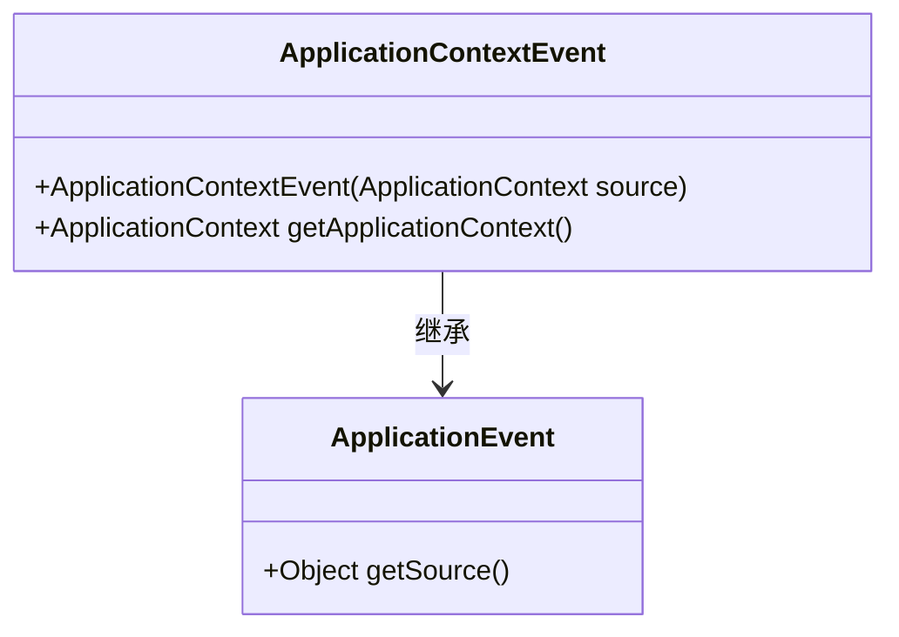
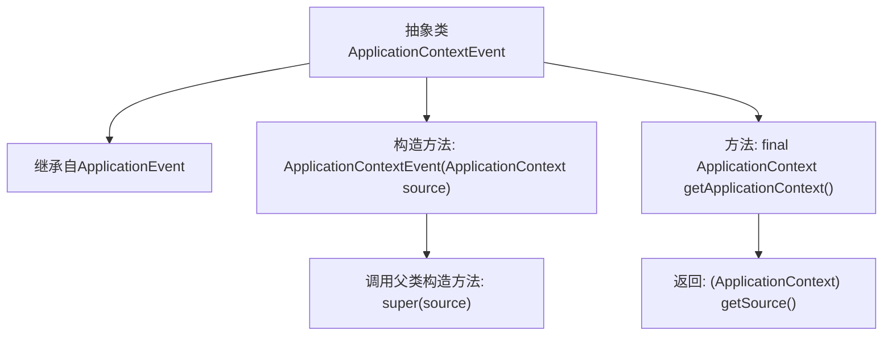

# 基础信息

|      |      |
|------|------|
| 名称 | ApplicationContextEvent |
| 编码语言 | .java |
| 代码路径 | Minis/src/com/minis/context/ApplicationContextEvent.java |
| 包名 | com.minis.context |
| 依赖项 | [] |
| 概述说明 | ApplicationContextEvent继承ApplicationEvent，提供获取ApplicationContext的方法。 |

# 说明

ApplicationContextEvent是继承自ApplicationEvent的一个类，主要用于在应用程序上下文中触发事件。该类提供了一个方法，用于获取当前的ApplicationContext对象，使得开发者可以在事件处理过程中访问和操作应用程序上下文的相关信息。这一设计有助于在事件驱动的架构中实现更灵活和高效的上下文管理。

# 类列表 Class Summary

| 名称   | 类型  | 说明 |
|-------|------|-------------|
| ApplicationContextEvent | class | ApplicationContextEvent继承ApplicationEvent，提供获取ApplicationContext的方法。 |

## 类 ApplicationContextEvent

|      |      |
|------|------|
| 访问范围 | public abstract |
| 类型 | class |
| 名称 | ApplicationContextEvent |
| 说明 | ApplicationContextEvent继承ApplicationEvent，提供获取ApplicationContext的方法。 |

### UML类图

类图描述：
`ApplicationContextEvent` 是一个抽象类，继承自 `ApplicationEvent`。它包含一个构造函数 `ApplicationContextEvent(ApplicationContext source)`，用于初始化事件源，并提供了一个公有方法 `getApplicationContext()`，用于获取事件源并强制转换为 `ApplicationContext` 类型。该类主要用于处理与应用程序上下文相关的事件。

### 内部方法调用关系图

这段代码定义了一个抽象类 `ApplicationContextEvent`，它继承自 `ApplicationEvent`。该类包含一个构造方法 `ApplicationContextEvent(ApplicationContext source)`，该构造方法调用父类的构造方法 `super(source)`。此外，该类还包含一个 `final` 方法 `getApplicationContext()`，该方法返回通过 `getSource()` 获取的 `ApplicationContext` 对象。这段代码主要用于处理与应用程序上下文相关的事件。

### 字段列表 Field List

| 名称  | 类型  | 说明 |
|-------|-------|------|

### 方法列表 Method List

| 名称  | 类型  | 说明 |
|-------|-------|------|
| getApplicationContext | ApplicationContext | 获取应用上下文，返回类型为ApplicationContext。 |

