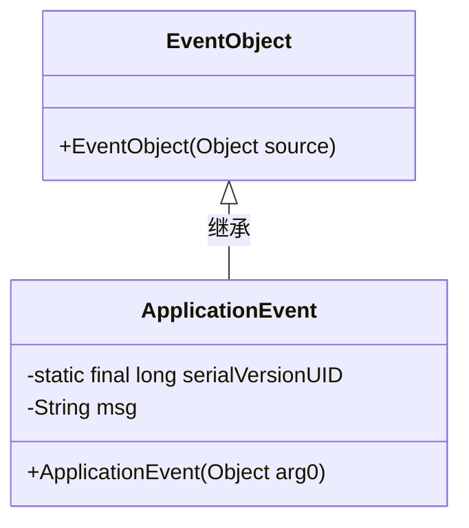
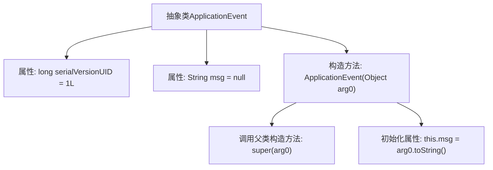

# 基础信息

|      |      |
|------|------|
| 名称 | ApplicationEvent |
| 编码语言 | .java |
| 代码路径 | Minis/src/com/minis/context/ApplicationEvent.java |
| 包名 | com.minis.context |
| 依赖项 | ['java.util.EventObject'] |
| 概述说明 | 抽象类ApplicationEvent继承EventObject，含序列化ID和消息字段，构造函数初始化消息。 |

# 说明

抽象类ApplicationEvent继承自EventObject，包含一个序列化ID和一个消息字段。该类的构造函数用于初始化消息字段。

# 类列表 Class Summary

| 名称   | 类型  | 说明 |
|-------|------|-------------|
| ApplicationEvent | class | 抽象类ApplicationEvent继承EventObject，包含序列化ID和消息字段，构造函数初始化消息。 |

## 类 ApplicationEvent

|      |      |
|------|------|
| 访问范围 | public abstract |
| 类型 | class |
| 名称 | ApplicationEvent |
| 说明 | 抽象类ApplicationEvent继承EventObject，包含序列化ID和消息字段，构造函数初始化消息。 |

### UML类图

这段代码定义了一个抽象类 `ApplicationEvent`，它继承自 `EventObject`。`ApplicationEvent` 类包含一个静态的 `serialVersionUID` 字段和一个私有的 `msg` 字段。构造函数 `ApplicationEvent` 接受一个 `Object` 类型的参数，并将其转换为字符串存储在 `msg` 字段中。这个类主要用于处理应用程序事件，通常用于事件驱动的编程模式。

### 内部方法调用关系图

这段代码定义了一个抽象类 `ApplicationEvent`，它继承自 `EventObject`。类中包含两个属性：`serialVersionUID` 用于序列化，`msg` 用于存储事件消息。构造方法 `ApplicationEvent(Object arg0)` 首先调用父类的构造方法，然后将传入的对象 `arg0` 转换为字符串并赋值给 `msg` 属性。这段代码主要用于处理应用程序事件，并通过构造方法初始化事件消息。

### 字段列表 Field List

| 名称  | 类型  | 说明 |
|-------|-------|------|
| msg = null | String | 定义受保护的字符串变量msg并初始化为null。 |
| serialVersionUID = 1L | long | 定义静态常量serialVersionUID，值为1L。 |

### 方法列表 Method List

| 名称  | 类型  | 说明 |
|-------|-------|------|

