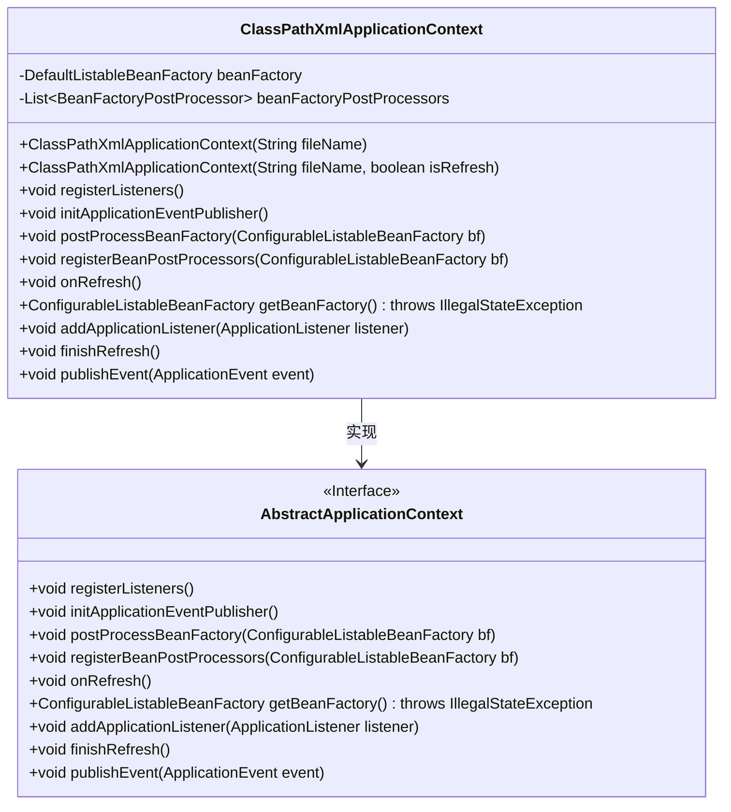

# 基础信息

|      |      |
|------|------|
| 名称 | ClassPathXmlApplicationContext |
| 编码语言 | .java |
| 代码路径 | Minis/src/com/minis/context/ClassPathXmlApplicationContext.java |
| 包名 | com.minis.context |
| 依赖项 | ['java.util.ArrayList', 'java.util.List', 'java.util.Map', 'com.minis.beans.BeansException', 'com.minis.beans.factory.annotation.AutowiredAnnotationBeanPostProcessor', 'com.minis.beans.factory.config.AbstractAutowireCapableBeanFactory', 'com.minis.beans.factory.config.BeanDefinition', 'com.minis.beans.factory.config.BeanFactoryPostProcessor', 'com.minis.beans.factory.config.BeanPostProcessor', 'com.minis.beans.factory.config.ConfigurableListableBeanFactory', 'com.minis.beans.factory.support.DefaultListableBeanFactory', 'com.minis.beans.factory.xml.XmlBeanDefinitionReader', 'com.minis.core.ClassPathXmlResource', 'com.minis.core.Resource', 'com.minis.core.env.Environment'] |
| 概述说明 | ClassPathXmlApplicationContext继承AbstractApplicationContext，实现Bean工厂和事件发布。 |

# 说明

ClassPathXmlApplicationContext是Spring框架中的一个类，它继承自AbstractApplicationContext。该类不仅实现了Bean工厂的功能，能够管理和创建Bean实例，还具备事件发布的功能，可以在应用程序中发布和处理各种事件。通过这种方式，ClassPathXmlApplicationContext为Spring应用程序提供了强大的配置和扩展能力。

# 类列表 Class Summary

| 名称   | 类型  | 说明 |
|-------|------|-------------|
| ClassPathXmlApplicationContext | class | ClassPathXmlApplicationContext继承AbstractApplicationContext，实现Bean工厂和事件发布功能。 |

## 类 ClassPathXmlApplicationContext

|      |      |
|------|------|
| 访问范围 | public |
| 类型 | class |
| 名称 | ClassPathXmlApplicationContext |
| 说明 | ClassPathXmlApplicationContext继承AbstractApplicationContext，实现Bean工厂和事件发布功能。 |

### UML类图

**描述：**  
`ClassPathXmlApplicationContext` 是一个继承自 `AbstractApplicationContext` 的类，用于从类路径加载 XML 配置文件并初始化 Spring 应用上下文。它包含一个 `DefaultListableBeanFactory` 实例和一个 `BeanFactoryPostProcessor` 列表，用于管理 Bean 的定义和生命周期。该类实现了多个方法，如 `registerListeners`、`initApplicationEventPublisher` 等，用于处理 Bean 的注册、事件发布、刷新等操作。通过这些方法，`ClassPathXmlApplicationContext` 能够完整地管理 Spring 应用上下文的生命周期。

### 内部方法调用关系图

```mermaid
graph TD
    A["类ClassPathXmlApplicationContext"]
    B["属性: DefaultListableBeanFactory beanFactory"]
    C["属性: List<BeanFactoryPostProcessor> beanFactoryPostProcessors"]
    D["构造方法: ClassPathXmlApplicationContext(String fileName)"]
    E["构造方法: ClassPathXmlApplicationContext(String fileName, boolean isRefresh)"]
    F["方法: void registerListeners()"]
    G["方法: void initApplicationEventPublisher()"]
    H["方法: void postProcessBeanFactory(ConfigurableListableBeanFactory bf)"]
    I["方法: void registerBeanPostProcessors(ConfigurableListableBeanFactory bf)"]
    J["方法: void onRefresh()"]
    K["方法: ConfigurableListableBeanFactory getBeanFactory()"]
    L["方法: void addApplicationListener(ApplicationListener<?> listener)"]
    M["方法: void finishRefresh()"]
    N["方法: void publishEvent(ApplicationEvent event)"]
    O["步骤: 创建Resource对象"]
    P["步骤: 创建DefaultListableBeanFactory对象"]
    Q["步骤: 创建XmlBeanDefinitionReader对象"]
    R["步骤: 加载Bean定义"]
    S["步骤: 设置beanFactory属性"]
    T["步骤: 调用refresh方法"]
    U["步骤: 获取Bean定义名称"]
    V["步骤: 获取Bean实例"]
    W["步骤: 检查是否为ApplicationListener"]
    X["步骤: 添加ApplicationListener"]
    Y["步骤: 创建ApplicationEventPublisher对象"]
    Z["步骤: 设置ApplicationEventPublisher"]
    AA["步骤: 获取Bean定义名称"]
    AB["步骤: 获取Bean定义"]
    AC["步骤: 获取类名"]
    AD["步骤: 加载类"]
    AE["步骤: 检查是否为BeanFactoryPostProcessor"]
    AF["步骤: 实例化并添加BeanFactoryPostProcessor"]
    AG["步骤: 调用postProcessBeanFactory方法"]
    AH["步骤: 获取Bean定义名称"]
    AI["步骤: 获取Bean定义"]
    AJ["步骤: 获取类名"]
    AK["步骤: 加载类"]
    AL["步骤: 检查是否为BeanPostProcessor"]
    AM["步骤: 添加BeanPostProcessor"]
    AN["步骤: 调用beanFactory的refresh方法"]
    AO["步骤: 返回beanFactory"]
    AP["步骤: 添加ApplicationListener"]
    AQ["步骤: 发布ContextRefreshedEvent"]
    AR["步骤: 发布事件"]

    A --> B
    A --> C
    A --> D
    A --> E
    A --> F
    A --> G
    A --> H
    A --> I
    A --> J
    A --> K
    A --> L
    A --> M
    A --> N
    E --> O
    E --> P
    E --> Q
    E --> R
    E --> S
    E --> T
    F --> U
    F --> V
    F --> W
    F --> X
    G --> Y
    G --> Z
    H --> AA
    H --> AB
    H --> AC
    H --> AD
    H --> AE
    H --> AF
    H --> AG
    I --> AH
    I --> AI
    I --> AJ
    I --> AK
    I --> AL
    I --> AM
    J --> AN
    K --> AO
    L --> AP
    M --> AQ
    N --> AR
```

这段代码定义了一个`ClassPathXmlApplicationContext`类，继承自`AbstractApplicationContext`，用于从XML文件中加载Spring应用上下文。它包含多个方法用于初始化、刷新、注册监听器、处理Bean工厂等操作。流程图展示了类中各个方法的调用关系及其内部步骤，帮助理解代码的执行流程和逻辑结构。

### 字段列表 Field List

| 名称  | 类型  | 说明 |
|-------|-------|------|
| beanFactoryPostProcessors =			new ArrayList<BeanFactoryPostProcessor>() | List<BeanFactoryPostProcessor> | 私有列表存储BeanFactoryPostProcessor实例。 |
| beanFactory | DefaultListableBeanFactory | DefaultListableBeanFactory是Spring框架的核心bean工厂实现。 |

### 方法列表 Method List

| 名称  | 类型  | 说明 |
|-------|-------|------|
| getBeanFactory | ConfigurableListableBeanFactory | 重写方法返回当前Bean工厂实例。 |
| publishEvent | void | 重写方法，发布应用事件。 |
| finishRefresh | void | 该方法发布了一个上下文刷新事件。 |
| registerListeners | void | 注册监听器，遍历Bean定义，添加应用监听器。 |
| registerBeanPostProcessors | void | 注册BeanPostProcessor，遍历Bean定义并实例化符合条件的Bean。 |
| addApplicationListener | void | 重写方法，将应用监听器添加到事件发布器中。 |
| initApplicationEventPublisher | void | 初始化应用事件发布器，设置简单事件发布器。 |
| onRefresh | void | 重写onRefresh方法，调用beanFactory的refresh方法。 |
| postProcessBeanFactory | void | 遍历Bean定义，实例化并执行BeanFactoryPostProcessor。 |

