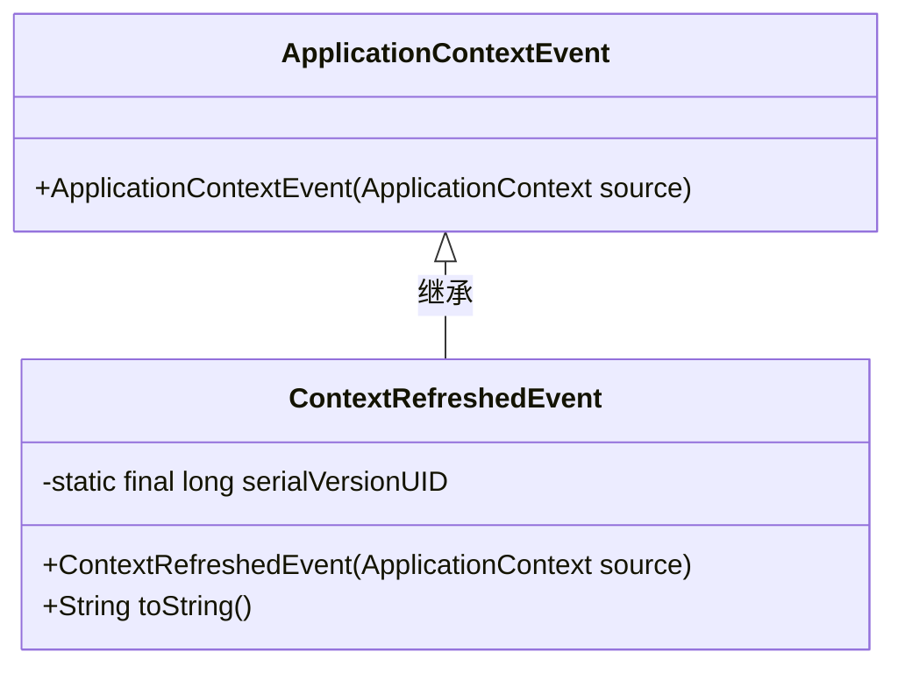
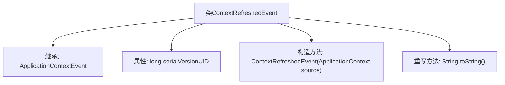

# 基础信息

|      |      |
|------|------|
| 名称 | ContextRefreshedEvent |
| 编码语言 | .java |
| 代码路径 | Minis/src/com/minis/context/ContextRefreshedEvent.java |
| 包名 | com.minis.context |
| 依赖项 | [] |
| 概述说明 | ContextRefreshedEvent继承ApplicationContextEvent，包含序列化ID和构造函数，重写toString方法。 |

# 说明

ContextRefreshedEvent继承自ApplicationContextEvent，包含一个序列化ID和一个构造函数。该事件类重写了toString方法，用于提供对象的字符串表示。

# 类列表 Class Summary

| 名称   | 类型  | 说明 |
|-------|------|-------------|
| ContextRefreshedEvent | class | ContextRefreshedEvent继承ApplicationContextEvent，包含序列化ID和构造函数，重写toString方法。 |

## 类 ContextRefreshedEvent

|      |      |
|------|------|
| 访问范围 | public |
| 类型 | class |
| 名称 | ContextRefreshedEvent |
| 说明 | ContextRefreshedEvent继承ApplicationContextEvent，包含序列化ID和构造函数，重写toString方法。 |

### UML类图

**描述：**  
`ContextRefreshedEvent` 类继承自 `ApplicationContextEvent`，表示应用上下文刷新事件。它包含一个静态的 `serialVersionUID` 用于序列化，并重写了 `toString()` 方法以返回事件消息。`ContextRefreshedEvent` 通过构造函数接收 `ApplicationContext` 作为事件源，并传递给父类构造函数。

### 内部方法调用关系图

这段代码定义了一个名为 `ContextRefreshedEvent` 的类，该类继承自 `ApplicationContextEvent`。它包含一个静态的 `serialVersionUID` 属性用于序列化，一个构造函数用于初始化事件源，并重写了 `toString()` 方法以返回消息内容。流程图展示了类的继承关系、属性、构造函数以及方法的调用关系。

### 字段列表 Field List

| 名称  | 类型  | 说明 |
|-------|-------|------|
| serialVersionUID = 1L | long | 定义了一个私有的静态最终长整型常量serialVersionUID，值为1L。 |

### 方法列表 Method List

| 名称  | 类型  | 说明 |
|-------|-------|------|
| toString | String | toString方法返回当前对象的msg属性值。 |

