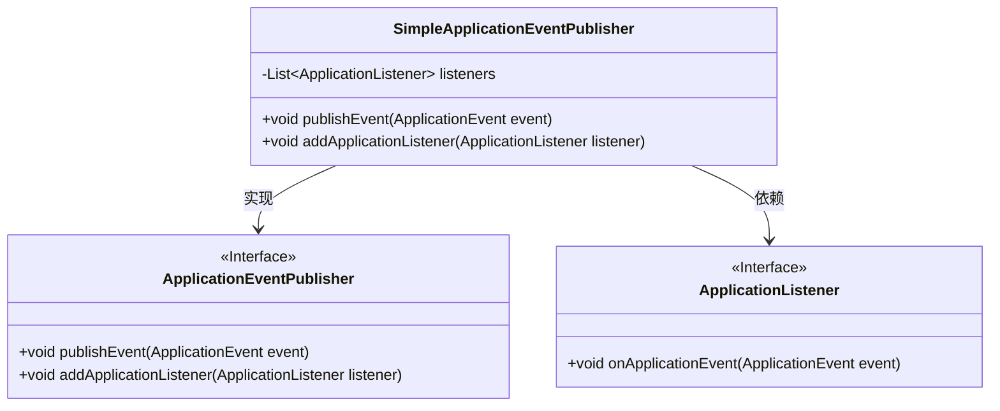
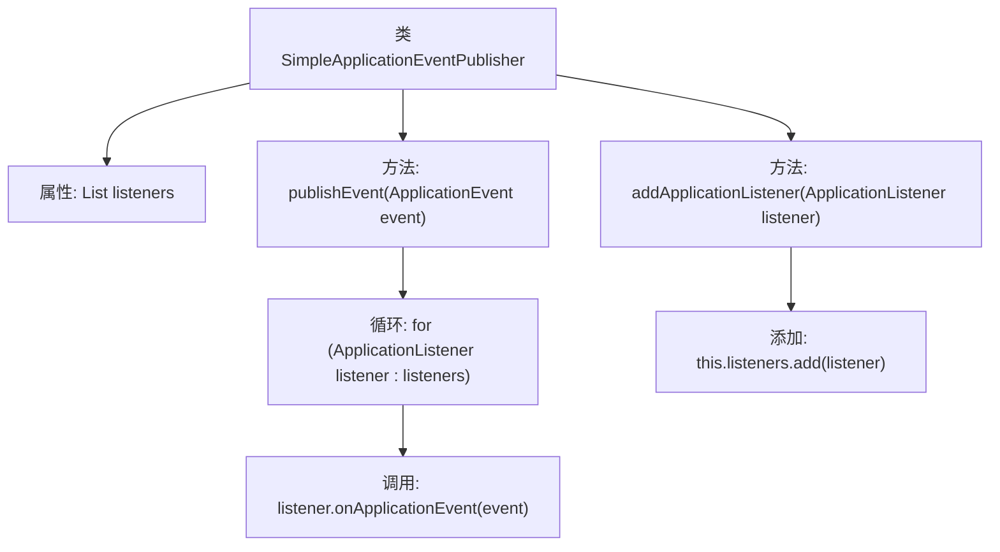

# 基础信息

|      |      |
|------|------|
| 名称 | SimpleApplicationEventPublisher |
| 编码语言 | .java |
| 代码路径 | Minis/src/com/minis/context/SimpleApplicationEventPublisher.java |
| 包名 | com.minis.context |
| 依赖项 | ['java.util.ArrayList', 'java.util.List'] |
| 概述说明 | SimpleApplicationEventPublisher实现事件发布，管理监听器并触发事件。 |

# 说明

SimpleApplicationEventPublisher负责实现事件的发布功能，其主要职责包括管理监听器列表以及触发事件。该组件通过维护一个监听器列表，确保在事件发生时能够通知所有相关的监听器。当事件被触发时，SimpleApplicationEventPublisher会遍历监听器列表，逐一调用每个监听器的处理方法，从而完成事件的传递与处理。这种机制使得事件发布与监听器之间的解耦更加灵活，便于系统的扩展与维护。

# 类列表 Class Summary

| 名称   | 类型  | 说明 |
|-------|------|-------------|
| SimpleApplicationEventPublisher | class | SimpleApplicationEventPublisher实现事件发布，管理监听器列表并触发事件。 |

## 类 SimpleApplicationEventPublisher

|      |      |
|------|------|
| 访问范围 | public |
| 类型 | class |
| 名称 | SimpleApplicationEventPublisher |
| 说明 | SimpleApplicationEventPublisher实现事件发布，管理监听器列表并触发事件。 |

### UML类图

这段代码描述了一个简单的事件发布器 `SimpleApplicationEventPublisher`，它实现了 `ApplicationEventPublisher` 接口。该发布器维护了一个 `ApplicationListener` 的列表，并提供了发布事件和添加监听器的方法。当事件发布时，所有注册的监听器都会接收到该事件并执行相应的处理逻辑。代码结构清晰，展示了事件发布与监听的基本实现方式。

### 内部方法调用关系图

这段代码定义了一个`SimpleApplicationEventPublisher`类，它实现了`ApplicationEventPublisher`接口。该类维护了一个`ApplicationListener`的列表，并通过`publishEvent`方法遍历所有监听器，触发它们的`onApplicationEvent`方法。`addApplicationListener`方法用于向列表中添加新的监听器。流程图展示了类的结构及其方法之间的调用关系。

### 字段列表 Field List

| 名称  | 类型  | 说明 |
|-------|-------|------|
| listeners = new ArrayList<>() | List<ApplicationListener> | 创建一个空的ApplicationListener类型ArrayList对象。 |

### 方法列表 Method List

| 名称  | 类型  | 说明 |
|-------|-------|------|
| addApplicationListener | void | 重写方法，添加应用监听器到集合中。 |
| publishEvent | void | 重写publishEvent方法，遍历listeners并调用onApplicationEvent处理事件。 |

