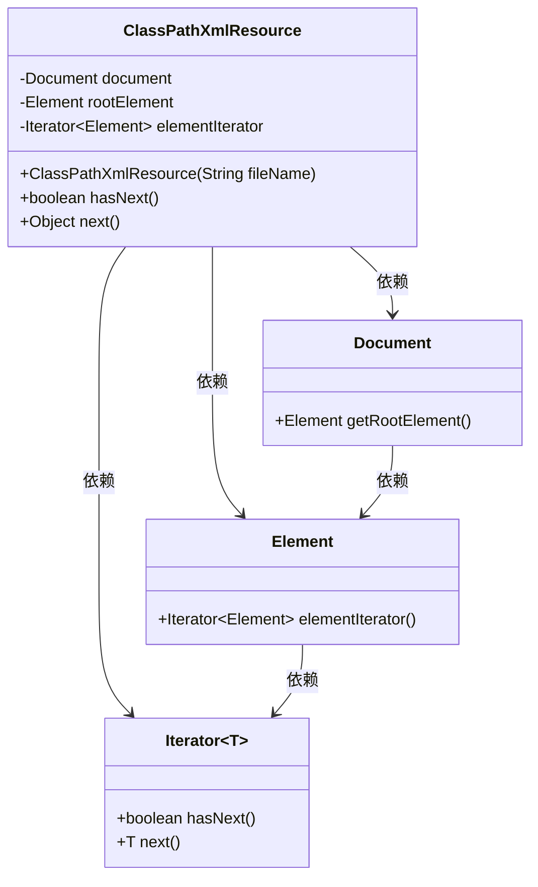
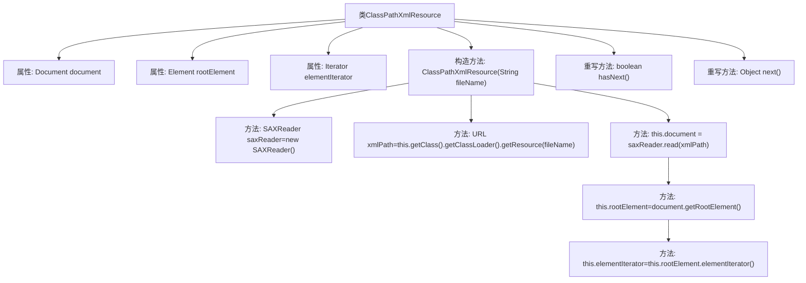

# 基础信息

|      |      |
|------|------|
| 名称 | ClassPathXmlResource |
| 编码语言 | .java |
| 代码路径 | Minis/src/com/minis/core/ClassPathXmlResource.java |
| 包名 | com.minis.core |
| 依赖项 | ['java.net.URL', 'java.util.Iterator', 'java.util.List', 'org.dom4j.Document', 'org.dom4j.DocumentException', 'org.dom4j.Element', 'org.dom4j.io.SAXReader', 'com.minis.beans.factory.config.BeanDefinition'] |
| 概述说明 | ClassPathXmlResource实现Resource接口，读取并迭代XML文件元素。 |

# 说明

ClassPathXmlResource类实现了Resource接口，专门用于读取XML文件并对其中的元素进行迭代操作。该类通过实现Resource接口，确保了对XML文件资源的高效管理和访问。其主要功能包括加载XML文件、解析文件内容，并提供对文件内部元素的迭代支持，使得用户可以方便地遍历和处理XML数据。

# 类列表 Class Summary

| 名称   | 类型  | 说明 |
|-------|------|-------------|
| ClassPathXmlResource | class | ClassPathXmlResource类实现Resource接口，读取XML文件并迭代元素。 |

## 类 ClassPathXmlResource

|      |      |
|------|------|
| 访问范围 | public |
| 类型 | class |
| 名称 | ClassPathXmlResource |
| 说明 | ClassPathXmlResource类实现Resource接口，读取XML文件并迭代元素。 |

### UML类图

**描述：**  
`ClassPathXmlResource` 类用于从类路径中读取 XML 文件，并解析为 `Document` 对象。它通过 `SAXReader` 读取 XML 文件，获取根元素 `rootElement`，并使用 `elementIterator` 遍历子元素。该类实现了 `hasNext` 和 `next` 方法，用于检查是否存在下一个元素以及获取下一个元素。`Document` 和 `Element` 类分别表示 XML 文档和元素，`Iterator` 是一个泛型接口，用于遍历集合中的元素。

### 内部方法调用关系图

这段代码定义了一个名为 `ClassPathXmlResource` 的类，该类实现了 `Resource` 接口。类中包含三个属性：`document`、`rootElement` 和 `elementIterator`。构造方法 `ClassPathXmlResource` 接收一个文件名作为参数，通过 `SAXReader` 读取 XML 文件，并初始化 `document`、`rootElement` 和 `elementIterator`。类中还重写了 `hasNext` 和 `next` 方法，用于遍历 XML 文件中的元素。流程图展示了类的结构及其方法之间的调用关系。

### 字段列表 Field List

| 名称  | 类型  | 说明 |
|-------|-------|------|
| document | Document | 定义一个名为`document`的文档对象。 |
| rootElement | Element | 根元素定义为rootElement。 |
| elementIterator | Iterator<Element> | 迭代器用于遍历元素集合。 |

### 方法列表 Method List

| 名称  | 类型  | 说明 |
|-------|-------|------|
| hasNext | boolean | 重写hasNext方法，返回elementIterator的hasNext结果。 |
| next | Object | 重写next方法，返回迭代器的下一个元素。 |

