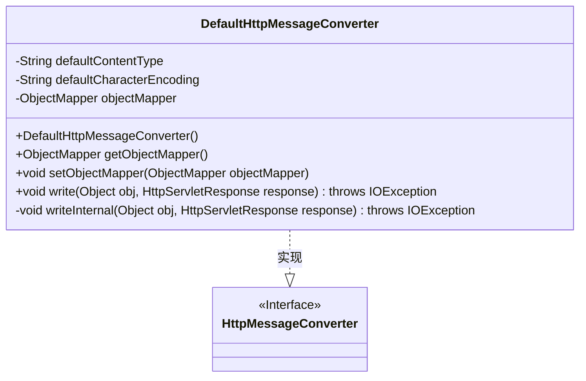
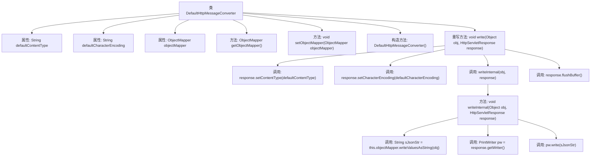

# 基础信息

|      |      |
|------|------|
| 名称 | DefaultHttpMessageConverter |
| 编码语言 | .java |
| 代码路径 | Minis/src/com/minis/http/converter/DefaultHttpMessageConverter.java |
| 包名 | com.minis.http.converter |
| 依赖项 | ['java.io.IOException', 'java.io.PrintWriter', 'javax.servlet.http.HttpServletResponse', 'com.minis.util.ObjectMapper'] |
| 概述说明 | DefaultHttpMessageConverter实现HttpMessageConverter，默认处理text/json，UTF-8编码，使用ObjectMapper。 |

# 说明

DefaultHttpMessageConverter类实现了HttpMessageConverter接口，主要用于处理HTTP消息的转换。其默认内容类型为text/json，字符编码采用UTF-8。该类使用ObjectMapper来处理JSON数据，确保数据的序列化和反序列化过程高效且准确。

# 类列表 Class Summary

| 名称   | 类型  | 说明 |
|-------|------|-------------|
| DefaultHttpMessageConverter | class | DefaultHttpMessageConverter类实现HttpMessageConverter接口，默认内容类型为text/json，字符编码为UTF-8，使用ObjectMapper处理JSON。 |

## 类 DefaultHttpMessageConverter

|      |      |
|------|------|
| 访问范围 | public |
| 类型 | class |
| 名称 | DefaultHttpMessageConverter |
| 说明 | DefaultHttpMessageConverter类实现HttpMessageConverter接口，默认内容类型为text/json，字符编码为UTF-8，使用ObjectMapper处理JSON。 |

### UML类图

这段代码定义了一个名为 `DefaultHttpMessageConverter` 的类，该类实现了 `HttpMessageConverter` 接口。`DefaultHttpMessageConverter` 类的主要功能是将对象转换为 JSON 格式的字符串，并通过 HTTP 响应输出。它包含默认的内容类型和字符编码设置，并通过 `ObjectMapper` 对象进行 JSON 序列化。`write` 方法负责设置响应头并调用 `writeInternal` 方法将对象写入响应流。

### 内部方法调用关系图

这段代码定义了一个名为 `DefaultHttpMessageConverter` 的类，实现了 `HttpMessageConverter` 接口。类中包含三个属性：`defaultContentType`、`defaultCharacterEncoding` 和 `objectMapper`，并提供了相应的 getter 和 setter 方法。`write` 方法用于将对象写入 HTTP 响应，设置内容类型和字符编码后，调用 `writeInternal` 方法将对象序列化为 JSON 字符串并写入响应输出流。最后，刷新缓冲区以确保数据发送到客户端。

### 字段列表 Field List

| 名称  | 类型  | 说明 |
|-------|-------|------|
| defaultCharacterEncoding = "UTF-8" | String | 设置默认字符编码为UTF-8。 |
| defaultContentType = "text/json;charset=UTF-8" | String | 默认内容类型设置为"text/json;charset=UTF-8"。 |
| objectMapper | ObjectMapper | 声明了一个ObjectMapper对象用于数据序列化和反序列化。 |

### 方法列表 Method List

| 名称  | 类型  | 说明 |
|-------|-------|------|
| setObjectMapper | void | 设置ObjectMapper实例的方法。 |
| writeInternal | void | 将对象转为JSON字符串并写入HTTP响应输出流。 |
| write | void | 重写write方法，设置响应内容类型和编码，调用内部写入并刷新缓冲区。 |
| getObjectMapper | ObjectMapper | 该方法返回一个ObjectMapper对象实例。 |

